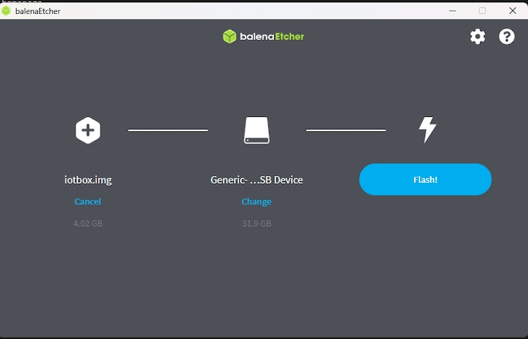

# Updating (IoT)

Due to the complexity of the `IoT (Internet of Things)` box, and virtual
Windows `IoT
(Internet of Things)` box, the term 'updating' can mean several
different things.

The actual drivers can be updated, the core code on the
`IoT (Internet of Things)` box can be updated, or a new image can be
flashed (using a physical `IoT (Internet of Things)` box).

This document explores the various ways to update
`IoT (Internet of Things)` boxes to ensure smooth operation of
`IoT (Internet of Things)` box processes and devices.

## Flashing the SD card on IoT box

> [!IMPORTANT]
> This update does **not** apply to the Windows
> `IoT (Internet of Things)` box (Konvergo ERP 16 and higher).
>
> To update the Windows `IoT (Internet of Things)`, first, uninstall the
> previous version of the Konvergo ERP Windows program, and then reinstall it
> using the most up-to-date installation package.
>
> To begin the installation, navigate to the Konvergo ERP 16 (or higher)
> installation package for Enterprise or Community - Windows edition, at
> [Konvergo ERP's download page](https://odoo.com/download).

In some circumstances, the `IoT (Internet of Things)` box's micro SD
Card may need to be re-flashed with *Etcher* software to benefit from
Konvergo ERP's latest `IoT (Internet of Things)` image update. This means the
Konvergo ERP `IoT (Internet of Things)` box software may need to be updated in
instances of a new `IoT (Internet of Things)` box, or when a handler's
update, or an update from the `IoT (Internet of Things)` box home page,
does not resolve issues.

> [!NOTE]
> - It is often necessary to re-flash the `IoT (Internet of Things)`
> box's image after upgrading the Konvergo ERP database to a new version. - A
> computer with a micro SD card reader/adapter is **required** to
> re-flash the micro SD card.

First, begin by downloading
[Etcher](https://www.balena.io/etcher#download-etcher). It is a free,
open-source utility, used for burning image files onto drives. After the
download completes, install and launch the program on the computer.

Then, download the latest `IoT (Internet of Things)` image from
[nightly](http://nightly.odoo.com/master/iotbox), which will be labeled
as iotbox-latest.zip. This particular
image is compatible with *all* supported versions of Konvergo ERP.

After this step is complete, insert the `IoT (Internet of Things)` box's
micro SD card into the computer or reader. Open *Etcher*, and select
`Flash from file`, then find and select the
iotbox-latest.zip image and extract it.
Next, select the drive the image should be burned to.

Lastly, click `Flash`, and wait for the process to finish.

> [!TIP]
> Balena's *Etcher* software also allows for the administrator to flash
> the `SD (Secure
> Digital)` card from a `URL (Uniform Resource Locator)`. To flash from
> a `URL (Uniform
> Resource Locator)`, simply click `Flash from URL`, instead of
> `Flash from
> file`.
>
> Then, enter the following:
> http://nightly.odoo.com/master/iotbox/iotbox-latest.zip.
>
>  alt="A view of Balena&#39;s Etcher software, with the flash from URL option highlighted." />

> [!NOTE]
> An alternative software for flashing the micro SD card is [Raspberry
> Pi Imager](https://www.raspberrypi.com/software/).

## Windows IoT update

Windows virtual `IoT (Internet of Things)` box may occasionally need an
update to work properly.

The following processes cover the
`uninstallation <iot/config/uninstall-windows-iot>` and
`re-installation <iot/config/re-install-windows-iot>` of the Windows
virtual `IoT
(Internet of Things)` box.

### Uninstalling Windows IoT

Prior to upgrading the Windows virtual `IoT (Internet of Things)` box,
the previous version should be uninstalled first.

> [!IMPORTANT]
> Before uninstalling a previous version of the Windows virtual
> `IoT (Internet of Things)` box, ensure that there is a newer version
> of Windows virtual `IoT (Internet of Things)` box available, compared
> to the version currently installed. To do so, navigate to the [Konvergo ERP
> Nightly builds](https://nightly.odoo.com/) page.
>
> On the `Konvergo ERP Nightly builds` page, navigate to
> `Builds (stable version)
> --> windows/` to view the date next to the `odoo_(version).latest.exe`
> file; where *(version)* is equal to the version of Konvergo ERP (e.g. 16.0,
> 17.0). The latest version of the Windows virtual
> `IoT (Internet of Things)` box can be downloaded by selecting this
> file, or it is always available at the [Konvergo ERP
> Download](https://odoo.com/download/) page.

Uninstalling the Windows virtual `IoT (Internet of Things)` box is done
through the Windows program manager.

On any version of Windows, search for
program to open the
`Programs --> Programs
and Features` section of the `Control Panel`. Then, select
`Uninstall or change
a program`. Next, search for Konvergo ERP, and
click the `... (three dot)` menu on the `Konvergo ERP.exe` program to uninstall.

Confirm the uninstallation, and follow the steps to uninstall through
the Konvergo ERP uninstall wizard.

### Download and re-install

The latest version of the Windows virtual `IoT (Internet of Things)` box
can be downloaded from the [Konvergo ERP Nightly
builds](https://nightly.odoo.com/) page or it is always available at the
[Konvergo ERP Download](https://odoo.com/download/) page.

To download from the `Konvergo ERP Nightly builds` page, navigate to `Builds
(stable version) --> windows/` to and select the
`odoo_(version).latest.exe` file; where *(version)* is equal to the
version of Konvergo ERP (e.g. 16.0, 17.0).

To download from the `Konvergo ERP Download` page, find the section for the
version of Konvergo ERP (e.g. 16.0, 17.0), and select the `Download` button for
`Windows`.

Next, install and setup the downloaded Konvergo ERP `.exe` file. After the
instructions screen, click `Next` to start the installation, and agree
to the `TOS (Terms of Service)`.

During the next step of the re-installation, select `Konvergo ERP IoT` from the
`Select
the type of install` drop-down menu.

For reference, the following should be installed:

- `Konvergo ERP server`
- `Konvergo ERP IoT`
- `Nginx WebServer`
- `Ghostscript interpreter`

Ensure there is enough space on the computer for the installation, then
click `Next`.

### Set the destination and complete the installation

To complete the re-installation, select the `Destination Folder`, and
click `Install`.

> [!WARNING]
> Choosing C:odoo as the install location
> allows for the *Nginx* server to start. Konvergo ERP's Windows virtual
> `IoT (Internet of Things)` box software should **not** be installed
> inside any of the Windows user's directories. Doing so does **not**
> allow for *Nginx* to initialize.

The installation may take a few minutes. When complete, click `Next` to
continue.

Then, ensure that the `Start Konvergo ERP` box is checked, and click `Finish`.
After installation, the Konvergo ERP server runs, and automatically opens
http://localhost:8069 on a web browser.
The webpage should display the `IoT (Internet of Things)` box homepage.

> [!TIP]
> A `restart <iot/restart_windows_iot>` of the Windows IoT program may
> be necessary if the web browser does not display anything.

## Update from the IoT box home page

In the background, the `IoT (Internet of Things)` box uses a version of
Konvergo ERP code to run and connect to the Konvergo ERP database. This code may need to
be updated in order for the `IoT (Internet
of Things)` box to operate effectively. This operation should be
completed on a routine basis, to ensure the `IoT (Internet of Things)`
system, and its processes, stay up-to-date.

Go to the `IoT (Internet of Things)` box home page by navigating to
`IoT app
--> IoT Boxes`, and clicking on the `IP address` of the
`IoT (Internet of Things)` box. Then, click on `Update` (next to the
version number).

If a new version of the `IoT (Internet of Things)` box image is
available, an `Upgrade to _xx.xx_` button appears at the bottom of the
page. Click this button to upgrade the unit, at which point the
`IoT (Internet of Things)` box flashes itself to the newer version. All
of the previous configurations are then saved.

> [!IMPORTANT]
> This process can take more than 30 minutes. Do **not** turn off, or
> unplug, the `IoT
> (Internet of Things)` box, as it would leave it in an inconsistent
> state. This means the `IoT (Internet of Things)` box needs to be
> `re-flashed <iot/config/flash>` with a new image.

## Handler (driver) update

There may be some instances where drivers or interfaces need to be
updated for individual devices (e.g. scales, measurement tools, etc.).
The IoT handler's (drivers and interfaces) code can be modified by
syncing them with the configured server handler's code.

This can be helpful in instances where `IoT (Internet of Things)`
devices (e.g. scales, measurement tools, etc.) are not working properly
with the `IoT (Internet of Things)` box.

For both the Windows `IoT (Internet of Things)` (Konvergo ERP 16 and higher) and
physical `IoT
(Internet of Things)` box, this process can be performed manually from
the `IoT (Internet of
Things)` box home page. Go to the `IoT (Internet of Things)` box home
page by navigating to `IoT app --> IoT Boxes`, and clicking on the
`IP address` of the `IoT
(Internet of Things)` box.

Next, click `Handlers list`, and then select `Load Handlers` at the
bottom of the page.

> [!IMPORTANT]
> Handler's code is fetched from the configured server, and it needs to
> be up-to-date to have the latest fixes and patches.

> [!NOTE]
> A handler update is also performed automatically each time the
> `IoT (Internet of Things)` box is restarted. The only exception to
> this process is if the *Automatic drivers update* is unchecked in the
> form view of the `IoT (Internet of Things)` box on the Konvergo ERP server.
> This setting can be reached by going to
> `IoT App --> Select the IoT box --> Automatic
> drivers update`.
