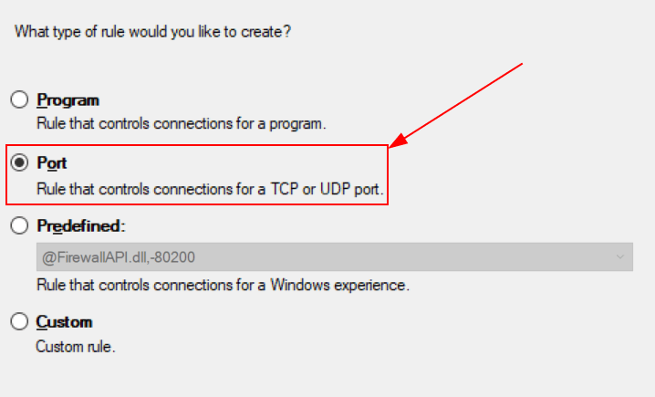

# Connect Windows IoT Odoo

A Virtual IoT box is a computer program that needs to be downloaded and
installed on a Windows computer. This requires a Windows operating
system with an Odoo 16 or later database.

The Windows virtual `IoT (Internet of Things)` box works the same way as
a physical `IoT
(Internet of Things)` box, with the ability to run most of the same
devices. All `POS (Point
of Sale)` devices work with it, such as a scale or printer. Payment
terminals will also work, but it should be noted that
`MRP (Material Requirement Planning)` devices are not compatible. *These
include cameras or measurement tools.*

## Pre-requisites

The following items will be needed to complete the Windows
`IoT (Internet of Things)` installation.

- Odoo 16 database or any version above.

- `IoT (Internet of Things)` compatible devices (except those mentioned
  above). Refer to: [Odoo's compatible IoT
  devices](https://www.odoo.com/app/iot-hardware).

- Device drivers for Windows.

  > [!NOTE]
  > Odoo recommends using an updated, recent version of Windows (Windows
  > 10/11) as some older operating systems can cause the Windows virtual
  > `IoT (Internet of Things)` to not work.

- Windows computer (laptop, desktop, or server).

- Odoo `IoT (Internet of Things)` subscription. Refer to:
  `iot/iot-eligibility`.

## Connect the Windows virtual IoT box to an Odoo database

The Windows virtual IoT box is simple to setup in just a few easy steps.
Follow this process when installing the Windows virtual IoT software for
the first time.

### Download and initial installation

To begin the installation, navigate to the Odoo 16 or higher
installation package for Community -Windows edition at [Odoo's download
page](https://odoo.com/download). Next, install and setup the Odoo
`.exe` file. After the instructions screen, click `Next` to start the
installation and agree to the `TOS (Terms of Service)`.

During the next step of the installation, select `Odoo IoT` from the
`Select the
type of install` drop-down menu.

For reference, the following should be installed:

- **Odoo server**
- **Odoo IoT**
- **Nginx WebServer**
- **Ghostscript interpreter**

Ensure there is enough space on the computer for the installation and
click `Next`.

### Setting the destination and completing the installation

To complete the installation, select the `Destination Folder` and click
`Install`.

> [!TIP]
> Choosing `C:\odoo` as the install location will allow for the Nginx
> server to start. If the folder doesn't exist, then create it.
> Otherwise the installation files will be spread throughout the hard
> drive.

> [!WARNING]
> Odoo's Windows virtual IoT software should not be installed inside any
> of the Window's User's directories. Doing so will not allow for Nginx
> to initialize.

The installation may take a few minutes. When complete, click `Next` to
continue.

Ensure that the `Start Odoo` box is checked and click `Finish`. After
installation, the Odoo server will run and automatically open
http://localhost:8069 on a web browser.
The webpage should display the `IoT (Internet of Things)` box homepage.

A restart of the Windows IoT program may be necessary should the web
browser not display anything. `iot/restart_windows_iot`

### Connecting devices

Next, connect the `IoT (Internet of Things)` devices to the Windows
computer. Windows should automatically detect the device because the
driver is pre-installed on the computer. If not, search for and install
the Windows driver for the device.

> [!IMPORTANT]
> Most devices connect to the Windows Machine for Windows IoT
> automatically through Windows Plug-N-Play (PnP). However, if Windows
> does not automatically recognize the device after connecting, then the
> administrator may need to install the corresponding drivers manually.
>
> Devices automatically recognized:
>
> - Regular ink/toner based printers
> - Receipt printers (Epson/Star)
> - Barcode scanners
> - Measurement devices (although some configuration of the measurement
>   device settings is required) See this documentation:
>   `../devices/measurement_tool`
>
> Devices not automatically recognized (requires manual driver
> download):
>
> - Label printers (Zebra)
> - Scales
>
> Reference the manufacturer's website for the equipment in question.
> Then, download the drivers and install them on the Windows machine.
> Reconnect the device in question and Windows will find the device.

Following connecting devices to the computer, refresh the
`IoT (Internet of Things)` box homepage and verify the device is seen.
If not, reload the handlers through the `IoT (Internet
of Things)` box homepage.

Finally, connect Windows `IoT (Internet of Things)` to a database using
existing instructions (manually using the Token).

`/applications/general/iot/config/connect`

Now the installation is complete, the devices connected to
`IoT (Internet of Things)` can be used to complete processes/actions.

## Troubleshooting

### Restart Windows IoT box

In some instances a manual restart of the physical
`IoT (Internet of Things)` box can resolve the issue of an
`IoT (Internet of Things)` box not showing up on the database. For the
Windows virtual `IoT (Internet of Things)` box a manual restart of the
Odoo server can resolve database connection issues.

To restart the virtual Windows IoT server:

1.  Type Services into the Windows
    `Search Bar`.
2.  Select the `Services` App and scroll down to the `Odoo` service.
3.  Right click on `Odoo` and select `Start` or `Restart`. This action
    will manually restart the Odoo IoT server.

### Firewalls

Firewalls keep devices safe and secure. Sometimes they can block
connections that should be made though. The Windows virtual
`IoT (Internet of Things)` box software may not be reachable to the
`LAN (Local Area Network)` due to a firewall preventing the connection.
Consult your local IT support team to make exceptions (network
discovery) in the `OS (Operating System)` or firewall program. Windows
has their own firewall as do other virus protection programs.

A client might encounter a time when they are able to reach the homepage
of the `IoT
(Internet of Things)` box, yet they cannot access it from another
computer/mobile device/tablet on the same network.

#### Making an exception on Windows Defender

It is possible to allow other devices to access the Windows virtual
`IoT (Internet of Things)` box while keeping the firewall on. This is
done by creating a rule on *Windows Defender* and allowing communication
through port 8069. The following process
describes the steps to take in order to make this exception.

##### Create a rule in Windows Defender

First, open the *Windows Firewall* by navigating to the `Start Menu` and
typing in Firewall. Then, open the
`Windows Defender Firewall` program. In the left-hand menu, navigate to
`Advanced Settings`.

Once `Advanced Settings` have been selected, click `Inbound Rules` in
the left-hand menu. Then, in the right-hand menu column (under
`Inbound Rules`), click on `New Rule` to create a new rule.

##### Configure new rule

On the `Rule Type` screen, select `Port`. Then click `Next`. From the
`Protocol and Ports` page leave the rule application to `TCP`. Then,
select `Specific Local Ports` for the `ports` option. In the text box,
type in 8069, 443. Finally, click `Next`
to continue to the next step.

On the `Actions` page, select `Allow the connection` and click `Next`.
The following page on the `Rule Configuration` wizard is the `Profile`
page. On this page, select whichever connection type applies to the
network the Windows machine is operating on. Ideally, select `Private`
only connections. The *Private* connection type is the most secure
connection while allowing the selected port to communicate. Click `Next`
to continue.

Finally, assign a new, unique name to the rule. For example, this name
can be Odoo. Optionally, add a brief
description in the `Description` field. Click `Finish` to complete the
`Rule Configuration` wizard. Now, the new rule is active and devices can
connect to the Windows virtual `IoT (Internet of Things)` box.

#### Worldline exception

*Worldline* is a payment terminal that can be connected to Odoo's *PoS*
(point of sale) system. It allows for a comprehensive and fluid payment
experience for customers. Worldline is available in Belgium, the
Netherlands, and Luxembourg.

When using the Windows IoT server to connect the Worldline payment
terminal, it is necessary to create an exception in the Windows firewall
so that a connection can be made between the Odoo
database/`IoT (Internet of Things)` box and Worldline.

`../../../sales/point_of_sale/payment_methods/terminals/worldline`

To create the exception, first, open the *Windows Defender Firewall* app
on the Windows machine. This can be accomplished by typing
windows defender in the `Search` bar.

Next, click `Advanced settings` in the left menu.

In the left menu, choose `Inbound Rules`.

After selecting `Inbound Rules`, select `New Rule` in the far right
menu.

Then, for the `Rule Type`, select the radio button for `Port`. Click
`Next` to continue to the rest of the configuration.

On the `Protocols and Ports` page, choose the radio button for `TCP`,
under `Does this rule apply to TCP or UDP?`.

Next, under
`Does this rule apply to all local ports or specific ports?`, select the
radio button for `Specific local ports`. Then, enter
9050, and click `Next` to continue.

The next screen is the `Action` page. Under
`What action should be taken when a
connection matches the specified conditions?`, choose the radio button
for `Allow the
connection`. Then, click `Next` to continue.

A `Profile` page appears. Under `When does this rule apply?`, leave the
three boxes checked for: `Domain`, `Private`, and `Public`. Click `Next`
to continue to the naming convention page.

On the `Name` page, enter Odoo Worldline,
under the `Name` field. Enter a `Description (optional)`. Finally, once
ready, click `Finish`.

The final `Inbound rule` should appear as follows:

|                             | Odoo Worldline |
|-----------------------------|----------------|
| Profile                     | All            |
| Enabled                     | Yes            |
| Action                      | Allow          |
| Override                    | No             |
| Program                     | Any            |
| Local Address               | Any            |
| Remote Address              | Any            |
| Protocol                    | TCP            |
| Local Port                  | 9050           |
| Remote Port                 | Any            |
| Authorized Users            | Any            |
| Authorized Computers        | Any            |
| Authorized Local Principals | Any            |
| Local User Owner            | Any            |
| PolicyAppld                 | None           |
| Application Package         | Any            |

### Uninstalling Windows IoT

Uninstalling the Windows virtual `IoT (Internet of Things)` box is done
through the Windows program manager. Using any Windows version, search
for program. Then, select `Add or
Remove Programs` located in the control panel. Search for
Odoo and click the `three dot
menu` to uninstall.

Confirm the un-installation and follow the steps to uninstall through
the Odoo uninstall guide.
