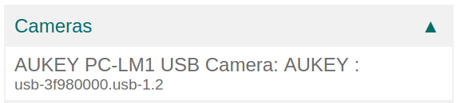
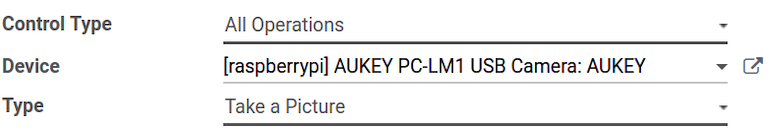

# Connect a camera

A camera can be connected to an `IoT (Internet of Things)` box with an
Odoo database in just a few steps. Once a camera is connected to an
`IoT (Internet of Things)` box, it can be used in a manufacturing
process, or it can be linked to a quality control point/quality check.
Doing so allows for the taking of pictures when a chosen quality control
point/check has been reached, or when a specific key is pressed during
manufacturing.

## Connection

To connect a camera to an `IoT (Internet of Things)` box, simply connect
the two via cable. This is usually done with a
`USB (Universal Serial Bus)` cable of some sort.

If the camera is [supported](https://www.odoo.com/page/iot-hardware),
there is no need to set up anything, as it'll be detected as soon as
it's connected.

## Link camera to quality control point in manufacturing process

In the `Quality app`, a device can be set up on a
`Quality Control Point`. To do that, navigate to the
`Quality app --> Quality Control --> Control Points` and open the
desired `Control Point` that'll be linked to the camera.

On the control point form, edit the control point by selecting the
`Type` field, and clicking on `Take a Picture` from the drop-down menu.
Doing so reveals a field called `Device`, wherein the attached *device*
can be selected. `Save` the changes, if required.

The camera is now useable with the selected quality control point. When
the quality control point is reached during the manufacturing process,
the database prompts the operator to take a picture.

> [!NOTE]
> Quality control points can also be accessed by navigating to
> `IoT App -->
> Devices`. From here, select the device. There is a
> `Quality Control Points` tab, where they can be added with the device.

> [!TIP]
> On a quality check form, the `Type` of check can also be specified to
> `Take a
> Picture`. Navigate to
> `Quality app --> Quality Control --> Quality Checks --> New` to create
> a new quality check from the `Quality Checks` page.

\-
`/applications/inventory_and_mrp/quality/quality_management/quality_control_points` -
`/applications/inventory_and_mrp/quality/quality_management/quality_alerts`

## Link camera to a work center in the Manufacturing app

To link a camera to an action, it first needs to be configured on a work
center. Navigate to
`Manufacturing app --> Configuration --> Work Centers`. Next, go to the
desired `Work Center` in which a camera will be used to reveal that
specific work center's detail form. From here, add the device in the
`IoT Triggers` tab, in the `Device` column, by clicking `Add a Line`.

Now, the camera device can be linked to the `Action` column drop-down
option labeled `Take a Picture`. A key can also be added to trigger the
action.

> [!IMPORTANT]
> The first trigger listed is chosen first. The order of triggers
> matters, and they can be dragged into any desired order.

> [!NOTE]
> On the `Work Order` screen, a status graphic indicates whether the
> database is correctly connected to the camera.

`workcenter_iot`

