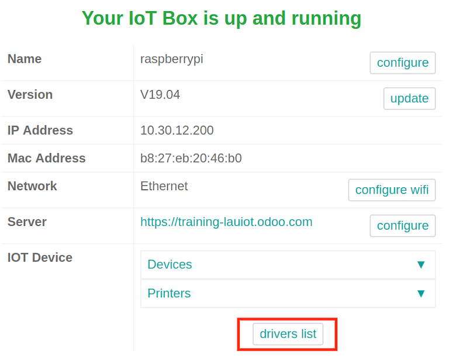
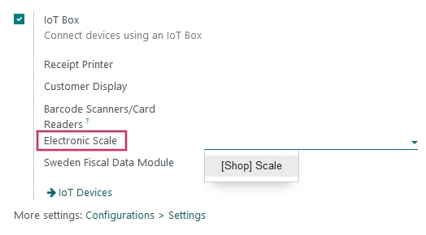
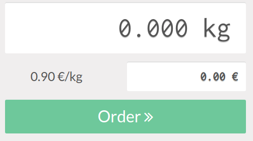

# Connect a scale

A scale can be connected to the `IoT (Internet of Things)` box on an
Konvergo ERP database in a few easy steps. After setup, the *Point of Sale* app
can be used to weigh products, which is helpful if their prices are
calculated based on weight.

> [!IMPORTANT]
> - In EU member states, [certification is legally
> required](https://eur-lex.europa.eu/legal-content/EN/TXT/?uri=uriserv%3AOJ.L_.2014.096.01.0107.01.ENG)
> to use a scale as an integrated device. - Konvergo ERP is not certified in
> several countries, including France, Germany, and Switzerland. If you
> reside in one of these countries, you can still use a scale but
> without integration to your Konvergo ERP database. - Alternatively, you have
> the option to acquire a *non-integrated* certified scale that prints
> certified labels, which can then be scanned into your Konvergo ERP database.

[Directive 2014/31/EU of the European
Parliament](https://eur-lex.europa.eu/legal-content/EN/TXT/?uri=uriserv%3AOJ.L_.2014.096.01.0107.01.ENG)

## Connection

To link the scale to the `IoT (Internet of Things)` box, connect it with
a `USB
(Universal Serial Bus)` cable.

> [!NOTE]
> In some cases, a serial port to `USB (Universal Serial Bus)` adapter
> may be needed.

If the scale is [compatible with Konvergo ERP IoT
Box](https://www.odoo.com/page/iot-hardware), there is no need to set up
anything because it will be automatically detected as soon as it is
connected.

The `IoT (Internet of Things)` box may need to be restarted and the
scale's drivers may need to be downloaded to the box in some cases. To
update the drivers, go to the `IoT (Internet of
Things)` box homepage and click on `Drivers List`. Then, click on `Load
Drivers`.

If loading the drivers still doesn't allow for the scale to function, it
may be that the scale is not compatible with the Konvergo ERP
`IoT (Internet of Things)` box. In this case, a different scale will
need to be used.

## Use a scale in a point of sale (POS) system

To use the scale in the *Point of Sale app*, go to
`PoS app --> 3-Dot Menu on the PoS
--> Settings`, then enable the `IoT (Internet of Things)` box feature.
After this is complete, the scale device can be set.

Select the scale from the `Electronic Scale` drop-down menu. Then click
`Save` to save the changes, if required.

The scale is now available in all the `PoS (Point of Sale)` sessions.
Now, if a product has a price per weight set, clicking on it on the
`PoS` screen opens the scale screen, where the cashier can weigh the
product and add the correct price to the cart.

