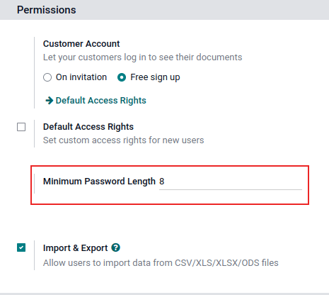

show-content  

# Users

Konvergo ERP defines a *user* as someone who has access to a database. An
administrator can add as many users as the company needs and, in order
to restrict the type of information each user can access, rules can be
applied to each user. Users and access rights can be added and changed
at any point.

\- `users/language` - `users/access_rights` -
`access-rights/superuser` - `access-rights/groups`

## Add individual users

To add new users, navigate to
`Settings app --> Users section --> Manage Users`, and click on
`Create`.

Fill in the form with all the required information. Under the
`Access Rights
<users/access_rights>` tab, choose the group within each application the
user can have access to.

The list of applications shown is based on the applications installed on
the database.

After filling out all the necessary fields on the page, click `Save`. An
invitation email is automatically sent to the user, using the email in
the `Email Address` field. The user must click on the link included in
the email to accept the invitation, and to create a database login.

> [!WARNING]
> If the company is on a monthly subscription plan, the database
> automatically updates to reflect the added users. If the company is on
> a yearly or multi-year plan, an expiration banner appears in the
> database. An upsell quotation can be created by clicking the banner to
> update the subscription. Alternatively, [send a support
> ticket](https://www.odoo.com/help) to resolve the issue.

### User type

With the `developer mode <developer-mode>` activated, `User Type` can be
selected from the `Access Rights` tab of the user form, accessible via
`Settings app
--> Users section --> Manage Users`.

There are three types of users: `Internal User`, `Portal`, and `Public`.

> [!TIP]
> Users are considered internal database users. Portal users are
> external users, who only have access to the database portal to view
> records. See the documentation on `users/portal`.
>
> Public users are those visiting websites, via the website's frontend.

The `Portal` and `Public` user options do **not** allow the
administrator to choose access rights. These users have specific access
rights pre-set (such as, record rules and restricted menus), and usually
do not belong to the usual Konvergo ERP groups.

## Deactivate users

To deactivate (i.e. archive) a user, navigate to
`Settings app --> Users section -->
Manage Users`. Then, tick the checkbox to the left of the user(s) to be
deactivated.

After selecting the appropriate user to be archived, click the
`⚙️ Actions` icon, and select `Archive` from the resulting drop-down
menu. Then, click `OK` from the `Confirmation` pop-up window that
appears.

Danger

**Never** deactivate the main/administrator user (admin). Making changes
to admin users can have a detrimental impact on the database. This
includes *impotent admin*, which means that no user in the database can
make changes to the access rights. For this reason, Konvergo ERP recommends
contacting an Konvergo ERP Business Analyst, or our Support Team, before making
changes.

### Error: too many users

If there are more users in an Konvergo ERP database than provisioned in the Konvergo ERP
Enterprise subscription, the following message is displayed.

When the message appears, the database administrator has 30 days to act
before the database expires. The countdown is updated every day.

To resolve the issue, either:

- Add more users to the subscription by clicking the
  `Upgrade your subscription` link displayed in the message to validate
  the upsell quotation, and pay for the extra users.
- `Deactivate users <users/deactivate>`, and reject the upsell
  quotation.

> [!WARNING]
> If the company is on a monthly subscription plan, the database
> automatically updates to reflect the added users. If the company is on
> a yearly or multi-year plan, an expiration banner appears in the
> database. An upsell quotation can be created by clicking the banner to
> update the subscription. Alternatively, users can [send a support
> ticket](https://www.odoo.com/help) to resolve the issue.

Once the database has the correct number of users, the expiration
message disappears automatically after a few days, when the next
verification occurs.

## Password management

Password management is an important part of granting users autonomous
access to the database at all times. Konvergo ERP offers a few different methods
to reset a user's password.

> [!TIP]
> Konvergo ERP has a setting to specify the length needed for a password. This
> setting can be accessed by navigating to
> `Settings app --> Permissions` section, and entering the desired
> password length in the `Minimum Password Length` field. By default the
> value is 8.

### Reset password

Sometimes, users might wish to reset their personal password for added
security, so they are the only ones with access to the password. Konvergo ERP
offers two different reset options: one initiated by the user to reset
the password, and another where the administrator triggers a reset.

#### Enable password reset from login page

It is possible to enable/disable password resets directly from the login
page. This action is completed by the individual user, and this setting
is enabled by default.

To change this setting, go to `Settings app --> Permissions` section,
activate `Password Reset`, and then click `Save`.

On the login page, click `Reset Password` to initiate the password reset
process, and have a reset-token sent to the email on file.

#### Send reset instructions

Go to `Settings app --> Users & Companies --> Users`, select the user
from the list, and click on `Send Password Reset Instructions` on the
user form. An email is automatically sent to them with password reset
instructions.

> [!NOTE]
> The `Send Password Reset Instructions` button **only** appears if the
> Konvergo ERP invitation email has already been confirmed by the user.
> Otherwise, a `Re-send Invitation Email` button appears.

This email contains all the instructions needed to reset the password,
along with a link redirecting the user to an Konvergo ERP login page.

### Change user password

Go to `Settings app --> Users & Companies --> Users`, and select a user
to access its form. Click on the `⚙️ Actions` icon, and select
`Change Password` from, the resulting drop-down menu. Enter a new
password in the `New Password` column of the `Change Password` pop-up
window that appears, and confirm the change by clicking
`Change Password`.

> [!NOTE]
> This operation only modifies the password of the users locally, and
> does **not** affect their odoo.com account.
>
> If the odoo.com password needs to be changed, use the
> `send the password reset instructions
> <users/reset-password-email>`. Konvergo ERP.com passwords grant access to the
> *My Databases* page, and other portal features.

After clicking `Change Password`, the page is redirected to an Konvergo ERP
login page where the database can be re-accessed using the new password.

## Multi Companies

The `Multi Companies` field on a user form allows an administrator to
provide access to multiple companies for existing users. To configure a
multi-company environment for a user, navigate to the desired user by
going to: `Settings app --> Users section --> Manage users`. Then,
select the user to open their user form, and configure with
multi-company access.

Under `Multi Companies` in the `Access Rights` tab, set the fields
labeled `Allowed Companies` and `Default Company`.

The `Allowed Companies` field can contain multiple companies. These are
the companies the user can access and edit, according to the set access
rights. The `Default Company` is the company the user defaults to, upon
logging in each time. This field can contain only **one** company.

> [!WARNING]
> If multi-company access is not configured correctly, it could lead to
> inconsistent multi-company behaviors. Because of this, only
> experienced Konvergo ERP users should make access rights changes to users for
> databases with a multi-company configuration. For technical
> explanations, refer to the developer documentation on
> `../../../developer/howtos/company`.

`companies`

users/language users/2fa users/access_rights users/portal users/google
users/azure users/ldap

