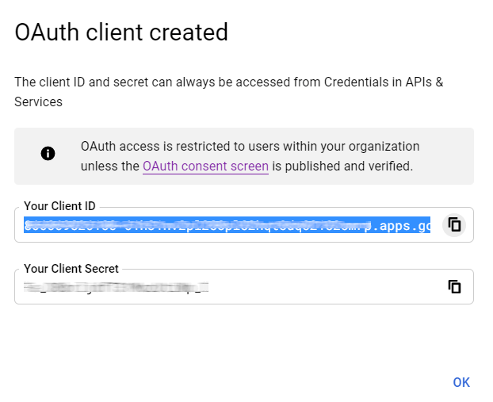

# Google Sign-In Authentication

The *Google Sign-In Authentication* is a useful function that allows
Odoo users to sign in to their database with their Google account.

This is particularly helpful if the organization uses Google Workspace,
and wants employees within the organization to connect to Odoo using
their Google Accounts.

> [!WARNING]
> Databases hosted on Odoo.com should not use Oauth login for the owner
> or administrator of the database as it would unlink the database from
> their Odoo.com account. If Oauth is set up for that user, the database
> will no longer be able to be duplicated, renamed or otherwise managed
> from the Odoo.com portal.

\- `/applications/productivity/calendar/google` -
`../email_communication/google_oauth`

## Configuration

The integration of the Google sign-in function requires configuration
both on Google *and* Odoo.

### Google API Dashboard

1.  Go to the [Google API
    Dashboard](https://console.developers.google.com/).

2.  Make sure the right project is opened. If there isn't a project yet,
    click on `Create
    Project`, fill out the project name and other details of the
    company, and click on `Create`.

    

    > [!TIP]
    > Choose the name of the company from the drop-down menu.

#### OAuth consent screen

1.  On the left side menu, click on `OAuth consent screen`.

    

2.  Choose one of the options (`Internal` / `External`), and click on
    `Create`.

    

    > [!WARNING]
    > *Personal* Gmail Accounts are only allowed to be **External** User
    > Type, which means Google may require an approval, or for *Scopes*
    > to be added on. However, using a *Google WorkSpace* account allows
    > for **Internal** User Type to be used.
    >
    > Note, as well, that while the API connection is in the *External*
    > testing mode, then no approval is necessary from Google. User
    > limits in this testing mode is set to 100 users.

3.  Fill out the required details and domain info, then click on
    `Save and Continue`.

4.  On the `Scopes` page, leave all fields as is, and click on `Save and
    Continue`.

5.  Next, if continuing in testing mode (*External*), add the email
    addresses being configured under the `Test users` step by clicking
    on `Add Users`, and then the `Save and Continue` button. A summary
    of the app registration appears.

6.  Finally, scroll to the bottom, and click on `Back to Dashboard`.

#### Credentials

1.  On the left side menu, click on `Credentials`.

    

2.  Click on `Create Credentials`, and select `OAuth client ID`.

    

3.  Select `Web Application` as the `Application Type`. Now, configure
    the allowed pages on which Odoo will be redirected.

    In order to achieve this, in the `Authorized redirect URIs` field,
    enter the database's domain immediately followed by
    /auth_oauth/signin. For example:
    https://mydomain.odoo.com/auth_oauth/signin,
    then click on `Create`.

4.  Now that the *OAuth client* has been created, a screen will appear
    with the `Client ID` and `Client Secret`. Copy the `Client ID` for
    later, as it will be necessary for the configuration in Odoo, which
    will be covered in the following steps.

### Google Authentication on Odoo

#### Retrieve the Client ID

Once the previous steps are complete, two keys are generated on the
Google API Dashboard: `Client ID` and `Client Secret`. Copy the
`Client ID`.

#### Odoo activation

1.  Go to `Odoo General Settings --> Integrations` and activate `OAuth
    Authentication`.

    > [!NOTE]
    > Odoo may prompt the user to log-in again after this step.

2.  Go back to
    `General Settings --> Integrations --> OAuth Authentication`,
    activate the selection and `Save`. Next, return to
    `General Settings -->
    Integrations --> Google Authentication` and activate the selection.
    Then fill out the `Client ID` with the key from the Google API
    Dashboard, and `Save`.

    

    > [!NOTE]
    > Google OAuth2 configuration can also be accessed by clicking on
    > `OAuth Providers` under the `OAuth Authentication` heading in
    > `Integrations`.

## Log in to Odoo with Google

To link the Google account to the Odoo profile, click on
`Log in with Google` when first logging into Odoo.

>  alt="Reset password screen with &quot;Log in with Google&quot; button." />

Existing users must `reset their password <users/reset-password>` to
access the `Reset Password` page, while new users can directly click on
`Log in with
Google`, instead of choosing a new password.

\- [Google Cloud Platform Console Help - Setting up OAuth
2.0](https://support.google.com/cloud/answer/6158849)

