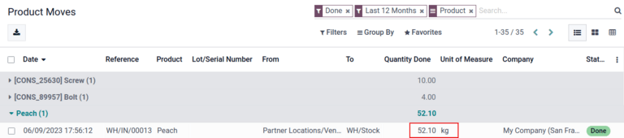

# GS1 barcode usage

GS1 barcodes provide a standardized format that barcode scanners can
interpret. They encode information in a
`specific structure recognized globally <barcode/operations/gs1>`,
allowing scanners to understand and process supply chain data
consistently.

Konvergo ERP *Barcode* interprets and prints GS1 barcodes, automating product
identification and tracking in warehouse operations such as receiving,
picking, and shipping.

The following sections contain examples of how Konvergo ERP uses GS1 barcodes
provided by the business to identify common warehouse items and automate
certain warehouse workflows.

> [!IMPORTANT]
> Konvergo ERP **does not** create GS1 barcodes. Businesses must purchase a
> unique Global Trade Item Number (GTIN) from GS1. Then, they can
> combine their existing GS1 barcodes with product and supply chain
> information (also provided by GS1) to create barcodes in Konvergo ERP.

\- [Purchase GTINs](https://www.gs1.org/standards/get-barcodes) -
`GS1 nomenclature <barcode/operations/gs1>`

## Configure barcodes for product, quantity, and lots

To build a GS1 barcode that contains information about a product, its
quantities, and the lot number, the following barcode patterns and
Application Identifiers (A.I.) are used:

<table style="width:98%;">
<colgroup>
<col style="width: 10%" />
<col style="width: 21%" />
<col style="width: 5%" />
<col style="width: 27%" />
<col style="width: 33%" />
</colgroup>
<thead>
<tr class="header">
<th><blockquote>

Name

</blockquote></th>
<th><blockquote>

Rule Name

</blockquote></th>
<th>A.I.</th>
<th><blockquote>

Barcode Pattern

</blockquote></th>
<th><blockquote>

Field in Konvergo ERP

</blockquote></th>
</tr>
</thead>
<tbody>
<tr class="odd">
<td>Product</td>
<td>Global Trade Item Number (GTIN)</td>
<td>01</td>
<td>(01)(\d{14})</td>
<td><code class="interpreted-text" role="guilabel">Barcode</code> field
on product form</td>
</tr>
<tr class="even">
<td>Quantity</td>
<td>Variable count of items</td>
<td>30</td>
<td>(30)(\d{0,8})</td>
<td><code class="interpreted-text" role="guilabel">Units</code> field on
transfer form</td>
</tr>
<tr class="odd">
<td>Lot Number</td>
<td>Batch or lot number</td>
<td>10</td>
<td>(10)([!"%-/0-9:-?A-Z_a-z]{0,20})</td>
<td><code class="interpreted-text" role="guilabel">Lot</code> on
Detailed Operations pop-up</td>
</tr>
</tbody>
</table>

### Configuration

First,
`enable product tracking using lots <inventory/management/track_products_by_lots>`
by navigating to `Inventory app --> Configuration --> Settings`, and
checking the box for `Lots & Serial Numbers` under the `Traceability`
heading.

Then, set up the product barcode by navigating to the intended product
form in `Inventory app --> Products --> Products` and selecting the
product. On the product form, click `Edit`. Then, in the
`General Information` tab, fill in the `Barcode` field with the unique
14-digit [Global Trade Item Number
(GTIN)](https://www.gs1.org/standards/get-barcodes), which is a
universally recognized identifying number that is provided by GS1.

> [!IMPORTANT]
> On the product form, omit the `A.I. (Application Identifier)`
> 01 for
> `GTIN (Global Trade Item Number)` product barcode pattern, as it is
> only used to encode multiple barcodes into a single barcode that
> contains detailed information about the package contents.

To record the GS1 barcode for the product, Fuji
Apple, enter the 14-digit `GTIN (Global Trade Item Number)`
20611628936004 in the `Barcode` field on
the product form.

> [!TIP]
> To view a list of *all* products and their corresponding barcodes in
> the Konvergo ERP database, navigate to
> `Inventory app --> Configuration --> Settings`. Under the `Barcode`
> heading, click on the `Configure Product Barcodes` button under the
> `Barcode
> Scanner` section. Enter the 14-digit `GTIN (Global Trade Item Number)`
> into the `Barcode` column, then click `Save`.
>
>  alt="View the Product Barcodes page from inventory settings." />

After activating tracking by lots and serial numbers from the settings
page, specify that this feature is to be applied on each product by
navigating to the `Inventory` tab on the product form. Under `Tracking`,
choose the `By Lots` radio button.

### Scan barcode on receipt

To ensure accurate lot interpretation in Konvergo ERP on product barcodes
scanned during a receipt operation, navigate to the `Barcode` app to
manage the `receipt picking process
<barcode/operations/scan-received-products>`.

From the `Barcode Scanning` dashboard, click the `Operations` button,
then the `Receipts` button to view the list of vendor receipts to
process. Receipts generated from `POs (Purchase Orders)` are listed, but
new receipt operations can also be created directly through the
`Barcode` app using the `Create` button.

On the list of receipts, click on the warehouse operation
(WH/IN) and scan product barcodes and lot
numbers with a barcode scanner. The scanned product then appears on the
list. Use the `✏️ (pencil)` button to open a window and manually enter
quantities for specific lot numbers.

After placing a `PO (Purchase Order)` for fifty apples, navigate to the
associated receipt in the *Barcode* app.

Scan the barcode containing the `GTIN (Global Trade Item Number)`,
quantity, and lot number. For testing with a barcode scanner, below is
an example barcode for the fifty Fuji apples in Lot 2.

| 50 Fuji apples in Lot0002                  |                                                                                                               |
|--------------------------------------------|---------------------------------------------------------------------------------------------------------------|
| 2D Matrix                                  |  |
| `A.I. (Application Identifier)` (product)  | 01                                                                                                            |
| GS1 Barcode (product)                      | 20611628936004                                                                                                |
| `A.I. (Application Identifier)` (quantity) | 30                                                                                                            |
| GS1 Barcode (quantity)                     | 00000050                                                                                                      |
| `A.I. (Application Identifier)` (lot)      | 10                                                                                                            |
| GS1 Barcode (lot \#)                       | LOT0002                                                                                                       |
| Full GS1 barcode                           | 0120611628936004 3000000050 10LOT0002                                                                         |

`If the configuration is correct <barcode/operations/troubleshooting>`,
50/50 `Units` processed will be displayed
and the `Validate` button turns green. Click the `Validate` button to
complete the reception.

## Configure barcode for product and non-unit quantity

To build a GS1 barcode that contains products measured in a non-unit
quantity, like kilograms, for example, the following barcode patterns
are used:

<table style="width:97%;">
<colgroup>
<col style="width: 13%" />
<col style="width: 25%" />
<col style="width: 10%" />
<col style="width: 20%" />
<col style="width: 27%" />
</colgroup>
<thead>
<tr class="header">
<th><blockquote>

Name

</blockquote></th>
<th><blockquote>

Rule Name

</blockquote></th>
<th><blockquote>

A.I.

</blockquote></th>
<th><blockquote>

Barcode Pattern

</blockquote></th>
<th><blockquote>

Field in Konvergo ERP

</blockquote></th>
</tr>
</thead>
<tbody>
<tr class="odd">
<td>Product</td>
<td>Global Trade Item Number (GTIN)</td>
<td>01</td>
<td>(01)(\d{14})</td>
<td><code class="interpreted-text" role="guilabel">Barcode</code> field
on product form</td>
</tr>
<tr class="even">
<td>Quantity in kilograms</td>
<td>Variable count of items</td>
<td>310[0-5]</td>
<td>(310[0-5])(\d{6})</td>
<td><code class="interpreted-text" role="guilabel">Units</code> field on
transfer form</td>
</tr>
</tbody>
</table>

### Scan barcode on receipt

To confirm that quantities are correctly interpreted in Konvergo ERP, place an
order in the *Purchase* app using the appropriate unit of measure
(`UoM`) for the quantity of products to be purchased.

`Simplify vendor unit conversions with UoMs
<inventory/product_replenishment/unit-conversion>`

After the order is placed, navigate to the `Barcode` app to
`receive the vendor
shipment <barcode/operations/scan-received-products>`.

On the receipt in the *Barcode* app, receive an order for
52.1 kg of peaches by scanning the
barcode containing the `GTIN (Global Trade Item Number)` and quantity of
peaches in kilograms.

| 52.1 kg of Peaches                                    |                                                                                   |
|-------------------------------------------------------|-----------------------------------------------------------------------------------|
| 2D Matrix                                             |  |
| `A.I. (Application Identifier)` (product)             | 01                                                                                |
| GS1 Barcode (product)                                 | 00614141000012                                                                    |
| `A.I. (Application Identifier)` (kg, 1 decimal point) | 3101                                                                              |
| GS1 Barcode (quantity)                                | 000521                                                                            |
| Full GS1 barcode                                      | 0100614141000012 3101000521                                                       |

`If the configuration is correct <barcode/operations/troubleshooting>`,
52.1 / 52.1 `kg` will be displayed and
the `Validate` button turns green. Finally, press `Validate` to complete
the validation.

## Verify product moves

For additional verification, the quantities of received products are
also recorded on the `Product Moves` report, accessible by navigating to
`Inventory app -->
Reporting --> Product Moves`.

The items on the `Product Moves` report are grouped by product by
default. To confirm the received quantities, click on a product line to
open its collapsible drop-down menu, which displays a list of *stock
move lines* for the product. The latest stock move matches the warehouse
reception reference number (e.g.
WH/IN/00013) and quantity processed in
the barcode scan, demonstrating that the records processed in the
*Barcode* app were properly stored in *Inventory*.

