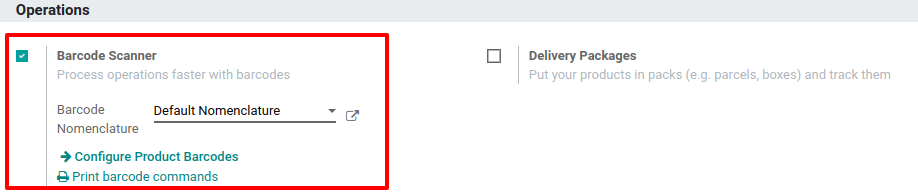
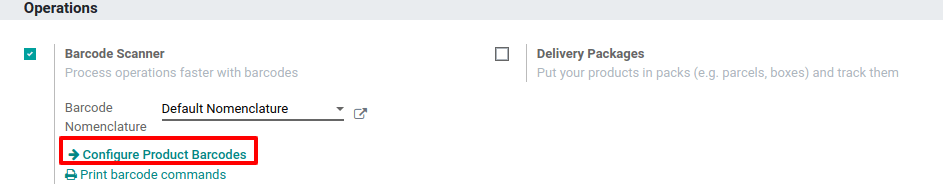
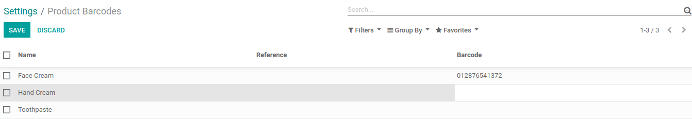
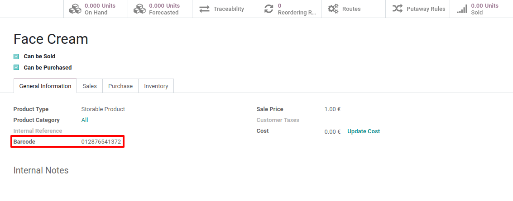
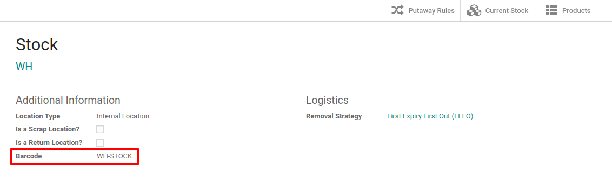
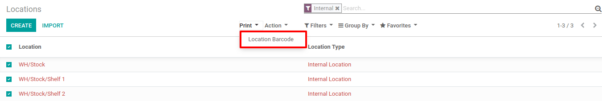

# Activate the Barcodes in Odoo

The barcode scanning features can save you a lot of time usually lost
switching between the keyboard, the mouse and the scanner. Properly
attributing barcodes to products, pickings locations, etc. allows you to
work more efficiently by controlling the software almost exclusively
with the barcode scanner.

## Configuration

To use this feature, you first need to activate the *Barcode*
functionality via `Inventory --> Settings --> Barcode Scanner`. Once you
have ticked the feature, you can hit save.

## Set Product Barcodes

You can easily assign barcodes to your different products via the
*Inventory* app. To do so, go to
`Settings --> Configure Products Barcodes`.

Then, you have the possibility to assign barcodes to your products
directly at creation on the product form.

> [!NOTE]
> Be careful to add barcodes directly on the product variants and not on
> the template product. Otherwise, you won’t be able to differentiate
> them.

## Set Locations Barcodes

If you manage multiple locations, you will find useful to attribute a
barcode to each location and stick it on the location. You can configure
the locations barcodes in `Inventory --> Configuration --> Locations`.

> [!NOTE]
> You can easily print the barcode you allocate to the locations via the
> *Print* menu.

## Barcode Formats

Most retail products use EAN-13 barcodes, also known as GTIN (Global
Trade Identification Numbers). GTIN are used by companies to uniquely
identify their products and services. While GTIN and UPC are often used
synonymously, GTIN refers to the number a barcode represents, while UPC
refers to the barcode itself. More information about GTIN can be found
on the GS1 website.

In order to create GTIN for items, a company must have a GS1 Company
Prefix. This prefix is the number that will appear at the beginning of
each GTIN, and will identify the company as the owner of the barcode any
the products it appears on. To learn more about GS1 Company Prefixes, or
purchase a license for a prefix, visit the GS1 Company Prefix page.

Odoo users are able to use GTIN barcodes to identify their products.
However, since Odoo supports any numeric string as a barcode, it is also
possible to define a custom barcode for internal use.
