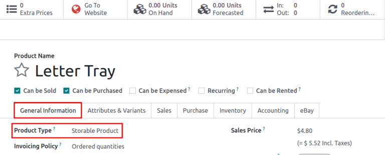

# Reordering rules

Reordering rules are used to keep forecasted stock levels above a
certain threshold without exceeding a specified upper limit. This is
accomplished by specifying a minimum quantity that stock should not fall
below and a maximum quantity that stock should not exceed.

Reordering rules can be configured for each product based on the route
used to replenish it. If a product uses the *Buy* route, then a Request
for Quotation (RFQ) is created when the reordering rule is triggered. If
a product uses the *Manufacture* route, then a Manufacturing Order (MO)
is created instead. This is the case regardless of the selected
replenishment route.

\- [Odoo Tutorials: Automatic Reordering
Rules](https://www.youtube.com/watch?v=XEJZrCjoXaU) - [Odoo Tutorials:
Manual Reordering Rules](https://www.youtube.com/watch?v=deIREJ1FFj4)

## Configure products for reordering rules

In order to use reordering rules for a product, it must first be
correctly configured. Begin by navigating to
`Inventory app --> Products --> Products`, then select an existing
product, or create a new one by clicking `New`.

On the product form, under the `General Information` tab, make sure that
the `Product Type` is set to `Storable Product`. This is necessary
because Odoo only tracks stock quantities for storable products, and
this number is used to trigger reordering rules.

Next, click on the `Inventory` tab and select one or more routes from
the `Routes` section. Doing so tells Odoo which route to use to
replenish the product.

If the product is reordered using the `Buy` route, confirm that the
`Can be
Purchased` checkbox is enabled under the product name. This makes the
`Purchase` tab appear. Click on the `Purchase` tab, and specify at least
one vendor, and the price that they sell the product for, so that Odoo
knows which company the product should be purchased from.

If the product is replenished using the `Manufacture` route, it needs to
have at least one Bill of Materials (BoM) associated with it. This is
necessary because Odoo only creates manufacturing orders for products
with a `BoM (Bill of Materials)`.

If a `BoM (Bill of Materials)` does not already exist for the product,
select the `Bill of Materials` smart button at the top of the product
form, then click `New` to configure a new `BoM (Bill of Materials)`.

## Create new reordering rules

To create a new reordering rule, navigate to
`Inventory app --> Configuration -->
Reordering Rules`, then click `New`, and fill out the new line as
follows:

- `Product`: The product that is replenished by the rule.
- `Location`: The location where the product is stored.
- `Min Quantity`: The minimum quantity that can be forecasted without
  the rule being triggered. When forecasted stock falls below this
  number, a replenishment order for the product is created.
- `Max Quantity`: The maximum quantity that stock is replenished up to.
- `Multiple Quantity`: Specify if the product should be replenished in
  batches of a certain quantity (e.g., a product could be replenished in
  batches of 20).
- `UoM`: The unit of measure used for reordering the product. This value
  can simply be Units or a specific unit
  of measurement for weight, length, etc.

> [!TIP]
> Reordering rules can also be created from each product form. To do so,
> navigate to `Inventory app --> Products --> Products`, then select a
> product. Click on `Reordering Rules smart button --> New`, then fill
> out the new line, as detailed above.

For advanced usage of reordering rules, learn about the following
reordering rule fields:

- `Trigger <inventory/product_management/trigger>`
- `Visibility days <inventory/product_management/visibility-days>`
- `Preferred route <inventory/product_management/route>`

> [!NOTE]
> The fields above are not available by default, and must be enabled by
> selecting the `(slider)` icon in the far-right corner, and selecting
> the desired column from the drop-down menu.

## Trigger

When stock falls below the reordering rule's minimum, set the reordering
rule's *trigger* to *automatic* to automatically create purchase or
manufacturing orders to replenish stock.

Alternatively, setting the reordering rule's trigger to *manual*
displays the product and forecasted stock on the *replenishment
dashboard*, where the procurement manager can review the stock levels,
lead times, and forecasted dates of arrival.

`strategies`

> [!TIP]
> The `Replenishment` dashboard is accessible by going to `Inventory app
> --> Operations --> Replenishment`.

To enable the `Trigger` field, go to
`Inventory app --> Configuration -->
Reordering Rules`. Then, click the `(slider)` icon, located to the
far-right of the column titles, and enable the `Trigger` option from the
additional options drop-down menu that appears.

In the `Trigger` column, select `Auto` or `Manual`. Refer to the
sections below to learn about the different types of reordering rules.

### Auto

Automatic reordering rules, enabled by setting the reordering rule's
`Trigger` field to `Auto`, generate purchase or manufacturing orders
when:

1.  the scheduler runs, and the *On Hand* quantity is below the minimum
2.  a sales order is confirmed, and lowers the *Forecasted* quantity of
    the product below the minimum

> [!TIP]
> The scheduler is set to run once a day, by default.
>
> To manually trigger a reordering rule before the scheduler runs,
> ensure `developer mode
> <developer-mode>` is enabled, and then select
> `Inventory app --> Operations -->
> Run Scheduler`. Then, select the green `Run Scheduler` button on the
> pop-up window that appears.
>
> Be aware that this also triggers *any other* scheduled actions.

The product, Office Lamp, has an
automatic reordering rule set to trigger when the forecasted quantity
falls below the `Min Quantity` of 5.00.
Since the current `Forecast` is 55.00,
the reordering rule is **not** triggered.

If the `Buy` route is selected, then an `RFQ (Request for Quotation)` is
generated. To view and manage `RFQs (Requests for Quotation)`, navigate
to `Purchase app
--> Orders --> Requests for Quotation`.

If the `Manufacture` route is selected, then an
`MO (Manufacturing Order)` is generated. To view and manage
`MOs (Manufacturing Orders)`, navigate to
`Manufacturing app --> Operations --> Manufacturing Orders`.

When no route is selected, Odoo selects the `Route` specified in the
`Inventory` tab of the product form.

### Manual

Manual reordering rules, configured by setting the reordering rule's
`Trigger` field to `Manual`, list a product on the replenishment
dashboard when the forecasted quantity falls below a specified minimum.
Products on this dashboard are called *needs*, because they are needed
to fulfill upcoming sales orders, for which the forecasted quantity is
not enough.

The replenishment dashboard, accessible by navigating to
`Inventory app -->
Operations --> Replenishment`, considers sales order deadlines,
forecasted stock levels, and vendor lead times. It displays needs
**only** when it is time to reorder items.

> [!NOTE]
> If the one-day window for ordering products is too short, skip to the
> `visibility days
> <inventory/product_management/visibility-days>` section to make the
> need appear on the replenishment dashboard a specified number of days
> in advance.

## Visibility days

> [!IMPORTANT]
> Ensure
> `lead times <../../shipping_receiving/advanced_operations_shipping/scheduled_dates>`
> are understood before proceeding with this section.

When `manual reordering rules <inventory/product_management/manual-rr>`
are assigned to a product, *visibility days* make the product appear on
the replenishment dashboard
(`Inventory app --> Operations --> Replenishment`) a certain number of
days in advance.

A product has a manual reordering rule set to trigger when the stock
level falls below four units. The current on-hand quantity is ten units.

The current date is February twentieth, and the *delivery date* on a
sales order (in the `Other Info` tab) is March third — twelve days from
the current date.

The `vendor lead time <inventory/management/purchase-lt>` is four days,
and the
`purchase security lead time <inventory/management/purchase-security-lt>`
is one day.

When the `Visibility Days` field of the reordering rule is set to zero,
the product appears on the replenishment dashboard five days before the
delivery date, which, in this case, is February twenty-seventh.

To see the product on the replenishment dashboard for the current date,
February twentieth, set the `Visibility Days` to
7.00.

To determine the number of visibility days needed to see a product on
the replenishment dashboard, subtract *today's date* from the *date the
need appears* on the replenishment dashboard.

$$Visibility~days = Need~appears~date - Today's~date$$

Referring to the example above, today's date is February twentieth, and
the need for the product appears on February twenty-seventh.

(February 27 - February 20 = 7 days)

Incorrectly setting the `Visibility Days` fewer than seven days in this
case results in the need **not** appearing on the replenishment
dashboard.

## Preferred route

Odoo allows for multiple routes to be selected under the `Inventory` tab
on each product form. For instance, it is possible to select both `Buy`
and `Manufacture`, thus enabling the functionality of both routes.

Odoo also enables users to set a preferred route for a product's
reordering rule. This is the route that the rule defaults to if multiple
are selected. To select a preferred route, begin by navigating to
`Inventory app --> Configuration --> Reordering Rules` or
`Inventory app --> Operations --> Replenishment`.

Click inside of the column on the row of a reordering rule, and a
drop-down menu shows all available routes for that rule. Select one to
set it as the preferred route.

> [!IMPORTANT]
> If multiple routes are enabled for a product but no preferred route is
> set for its reordering rule, the product is reordered using the
> selected route that is listed first on the `Inventory` tab of the
> product form.
