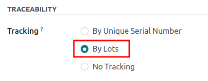
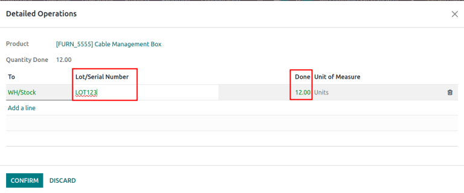
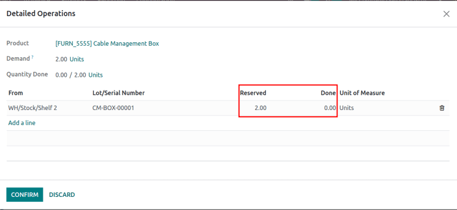
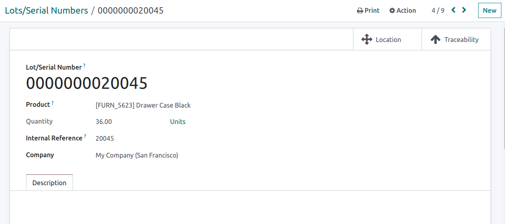

# Lot numbers

*Lots* are one of the two ways to identify and track products in Odoo.
They typically represent a specific batch of products that were
received, stored, shipped, or manufactured in-house.

Manufacturers assign lot numbers to groups of products sharing common
properties, facilitating end-to-end traceability through their
lifecycles.

Lots are useful for managing large quantities of manufactured or
received products, aiding in tracing items back to their group,
particularly for product recalls or `expiration dates
<expiration_dates>`.

`serial_numbers`

## Configuration

To track products by lots, enable the *Lots & Serial Numbers* feature.
Then, configure each product to be tracked by serial numbers on the
product form.

### Enable lots & serial numbers

To track products using lots, enable the *Lots & Serial Numbers*
feature. Go to the `Inventory app --> Configuration --> Settings`,
scroll down to the `Traceability` section, and tick the checkbox next to
`Lots & Serial Numbers`. Then, click `Save`.

\- `Tracking expiration dates <expiration_dates>` -
`Print GS1 barcodes for lots and serial numbers <barcode/operations/gs1-lots>`

### Track by lots

Once the `Lots & Serial Numbers` feature is activated, configure
individual products to be tracked using lots. To do this, go to
`Inventory app --> Products --> Products`, and choose a product to
configure.

On the product form, go to the `Inventory` tab. In the `Traceability`
section, select the `By Lots` option in the `Tracking` field. Now, new
or existing lot numbers can be assigned to newly-received or
manufactured batches of this product.

> [!IMPORTANT]
> If a product has stock on-hand prior to activating tracking by lots or
> serial numbers, use an
> `inventory adjustment <../../warehouses_storage/inventory_management/count_products>`
> to assign lot numbers to existing products in stock.

## Assign lots for shipping and receiving

Assign new lot numbers to
`incoming goods <inventory/product_management/assign-lots>` on the
receipt form. When shipping `outgoing goods
<inventory/product_management/assign-lots-delivery>`, select products
with specific lot numbers on the delivery order form.

### On receipts

Assigning new or existing lot numbers to incoming goods can be done
directly on receipts.

To begin, go to the `Purchase` app to [create and
confirm](https://www.youtube.com/watch?v=o_uI718P1Dc) a
`PO (Purchase Order)` for products tracked by lot numbers. Then, click
the `Receipt` smart button that appears at the top of the page to
navigate to the warehouse receipt form.

> [!NOTE]
> Alternatively, navigate to an existing receipt by going to the
> `Inventory` app, clicking the `Receipts` Kanban card, and choosing the
> desired receipt.

> [!IMPORTANT]
> Clicking `Validate` before assigning a lot number triggers a
> `User Error`, indicating that a lot number **must** be assigned before
> validating the receipt.
>
>  alt="Add lot/serial number user error popup." />

On the receipt form, on the product line in the `Operations` tab, select
the `⦙≣
(bulleted list)` icon to the right of the product that is tracked by lot
numbers.

<figure>

<figcaption>The bulleted list icon on the product line.</figcaption>
</figure>

Doing so opens the `Detailed Operations` pop-up window, where the
`Lot/Serial
Number` and `Done` quantity are assigned.

The two ways to assign lot numbers are **manually** and **copy/paste**.

#### Manual assignment

To manually assign lot numbers, click `Add a line`, and choose the
location the products will be stored in under the `To` column. Then,
type a new `Lot/Serial Number`, and specify the `Done` quantity.

> [!NOTE]
> To assign multiple lot numbers, or store to multiple locations, click
> `Add a line`, and type a new `Lot/Serial Number` for additional
> quantities. Repeat until the total in the `Done` column matches the
> `Quantity Done` at the top.

#### Copy and paste

From a spreadsheet with all of the lot numbers received from the
supplier (or manually chosen to assign upon receipt), click
`Add a line`, and proceed to copy and paste the lot numbers, in the
`Lot/Serial Number` column.

<figure>

<figcaption>Lot numbers copied to the lot number line, with each lot
number on its own line.</figcaption>
</figure>

After clicking away from the text field, Odoo automatically generates
the necessary lot number lines. The quantities in the `Done` column
match the first entry. Manually adjust the `To` locations and `Done`
quantities for each lot number, as needed.

Once all product quantities have been assigned a lot number, click
`Confirm` to close the pop-up window. Then, click `Validate` on the
receipt form.

`Traceability report for lot numbers <inventory/product_management/lot-traceability>`

### On delivery orders

Odoo makes it possible to specify which lot numbers for a product are
chosen for outgoing shipment on a delivery order form.

To begin, create or select an existing quotation from the `Sales` app.
After confirming the `SO (Sales Order)`, the `Delivery` smart button
becomes available. Click the `Delivery` smart button to view the
warehouse receipt form for that specific `SO (Sales Order)`.

> [!NOTE]
> Alternatively, navigate to delivery orders by going to the `Inventory`
> app, and clicking the `Delivery Orders` Kanban card.

Clicking the `Delivery` smart button opens the the delivery order form,
where lot numbers are picked for delivery. In the `Operations` tab,
click the `⦙≣ (bulleted list)` icon to the right of the product that is
tracked by lot numbers. Clicking that icon reveals a
`Detailed Operations` pop-up window.

In the `Detailed Operations` pop-up window, a `Lot/Serial Number` is
chosen, with the full `Reserved` quantity taken from that specific lot
(if there is enough stock in that particular lot).

If there is insufficient stock in that lot, or if partial quantities of
the `Demand` should be taken from multiple lots, change the quantity in
the `Done` column to only include that specific part of the total
quantity.

> [!NOTE]
> The lot automatically chosen for delivery orders varies, depending on
> the selected removal strategy (`FIFO (First In, First Out)`,
> `LIFO (Last In, First Out)`, or `FEFO
> (First Expiry, First Out)`). It also depends on the ordered quantity,
> and whether the lot's on-hand quantity is enough to fulfill the order.

`../../warehouses_storage/advanced_operations_warehouse/removal`

Next, click `Add a line`, select a different `Lot/Serial Number`, apply
the remaining `Done` quantities, and click `Confirm` to close the pop-up
window. Lastly, click the `Validate` button to deliver the products.

`Traceability report for lot numbers <inventory/product_management/lot-traceability>`

## Lot management

Manage and view existing lot numbers for products in the
`Lot/Serial Numbers` dashboard by going to
`Inventory app --> Products --> Lots/Serial Numbers`.

By default, lot numbers are grouped by product, and selecting the
drop-down menu for each product displays the existing lot numbers.
Select a lot number to `modify or add details
<inventory/product_management/edit-lot>` linked to the lot. Lot numbers
can also be `created
<inventory/product_management/create-new-lot>` from this page, by
clicking the `New` button.

<figure>

<figcaption>Display lot numbers, grouped by products, on the
<strong>Lot/Serial Number</strong> dashboard.</figcaption>
</figure>

### Modify lot

Clicking a lot from the `Lot/Serial Number` dashboard reveals a separate
page where additional information can be provided about the lot.

> [!TIP]
> Odoo automatically generates a new `Lot/Serial Number` to follow the
> most recent number. However, it can be edited, by clicking the line
> under the `Lot/Serial Number` field, and changing the generated number
> to any desired one.

On the lot number form, the following fields can be modified:

- `Lot/Serial Number`: Change the lot number linked to the `Product`
- `Internal Reference`: Records an alternative lot/serial number used
  within the warehouse that differs from the one used by the supplier
  manufacturer.
- `Company`: Specify the company where the lot number is available.
- `Description`: Add extra details about the lot or serial number in
  this text field.

> [!IMPORTANT]
> The `Product` and `Quantity` fields **cannot** be modified, as the lot
> numbers are linked with existing stock moves.

`Set expiration dates for lots <expiration_dates>`

### Reserve lot number for a product

To create a lot number for a product, begin by going to
`Inventory app --> Products
--> Lot/Serial Numbers`, and click `New`.

> [!IMPORTANT]
> Creating a lot number reserves it for a product but **does not**
> assign it. To assign lot numbers, refer to the section on
> `assigning lot numbers on receipts
> <inventory/product_management/assign-lots>`.

> [!TIP]
> While Odoo automatically generates a new `Lot/Serial Number` to follow
> the most recent number, it can be edited and changed to any desired
> number, by clicking the line under the `Lot/Serial Number` field on
> the lot form, and changing the generated number.

Once the new `Lot/Serial Number` is generated, click the blank field
next to `Product` to reveal a drop-down menu. From this menu, select the
product to which this new number will be assigned.

The lot number, 0000011, is created for
the product, Drawer Black.

After a new lot number has been created, saved, and assigned to the
desired product, the lot number is saved as an existing lot number
linked to the product, and can be selected when `assigning
lot numbers to products on a receipt <inventory/product_management/assign-lots>`,
or when making an inventory adjustment.

After creating the lot number, 0000011
appears as an option for Drawer Black
when assigning lot numbers on the `Inventory Adjustment` page.

## Manage lots for different operations types

By default, new lots can only be created when receiving products, and
existing lot numbers cannot be used. For sales orders, only existing lot
numbers can be utilized, and new ones cannot be created on the delivery
order.

To change the ability to use new (or existing) lot numbers on any
operation type, go to the
`Inventory app --> Configuration --> Operations Types`, and select the
desired operation type.

On the operation type form, under the `Lots/Serial Numbers` section,
tick the `Create New` checkbox to enable new lot numbers to be created
during this operation type. Choose `Use Existing ones` if only existing
lot numbers can be selected.

> [!TIP]
> For inter-warehouse transfers involving products tracked by lots, it
> can be useful to enable the `Use Existing Lots/Serial Numbers` option
> for warehouse receipts.

## Traceability

Manufacturers and companies can refer to traceability reports to see the
entire lifecycle of a product: where it came from, when it arrived,
where it was stored, who it went to (and when).

To see the full traceability of a product, or group by lots, go to the
`Inventory app
--> Products --> Lots/Serial Numbers`. Doing so reveals the
`Lots/Serial Numbers` dashboard.

From here, products with lot numbers assigned to them will be listed by
default, and can be expanded to show the lot numbers those products have
assigned to them.

To group by lots, begin by removing any filters in the `Search...` bar.
Then, click the `Group By` drop-down menu, select `Add Custom Group`,
and select `Lot/Serial Number` from the drop-down menu. Then, click
`Apply`.

Doing so displays all existing lots and serial numbers, and can be
expanded to show all quantities of products with that assigned number.

### Traceability report

To view a full stock moves report for a lot number, select the lot
number line from the `Lots/Serial Number` dashboard. On the lot number
form, click the `Traceability` smart button.

`differences`

