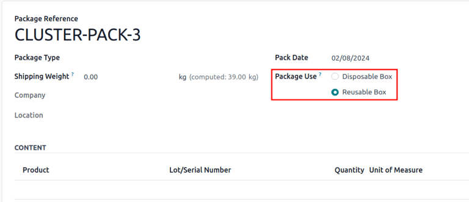

# Packages

A *package* is a physical container holding one or more products.
Packages can also be used to store items in bulk.

Packages are commonly used for the following purposes:

1.  `Grouping products to move them in bulk <inventory/warehouses_storage/pack>`.
2.  `Shipping to customers <inventory/warehouses_storage/package-type>`:
    configure package types to align with shipping carriers' size and
    weight requirements, streamlining the packing process, and ensuring
    compliance with carrier shipping specifications.
3.  Storing items in bulk.

*Package use* is a field on the package form in Konvergo ERP that is only
visible by enabling the *Batch Transfers* and *Packages* features
(`Inventory app --> Configuration --> Settings`).

By default, the *Package Use* field on a packages form is set to
*Disposable Box*. Change this field to *Reusable Box* **only** when
configuring packages for `cluster pickings
<inventory/warehouses_storage/cluster-pack>`.

*Package type* is an optional feature used for
`calculating shipping cost
<../../shipping_receiving/setup_configuration/delivery_method>`, based
on real shipping weight. Create package types to include the weight of
the package itself (e.g. boxes, pallets, other shipping containers) in
shipping cost calculations.

> [!NOTE]
> While packages are commonly used in the `three-step delivery route
> <../../shipping_receiving/daily_operations/delivery_three_steps>`,
> they can be used in any workflow involving storable products.

## Configuration

To use packages, first go to
`Inventory app --> Configuration --> Settings`. Under the `Operations`
heading, activate the `Packages` feature. Then, click `Save`.

## Pack items

Products can be added to packages in any transfer by:

1.  Clicking each
    `Detailed Operations <inventory/warehouses_storage/detailed-operations>`
    icon on the product line.
2.  Using the `Put in Pack <inventory/warehouses_storage/put-in-pack>`
    button to place everything in the transfer into a package.

### Detailed operations

On any warehouse transfer (e.g. receipt, delivery order), add a product
to a package by clicking the `⦙≣ (bulleted list)` icon in the
`Operations` tab.

Doing so opens the `Detailed Operations` pop-up window for the
`Product`.

To put the `Product` in a package, click `Add a line`, and assign the
product to a `Destination Package`. Select an existing package, or
create a new one by typing the name of the new package, then select
`Create...`.

<figure>

<figcaption>Twelve units of Acoustic Bloc
Screen are placed in PACK0000001.</figcaption>
</figure>

Then, specify the quantity of items to go into the package in the `Done`
column. Repeat the above steps to place the `Product` in different
packages. Once finished, click `Confirm` to close the window.

`Ship one order in multiple packages
<../../shipping_receiving/advanced_operations_shipping/multipack>`

### Put in pack

Alternatively, click the `Put in Pack` button on **any** warehouse
transfer to create a new package, and place all the items in the
transfer in that newly-created package.

> [!IMPORTANT]
> The `Put in Pack` button appears on receipts, delivery orders, and
> other transfer forms with the *Packages* feature enabled in
> `Inventory app --> Configuration -->
> Settings`.

<figure>

<figcaption>In batch transfer BATCH/00003, the <code class="interpreted-text"
role="guilabel">Put in Pack</code> button was clicked to create a new
package, PACK0000002, and assign all
items to it in the <code class="interpreted-text"
role="guilabel">Destination Package</code> field.</figcaption>
</figure>

## Package type

Create package types by navigating to
`Inventory app --> Configuration --> Package
Types`, in order to set custom dimensions and weight limits. This
feature is mainly used to calculate package weights for shipping costs.

\-
`Shipping carriers <../../shipping_receiving/setup_configuration/third_party_shipper>` -
`../../shipping_receiving/setup_configuration/delivery_method`

On the `Package Types` list, clicking `New` opens a blank package type
form. The fields of the form are as follows:

- `Package Type` (required): define the package type's name.
- `Size`: define the dimensions of the package in millimeters (mm). The
  fields, from left to right, define the `Length`, `Width`, and
  `Height`.
- `Weight`: weight of an empty package (e.g. an empty box, pallet).

> [!NOTE]
> Konvergo ERP calculates the package's weight by adding the weight of the empty
> package plus the weight of the item(s), which can be found in the
> `Weight` field, in the `Inventory` tab, of each product form.

- `Max Weight`: maximum shipping weight allowed in the package.
- `Barcode`: define a barcode to identify the package type from a scan.
- `Company`: specify a company to make the package type available
  **only** at the selected company. Leave the field blank if it is
  available at all companies.
- `Carrier`: specify the intended shipping carrier for this package
  type.
- `Carrier Code`: define a code that is linked to the package type.

## Cluster packages

To use *cluster packages*, first navigate to
`Inventory app --> Configuration -->
Settings`, and activate the `Batch Transfers` feature, located in the
`Operations` section. Doing so makes the *Package Use* field become
visible on a package form.

Add new packages by going to `Inventory app --> Products --> Packages`.
Then, click `New`, or select an existing package. Doing so opens the
package form, which contains the following fields:

- `Package Reference` (required): name of the package.

- `Package Type`: used for
  `configuring shipping boxes to ship to the customer
  <inventory/warehouses_storage/package-type>`.

  > [!NOTE]
  > `Package Type` is unnecessary for configuring packages for cluster
  > pickings.

- `Shipping Weight`: used to input the weight of the package after
  measuring it on a scale.

- `Company`: specify a company to make the package available **only** at
  the selected company. Leave the field blank if the package is
  available at all companies.

- `Location`: current location of the package.

- `Pack Date`: the date the package was created.

- `Package Use`: choose `Reusable` for packages used for moving products
  within the warehouse; `Disposable` for packages used to ship products
  to customers.

`Using cluster packages
<../../warehouses_storage/advanced_operations_warehouse/cluster_picking>`

