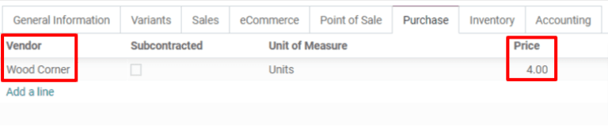
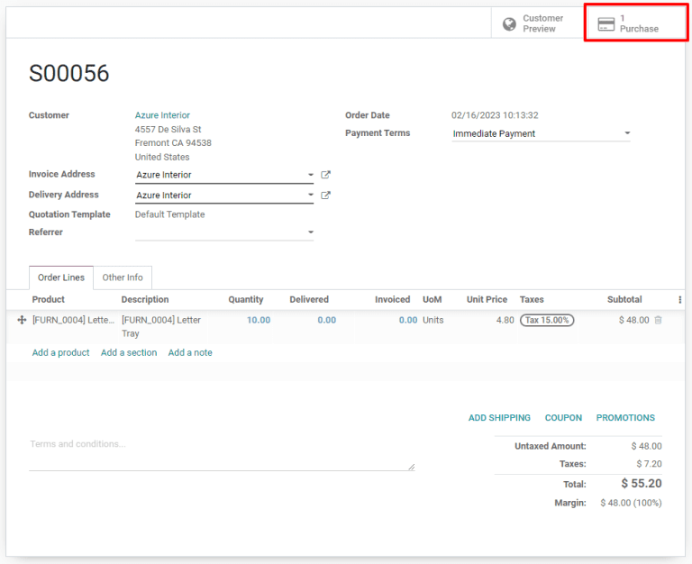
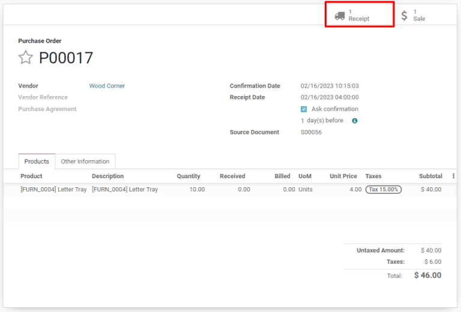

# Use dropshipping to ship directly from suppliers to customers

Dropshipping is an order fulfillment strategy that allows sellers to
have items shipped directly from suppliers to customers. Normally, a
seller purchases a product from a supplier, stores it in their
inventory, and ships it to the end customer once an order is placed.
With dropshipping, the supplier is responsible for storing and shipping
the item. This benefits the seller by reducing inventory costs,
including the price of operating warehouses.

## Configure products to be dropshipped

To use dropshipping as a fulfillment strategy, navigate to the
`Purchase` app and select `Configuration --> Settings`. Under the
`Logistics` heading, click the `Dropshipping` checkbox, and `Save` to
finish.

Next, go to the `Sales` app, click `Products --> Products` and choose an
existing product or select `Create` to configure a new one. On the
`Product` page, make sure that the `Can be Sold` and `Can be Purchased`
checkboxes are enabled.

Click on the `Purchase` tab and specify a vendor and the price that they
sell the product for. Multiple vendors can be added, but the vendor at
the top of the list will be the one automatically selected for purchase
orders.

Finally, select the `Inventory` tab and enable the `Dropship` checkbox
in the `Routes` section.

## Fulfill orders using dropshipping

When a customer completes an online purchase for a dropshipped product,
a sales order will be automatically created with an associated request
for quotation (`RFQ (Request for Quotation)`) for the supplier. Sales
orders can be viewed in the `Sales` app by selecting
`Orders --> Orders`. Click the `Purchase` smart button at the top right
of a sales order to view the associated `RFQ (Request for Quotation)`.

> [!TIP]
> Dropship sales orders can also be created manually through the `Sales`
> app by selecting `Orders --> Orders --> Create` and adding a product
> configured for dropshipping.

Once the `RFQ (Request for Quotation)` is confirmed, it becomes a
purchase order and a dropship receipt is created and linked to it. The
receipt can be viewed by clicking the `Receipt` smart button in the top
right corner of the purchase order form.

The dropship receipt will list the supplier in the `Receive From`
section and the customer in the `Destination Location` section. Upon
delivery of the product to the customer, click on the `Validate` button
at the top left of the dropship receipt to confirm the delivered
quantity.

To view all dropship orders, simply navigate to the `Inventory`
`Overview` dashboard and click the teal `# TO PROCESS` button on the
`Dropship` card.

