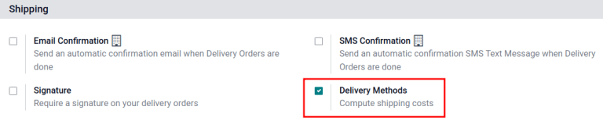
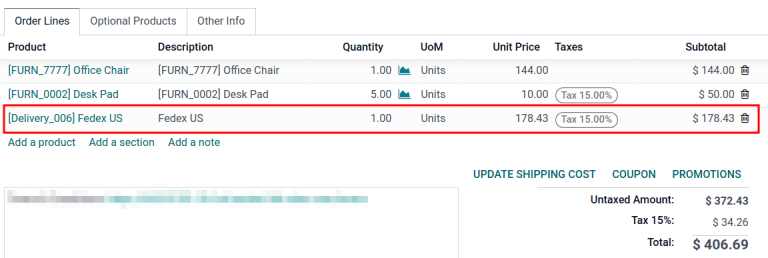

# Shipping cost invoicing

Invoicing customers for shipping after delivery ensures accurate charges
based on real-time shipping factors like distance, weight, and method.

In Odoo, shipping costs can be invoiced in two ways:

1.  Agree with the customer on a fixed cost and
    `include it in the sale order.
    <inventory/shipping/invoice-so>`
2.  `Invoice shipping costs to the customer post-delivery
    <inventory/shipping/invoice-shipping>`, reflecting the actual
    expenses incurred by the business.

## Configuration

To set prices to delivery methods, go to
`Inventory app --> Configuration -->
Settings`. Under the `Shipping` section, enable the `Delivery Methods`
feature. Then, click `Save`.

## Add shipping method

Next, configure the the price of each delivery method by going to
`Inventory app -->
Configuration --> Shipping Methods` and click the `Create` button. Doing
so opens a form to provide details about the shipping provider,
including:

- `Shipping Method` (*required*) the name of the delivery method (e.g.
  flat-rate shipping,
  same day delivery, etc.).

- `Provider` (*required*): choose the delivery service, like FedEx, if
  using a third-party carrier Ensure the integration with the shipping
  carrier is properly installed and select the provider from the
  drop-down menu.

  

  `../setup_configuration/third_party_shipper`

  

- `Company`: if the shipping method should apply to a specific company,
  select it from the drop-down menu. Leave the field blank to apply the
  method to all companies.

- `Website`: configure shipping methods for an e-commerce page. Select
  the applicable website from the drop-down menu, or leave it blank to
  apply the method to all web pages.

- `Delivery Product` (*required*): the product listed on the
  `sales order line
  <inventory/shipping/invoice-on-so>` as the delivery charge.

- `Free if order amount is above`: checking this box enables free
  shipping if the customer spends above the specified amount.

## Invoice cost on sales order

To invoice shipping costs on the sales order, before the item is
delivered, go to the `Sales app` and select the desired sales order.

On the sales order, click the `Add Shipping` button at the bottom-right
corner.

In the `Add a shipping method` pop-up window, choose the intended
carrier in the `Shipping Method` field.

Then, click the `Get Rate` button to the calculate shipping price based
on real-time shipping data Odoo's shipping carrier integration.

The `Cost` is automatically calculated using the weight of the items in
the order. Finally, click the `Add` button to close the window.

On the sales order, the delivery product appears in the `Order Lines`
tab, with the `Unit Price` set as the shipping cost calculated in the
`Add a shipping method` pop-up window.

Finally, after the product is delivered, click the `Create invoice`
button, and an invoice is created that includes the shipping cost that
was added earlier.

Then, click the `Create and View Invoice` button, and a draft invoice is
generated, with the shipping cost included in the `Invoice Lines` tab.

## Invoice real shipping costs

To modify the invoice to reflect the real cost of shipping, follow the
steps `above
<inventory/shipping/invoice-so>` to create an invoice with a delivery
product with a `Unit
Price` of zero.

Then, on a draft invoice, modify the `Unit Price` to reflect the real
shipping cost. Finally, invoice the customer the adjusted shipping cost
by clicking `Confirm`.

\- `../setup_configuration/third_party_shipper` -
`../setup_configuration/labels`

