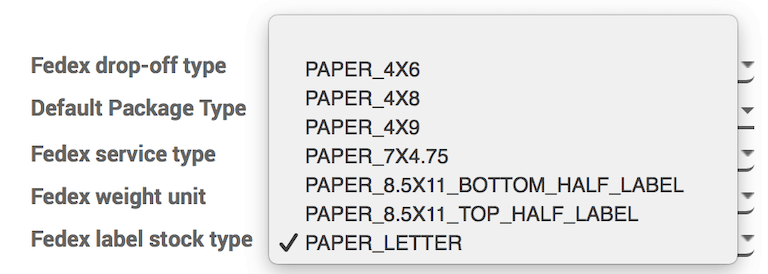

# Change shipping label size

## Overview

In Konvergo ERP, there are a variety of different types of shipping labels that
can be selected for delivery orders. Depending on the types of shipping
packages used, different label sizes may be more appropriate, and can be
configured to fit the package.

## Configuration

In the `Inventory` module, go to `Configuration --> Delivery -->
Shipping Methods.` Click on a delivery method to choose it. For the
following example, *FedEx International* will be used.

In the `Configuration` tab, under `Label Type`, choose one of the label
types available. The availability varies depending on the carrier.

When a sales order with the corresponding shipping company is confirmed
and a delivery order is validated, the shipping label will be
automatically created as a PDF and appear in the `Chatter`.

## Create a sales order

In the `Sales` application, click `Create` and select an international
customer. Click `Add A Product` and select an item. Click
`Add Shipping`, select a shipping method, then click `Get Rate`, and
finally, click `Add`.

Once the quotation is confirmed by clicking `Confirm`, a `Delivery`
smart button will appear.

Once the delivery order is validated by clicking `Validate` in the
delivery order, the shipping documents appear in the `Chatter`.

## Example labels

The default `Label Type` is `Paper Letter`. An example of a FedEx letter
sized label is:

For comparison, an example of a FedEx bottom-half label is:

