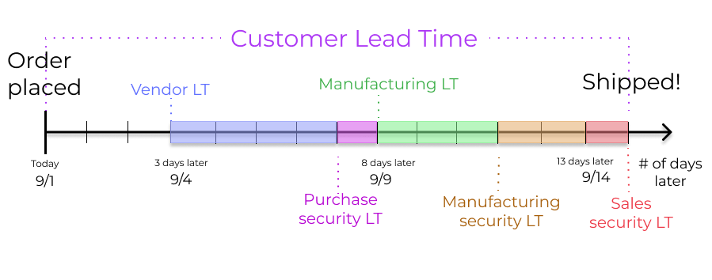
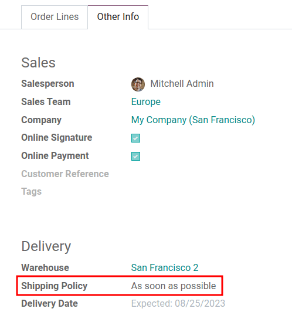

# Scheduled delivery dates

Accurately forecasting delivery dates is vital for fulfilling customer
expectations. In Konvergo ERP, the *Inventory* app allows for comprehensive lead
time configuration, allowing coordination and planning of manufacturing
orders, deliveries, and receptions.

## Lead time types

Different lead times for different operations can impact various stages
of the order fulfillment process. Here's a summary of the types of lead
times in Konvergo ERP:

- `Customer lead time <inventory/management/customer-lt>`: The default
  time frame for fulfilling customer orders. The customer lead time is
  the number of days from the date the sales order (SO) is confirmed to
  the date the products are shipped from the warehouse. This is also
  known as *delivery lead time*.
- `Sales security lead time <inventory/management/sales-security-lt>`:
  moves the *scheduled delivery date* forward by a specified number of
  days. This serves as a buffer to allow the team ample time to prepare
  the outgoing shipment earlier, considering the possibility of delays
  in the fulfillment process.
- `Purchase lead time <inventory/management/purchase-lt>`: the number of
  days from the confirmation of a purchase order (PO) to the receipt of
  products. It provides insight on the time it takes for products to
  arrive at the warehouse, facilitating effective scheduling and
  planning of supplier deliveries.
- `Purchase security lead time <inventory/management/purchase-security-lt>`:
  advances the order deadline on a `PO (Purchase Order)` by a specified
  number of days. This proactive approach of placing orders earlier
  mitigates the risk of vendor or shipping delays. Thus, for products
  that are set to replenish to order, the need appears on the
  *Replenishment report* earlier, according to the specified number of
  days.
- `Manufacturing lead time <inventory/management/manuf-lt>`: the number
  of days needed to complete a manufacturing order (MO) from the date of
  confirmation. This lead time includes weekends (non-working hours in
  Konvergo ERP), and is used to forecast an approximate production date for a
  finished good.
- `Manufacturing security lead time <inventory/management/manuf-security-lt>`:
  moves the scheduled date of the `MO (Manufacturing Order)` forward by
  a specified number of days. When used in conjunction with
  `replenish to order <inventory/management/products/strategies>`, the
  security lead time makes the need appear earlier on the replenishment
  report.

## Sales lead times

Customer lead times and sales security lead times can be configured to
automatically compute an *expected delivery date* on a
`SO (Sales Order)`. The expected delivery date ensures a realistic
*delivery dates* setting for shipments from the warehouse.

Konvergo ERP issues a warning message if the set delivery date is earlier than
the expected date, as it may not be feasible to fulfill the order by
that time, which would impact other warehouse operations.

A `SO (Sales Order)` containing a
Coconut-scented candle is confirmed on
July 11th. The product has a customer lead time of 14 days, and the
business uses a sales security lead time of 1 day. Based on the lead
time inputs, Konvergo ERP suggests a delivery date in 15 days, on July 26th.

The following sections demonstrate how to automatically compute expected
delivery dates.

### Customer lead time

Set the customer lead time on each product form, by navigating to the
products page. To do so, go to `Sales app --> Products --> Products`.
From there, select the desired product, and switch to the `Inventory`
tab. Then, under the `Customer Lead Time` field, fill in the number of
calendar days required to fulfill the delivery order from start to
finish.

Set a 14-day customer lead time for the
Coconut-scented candle by navigating to
its product form. Then, in the `Inventory` tab, type
14.00 days into the `Customer Lead
Time` field.

### Sales security lead time

*Sales security lead time* is set globally for the business in
`Inventory app -->
Configuration --> Settings`.

On the configuration page, under the `Advanced Scheduling` heading,
locate the box for `Security Lead Time for Sales`, and click the
checkbox to enable the feature.

Next, enter the desired number of calendar days. This security lead time
is a buffer notifying the team to prepare for outgoing shipments earlier
than the scheduled date.

Setting the `Security Lead Time for Sales` to
1.00 day, pushes the `Scheduled Date` of
a delivery order (DO) forward by one day. In that case, if a product is
initially scheduled for delivery on April 6th, but with a one-day
security lead time, the new scheduled date for the delivery order would
be April 5th.

### Deliver several products

For orders that include multiple products with different lead times, the
lead times can be configured directly from the quotation itself. On a
quotation, click the `Other Info` tab, and set the `Shipping Policy` to:

1.  `As soon as possible` to deliver products as soon as they are ready.
    The `Scheduled Date` of the `DO (Delivery Order)` is determined by
    adding today's date to the shortest lead time among the products in
    the order.
2.  `When all products are ready` to wait to fulfill the entire order at
    once. The `Scheduled Date` of the `DO (Delivery Order)` is
    determined by adding today's date to the longest lead time among the
    products in the order.

In a quotation containing 2 products, Yoga
mat and Resistance band, the
products have a lead time of 8 days and 5 days, respectively. Today's
date is April 2nd.

When the `Shipping Policy` is set to `As soon as possible`, the
scheduled delivery date is 5 days from today: April 7th. On the other
hand, selecting `When all
products are ready` configures the scheduled date to be 8 days from
today: April 10th.

## Purchase lead times

Automatically determining the dates on which to place orders from
suppliers can help simplify the procurement process.

Konvergo ERP calculates the supplier shipment *receipt date*, and
`PO (Purchase Order)` deadline, based on the required date the product
is needed in the warehouse. By working backwards from the receipt date,
vendor lead times and purchase security lead times are taken into
account, in order to determine the `PO (Purchase Order)` deadline.

This deadline is the date by which the order should be confirmed, in
order to ensure timely arrival by the expected receipt date.

`PO scheduling with reordering rules <inventory/management/reordering_rules>`

### Vendor lead time

To set a vendor lead time for orders arriving in the warehouse from a
vendor location, begin by navigating to a product form through
`Purchase app --> Products --> Products`.

Next, select the desired product, and switch to the `Purchase` tab. In
the editable vendor pricelist, click the `Add a line` button to add
vendor details, such as the `Vendor` name, `Price` offered for the
product, and lastly, the `Delivery Lead Time`.

> [!NOTE]
> Multiple vendors and lead times can be added to the vendor pricelist.
> The default vendor and lead time selected will be the entry at the top
> of the list.

On the vendor pricelist of the product form, the `Delivery Lead Time`
for the selected vendor is set to 10
days.

By setting the vendor lead time, the expected arrival date of the item
is automatically determined as the date of the `PO (Purchase Order)`
confirmation, plus the vendor lead time. This ensures that warehouse
employees are notified, if the products do **not** arrive within the
expected timeframe.

On a `PO (Purchase Order)` confirmed on July 11th, for a product
configured with a 10-day vendor lead time, Konvergo ERP automatically sets the
`Receipt Date` to July 21st. The receipt date also appears as the
`Scheduled Date` on the warehouse receipt form, accessible from the
`Receipt` smart button, located on the `PO (Purchase Order)`.

### Purchase security lead time

*Purchase security lead time* is set globally for the business in
`Inventory app -->
Configuration --> Settings`.

On the configuration page, under the `Advanced Scheduling` heading,
locate the box for `Security Lead Time for Purchase`, and click the
checkbox to enable the feature.

Next, enter the desired number of calendar days. By configuring the
security lead time, a buffer is set to account for potential delays in
supplier deliveries.

Setting the `Security Lead Time for Purchase` to
2.00 days, pushes the `Scheduled Date` of
receipt back by one day. In that case, if a product is initially
scheduled to arrive on April 6th, with a two-day security lead time, the
new scheduled date for the receipt would be April 8th.

## Manufacturing lead times

Lead times can help simplify the procurement process for consumable
materials and components used in manufactured products with bills of
materials.

The `MO (Manufacturing Order)` deadline, which is the deadline to begin
the manufacturing process to complete the product by the scheduled
delivery date, can be determined by configuring the manufacturing lead
times and manufacturing security lead times.

### Manufacturing lead time

Configure the manufacturing lead time directly on the product form, by
navigating to `Manufacturing app --> Products --> Products`, and select
the desired product.

In the `Inventory` tab of the product, specify the calendar days needed
to the manufacture the product in the `Manufacturing Lead Time` field.

Specify a 14-day `Manufacturing Lead Time` for a product directly in the
`Inventory` tab of the product.

Establish a `MO (Manufacturing Order)` deadline, based on the *expected
delivery date*, indicated in the `Scheduled Date` field of the
`DO (Delivery Order)`.

The `MO (Manufacturing Order)` deadline, which is the `Scheduled Date`
field on the `MO (Manufacturing Order)`, is calculated as the *expected
delivery date* subtracted by the manufacturing lead time.

This ensures the manufacturing process begins on time, in order to meet
the delivery date.

However, it's important to note that lead times are based on calendar
days. Lead times do **not** consider weekends, holidays, or *work center
capacity* (`the number of operations that can be
performed at the work center simultaneously`).

\- `Manufacturing planning <manufacturing/management/use_mps>` -
`Configure automatic MO scheduling with reordering rules
<inventory/management/reordering_rules>`

A product's scheduled shipment date on the `DO (Delivery Order)` is
August 15th. The product requires 14 days to manufacture. So, the latest
date to start the `MO
(Manufacturing Order)` to meet the commitment date is August 1st.

### Manufacturing security lead time

*Manufacturing security lead time* is set globally for the business in
`Manufacturing
app --> Configuration --> Settings`. Under the `Planning` heading,
locate the box for `Security Lead Time`, and click the checkbox to
enable the feature.

Next, enter the desired number of calendar days. By configuring the
security lead time, a buffer is set to account for potential delays in
the manufacturing process.

A product has a scheduled shipment date on the `DO (Delivery Order)` set
for August 15th. The manufacturing lead time is 7 days, and
manufacturing security lead time is 3 days. So, the `Scheduled Date` on
the `MO (Manufacturing Order)` reflects the latest date to begin the
manufacturing order. In this example, the planned date on the
`MO (Manufacturing
Order)` is August 5th.

## Global example

See the following example to understand how all the lead times work
together to ensure timely order fulfillment:

- **Sales security lead time**: 1 day
- **Manufacturing security lead time**: 2 days
- **Manufacturing lead time**: 3 days
- **Purchase security lead time**: 1 day
- **Vendor lead time**: 4 days

The customer places an order for a manufactured product on September
1st, and the scheduled delivery date from the warehouse is on September
20th. Konvergo ERP uses lead times and automated reordering rules to schedule
the necessary operations, based on the outgoing shipment delivery date,
September 20th:

- **September 1st**: Sales order created, confirmed by salesperson.
- **September 9th**: Deadline to order components to ensure they arrive
  in time when manufacturing begins (4-day supplier lead time).
- **September 13th**: Scheduled date of receipt for components.
  Initially, it was set to 9/14, but the 1-day purchase security lead
  time pushed the date earlier by 1 day.
- **September 14th**: Deadline to begin manufacturing. Calculated by
  subtracting the manufacturing lead time of 3 days, and the
  manufacturing security lead time of 2 days, from the expected delivery
  date of September 19th.
- **September 19th**: `Scheduled Date` on the delivery order form
  indicates the updated expected delivery date, which was originally set
  as September 20th. But the sales security lead time pushed the date
  forward by a day.

Konvergo ERP's replenishment planning maps a business' order fulfillment
process, setting pre-determined deadlines and raw material order dates,
including buffer days for potential delays. This ensures products are
delivered on time.
