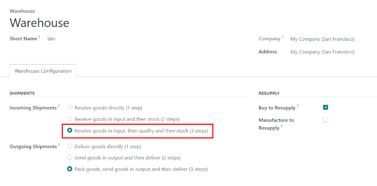
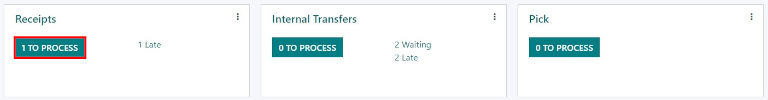
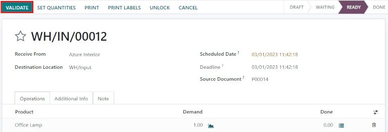

# Process receipts in three steps

Some companies require a quality control process before receiving goods
from suppliers. To accomplish this, Konvergo ERP has a three-step process for
receiving goods.

In the three-step receipt process, products are received in an input
area, then transferred to a quality area for inspection. Products that
pass the quality inspection are then transferred into stock. The
products are not available for further processing until they are
transferred out of the quality area and into stock.

## Configuration

Konvergo ERP is configured by default to `receive and deliver goods in one step
<inventory/receipts_delivery_one_step>`, so the settings need to be
changed in order to utilize three-step receipts. First, make sure the
*Multi-Step Routes* option is enabled in
`Inventory --> Configuration --> Settings --> Warehouse`. Note that
activating `Multi-Step Routes` will also activate *Storage Locations*.

Next, the warehouse needs to be configured for three-step receipts. To
do that, go to `Inventory app --> Configuration --> Warehouses`, and
select the desired warehouse to be edited. Doing so reveals the detail
form for that specific warehouse.

On that `Warehouse` detail form page, select
`Receive goods in input, then
quality and then stock (3 steps)` for `Incoming Shipments`.

Activating three-step receipts and deliveries creates two new internal
locations: *Input* (WH/Input), and *Quality Control* (WH/Quality
Control). To rename these locations, go to
`Inventory app --> Configuration --> Locations`, then click on the
desired location to change (or update) the name.

## Receive in three steps (input + quality + stock)

### Create a purchase order

To create a new `RfQ (Request for Quotation)`, navigate to
`Purchase app -->
New`, which reveals a blank `RfQ (Request for Quotation)` form page. On
this page, select a `Vendor`, add a storable `Product`, and click
`Confirm Order`.

A `Receipt` smart button will appear in the top right, and the receipt
will be associated with the purchase order. Clicking on the `Receipt`
smart button will show the receipt order.

### Process a receipt

One receipt and two internal transfers (one transfer to quality, and a
subsequent transfer to stock) will be created once the purchase order is
confirmed. To view these transfers, go to
`Inventory --> Operations --> Transfers`.

The status of the receipt transferring the product to the input location
will be `Ready`, since the receipt must be processed before any other
operation can occur. The status of the two internal transfers will be
`Waiting Another Operation`, since the transfers cannot be processed
until the linked step before each transfer is completed.

The status of the first internal transfer to *quality* will only change
to `Ready` when the receipt has been marked `Done`. The status for the
second internal transfer to *stock* will be marked `Ready` only after
the transfer to quality has been marked `Done`.

The receipt can also be found in the `Inventory` application. In the
`Overview` dashboard, click the `1 To Process` smart button in the
`Receipts` kanban card.

Click on the receipt associated with the purchase order, then click
`Validate` to complete the receipt and move the product to the
`Input Location`.

### Process a transfer to Quality Control

Once the product is in the `Input Location`, the internal transfer is
ready to move the product to `Quality Control`. In the `Inventory`
`Overview` dashboard, click the `1 To Process` smart button in the
`Internal Transfers` kanban card.

Click on the `Transfer` associated with the purchase order, then click
`Validate` to complete the transfer and move the product to the `Quality
Control` location. Once the transfer is validated, the product is ready
for the quality inspection, but is not available for manufacturing or
delivery orders.

## Process a transfer to stock

Once the product is in the `Quality Control` location, the final
internal transfer is ready to move the product to `Stock`. In the
`Inventory` overview dashboard, click the `1 To Process` smart button in
the `Internal Transfers` Kanban card.

Click on the final `Transfer` associated with the purchase order, then
click `Validate` to complete the transfer and move the product to stock.
Once the transfer is validated, the product enters the stock and is
available for customer deliveries or manufacturing orders.
