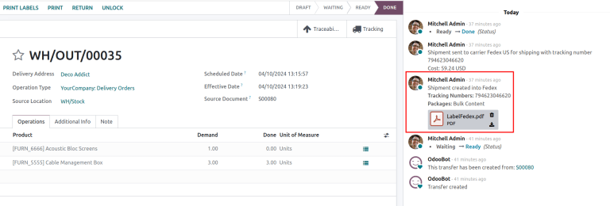

# Print shipping labels

Integrate Odoo with `third-party shipping carriers
<../setup_configuration/third_party_shipper>` to automatically generate
shipping labels that includes prices, destination addresses, tracking
numbers, and barcodes.

## Configuration

To generate labels for a third-party shipping carrier, first
`install the third-party shipping
connector <../setup_configuration/third_party_shipper>`. Then, configure
and activate the
`delivery method <inventory/shipping_receiving/configure-delivery-method>`,
being sure to set the `Integration Level` to
`Get Rate and Create Shipment` to generate shipping labels. Finally,
provide the company's `source address
<inventory/shipping_receiving/configure-source-address>` and
`product weights
<inventory/shipping_receiving/configure-weight>`.

`../setup_configuration/third_party_shipper`

## Print tracking labels

Tracking labels are generated after the delivery order (DO) is
validated.

When both the *Sales* and *Inventory* apps are installed, begin on the
`Sales app`, and proceed to the desired quotation to
`add the shipping cost
<inventory/shipping_receiving/add-shipping-quote>`, confirm the sales
order, and validate the `DO (Delivery Order)`.

If only the *Inventory* app is installed, create `DOs (Delivery Orders)`
directly in the `Inventory` app , `add the third-party carrier
<inventory/shipping_receiving/validate-print-label>` in the `Carrier`
field, and validate the `DO (Delivery Order)`.

### Add shipping on quotation

To generate a tracking label for an order, begin by creating a quotation
in `Sales
app --> Orders --> Quotations`, clicking `New`, and filling out the
quotation form. Then, click the `Add Shipping` button in the
bottom-right corner of the quotation.

In the resulting pop-up window, select the intended carrier from the
`Shipping Method` drop-down menu. Clicking `Get Rate` displays the
shipping cost for the customer, via the third-party carrier in the
`Cost` field.

> [!IMPORTANT]
> If clicking `Get Rate` results in an error, ensure the
> `warehouse's address
> <inventory/shipping_receiving/configure-source-address>` and
> `weight of products in the
> order <inventory/shipping_receiving/configure-weight>` are properly
> configured.

Click `Add` to add the cost to the quotation, which is listed as the
`configured
delivery product <inventory/shipping_receiving/delivery-product>`.
Finally, click `Confirm` on the quotation, and click the `Delivery`
smart button to access the `DO (Delivery Order)`.

> [!TIP]
> For users who do not have the *Sales* app installed, the shipping
> carrier is specified in a delivery order's `Carrier` field of the
> `Additional Info` tab.
>
>  alt="Show the &quot;Additional Info&quot; tab of a delivery order." />

### Validate delivery order

On a delivery order form, navigate to the `Additional Info` tab to
ensure the third-party shipping carrier has been added to the `Carrier`
field.

> [!IMPORTANT]
> If the *Sales* app is not installed, the third-party carrier is set in
> the `Carrier` field.

After the items in the order have been packed, click `Validate` to get
the shipping carrier's tracking number, and generate the shipping label.

> [!NOTE]
> Create or select an existing delivery order by going to the
> `Inventory` app, and selecting the `Delivery Orders` card.

The `Tracking Reference` number is generated in the `Additional Info`
tab of the delivery order. Click the `Tracking` smart button to access
the tracking link from the shipping carrier's website.

The tracking label is found in PDF format in the chatter.

> [!NOTE]
> For multi-package shipping, one label is generated per package. Each
> label appears in the chatter.

<figure>

<figcaption>Sample label generated from Odoo's shipping connector with
FedEx.</figcaption>
</figure>

\- `../advanced_operations_shipping/invoicing` -
`../advanced_operations_shipping/multipack`

