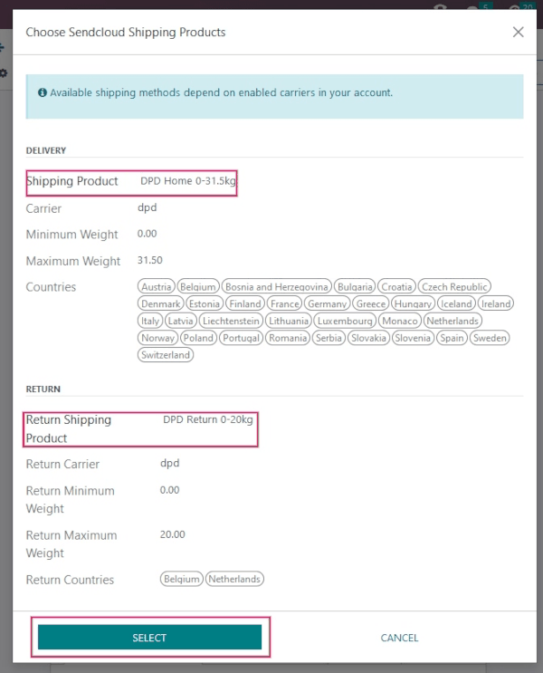
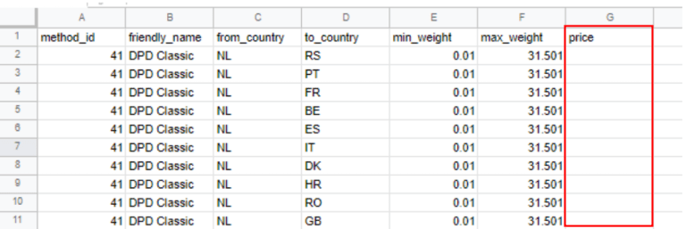

# Sendcloud configuration

Sendcloud is a shipping service aggregator that facilitates the
integration of European shipping carriers with Odoo. Once integrated,
users can select shipping carriers on inventory operations in their Odoo
database.

[Sendcloud integration documentation
\<https://support.sendcloud.com/hc/en-us/articles
/360059470491-Odoo-integration\>]()

## Setup in Sendcloud

### Create an account and activate carriers

To get started, go to [Sendcloud's platform](https://www.sendcloud.com)
to configure the account and generate the connector credentials. Log in
with the Sendcloud account, or create a new one if needed.

> [!NOTE]
> For new account creation, Sendcloud will ask for a
> `VAT (Value-Added Tax Identification)` number or
> `EORI (Economic Operators' Registration and Identification)` number.
> After completing the account setup, activate (or deactivate) the
> shipping carriers that will be used in the Odoo database.

> [!IMPORTANT]
> Odoo integration of Sendcloud works on free Sendcloud plans *only* if
> a bank account is linked, since Sendcloud won't ship for free. To use
> shipping rules, or individual custom carrier contacts, a paid plan of
> Sendcloud is **required**.

### Warehouse configuration

Once logged into the Sendcloud account, navigate to
`Settings --> Shipping -->
Addresses`, and fill in the field for `Warehouse address`.

To allow Sendcloud to process returns as well, a `Return Address` is
required. Under the `Miscellaneous section`, there is a field called
`Address Name (optional)`. The Odoo warehouse name should be entered
here, and the characters should be exactly the same.

**SendClould configuration**  
`Miscellaneous`  
`Address Name (optional)`: Warehouse
\#1  
`Brand`: Default

**Odoo warehouse configuration**  
`Warehouse`: Warehouse \#1  
`Short Name`: WH  
`Company`: My company (San Francisco)  
`Address`: My Company (San Francisco)

Notice how the inputs for the `Warehouse` field, for both the Odoo
configuration and the Sendcloud configuration, are the exact same.

### Generate Sendcloud credentials

In the Sendcloud account, navigate to `Settings --> Integrations` in the
menu on the right. Next, search for `Odoo Native`. Then, click on
`Connect`.

After clicking on `Connect`, the page redirects to the `Sendcloud API`
settings page, where the `Public and Secret Keys` are produced. The next
step is to name the `Integration`. The naming convention is as follows:
Odoo CompanyName, with the user's company
name replacing CompanyName (e.g.
Odoo StealthyWood).

Then, check the box next to `Service Points` and select the shipping
services for this integration. After saving, the
`Public and Secret Keys` are generated.

## Setup in Odoo

To ensure seamless Sendcloud integration with Odoo, `install
<inventory/shipping_receiving/sendcloud-module>` and `link
<inventory/shipping_receiving/link-sendcloud-module>` the Sendcloud
shipping connector to the Sendcloud account. Then,
`configure Odoo fields
<inventory/shipping_receiving/sendcloud-shipping-info>`, so Sendcloud
can accurately pull shipping data to generate labels.

### Install Sendcloud shipping module

After the Sendcloud account is set up and configured, it's time to
configure the Odoo database. To get started, go to Odoo's `Apps` module,
search for the Sendcloud Shipping
integration, and install it.

### Sendcloud shipping connector configuration

Once installed, activate the `Sendcloud Shipping` module in
`Inventory -->
Configuration --> Settings`. The `Sendcloud Connector` setting is found
under the `Shipping Connectors` section.

After activating the `Sendcloud Connector`, click on the
`Sendcloud Shipping
Methods` link below the listed connector. Once on the `Shipping Methods`
page, click `Create`.

> [!TIP]
> `Shipping Methods` can also be accessed by going to `Inventory -->
> Configuration --> Delivery --> Shipping Methods`.

Fill out the following fields in the `New Shipping Method` form:

- `Shipping Method`: type Sendcloud DPD.
- `Provider`: select `Sendcloud` from the drop-down menu.
- `Delivery Product`: set the product that was configured for this
  shipping method or create a new product.
- In the `SendCloud Configuration` tab, enter the
  `Sendcloud Public Key`.
- In the `SendCloud Configuration` tab, enter the
  `Sendcloud Secret Key`.
- Manually `Save` the form by clicking the cloud icon next to the
  `Shipping
  Methods / New` breadcrumbs.

After configuring and saving the form, follow these steps to load the
shipping products:

- In the `SendCloud Configuration` tab of the `New Shipping Method`
  form, click on the `Load your SendCloud shipping products` link.
- Select the shipping products the company would like to use for
  deliveries and returns.
- Click `Select`.

Sample Sendcloud shipping products configured in Odoo:

`DELIVERY`  
`Shipping Product`: DPD Home 0-31.5kg  
`Carrier`: DPD  
`Minimum Weight`: 0.00  
`Maximum Weight`: 31.50

`Countries`: Austria
Belgium
Bosnia
Herzegovina
Bulgaria
Croatia
Czech
Republic
Denmark
Estonia
Finland
France
Germany
Greece
Hungary
Iceland
Ireland
Italy
Latvia
Liechtenstein
Lithuania
Luxembourg
Monaco
Netherlands
Norway
Poland
Portugal
Romania
Serbia
Slovakia
Slovenia
Spain
Sweden
Switzerland

`RETURN`  
`Return Shipping Product`: DPD Return
0-20kg  
`Return Carrier`: DPD  
`Return Minimum Weight`: 0.00  
`Return Maximum Weight`: 20.00  
`Return Countries`: Belgium
Netherlands

> [!TIP]
> Sendcloud does not provide test keys when a company tests the sending
> of a package in Odoo. This means if a package is created, the
> configured Sendcloud account will be charged, unless the associated
> package is canceled within 24 hours of creation.
>
> Odoo has a built-in layer of protection against unwanted charges when
> using test environments. Within a test environment, if a shipping
> method is used to create labels, then those labels are immediately
> canceled after the creation — this occurs automatically. The test and
> production environment settings can be toggled back and forth from
> their respective smart buttons.

### Shipping information

To use Sendcloud to generate shipping labels, the following information
**must** be filled out accurately and completely in Odoo:

1.  **Customer information**: when creating a quotation, ensure the
    selected `Customer` has a valid phone number, email address, and
    shipping address.

    To verify, select the `Customer` field to open their contact page.
    Here, add their shipping address in the `Contact` field, along with
    their `Mobile` number and `Email` address.

2.  **Product weight**: ensure all products in an order have a specified
    `Weight` in the `Inventory` tab of their product form. Refer to the
    `Product weight section
    <inventory/shipping_receiving/configure-weight>` of this article for
    detailed instructions.

3.  **Warehouse address**: ensure the warehouse name and address in Odoo
    match the `previously
    defined warehouse <inventory/shipping_receiving/sendcloud-warehouse-config>`
    in the Sendcloud setup. For details on warehouse configuration in
    Odoo, refer to the `warehouse configuration
    section <inventory/shipping_receiving/configure-source-address>` of
    the third-party shipping documentation.

## Generate labels with Sendcloud

When creating a quotation in Odoo, add shipping and a
`Sendcloud shipping product`. Then, `Validate` the delivery. Shipping
label documents are automatically generated in the chatter, which
include the following:

1.  `Shipping label(s)` depending on the number of packages.
2.  `Return label(s)` if the Sendcloud connector is configured for
    returns.
3.  `Customs document(s)` should the destination country require them.

Additionally, the tracking number is now available.

> [!IMPORTANT]
> When return labels are created, Sendcloud will automatically charge
> the configured Sendcloud account.

## FAQ

### Shipment is too heavy

If the shipment is too heavy for the Sendcloud service that is
configured, then the weight is split to simulate multiple packages.
Products will need to be put in different `Packages` to `Validate` the
transfer and generate labels.

`Rules` can also be set up in Sendcloud to use other shipping methods
when the weight is too heavy. However, note that these rules will not
apply to the shipping price calculation on the calculation on the sales
order.

### Personal carrier contract

Use custom prices from a direct carrier contract, via CSV upload, by
first logging into Sendcloud, navigating to
`Settings --> Carriers --> My contracts`, and then selecting the
intended contract.

Under the `Contract prices` section, click `Download CSV` and fill out
the contract prices in the `price` column of the CSV file template.

> [!WARNING]
> Ensure the CSV file includes the correct prices to avoid any
> inaccuracies.

`Upload` the completed CSV file to Sendcloud, then click
`Save these prices`.

[Sendcloud: How to upload contract prices with
carriers](https://support.sendcloud.com/hc/en-us/articles/5163547066004)

### Measuring volumetric weight

Many carriers have several measures for weight. There is the actual
weight of the products in the parcel, and there is the *volumetric
weight* (`Volumetric weight is the volume that a package
occupies when in transit. In other words it is the physical size of a package`).

> [!TIP]
> Check to see if selected carrier(s) already have defined formulas to
> compute the volumetric weight.

[Sendcloud: How to calculate & automate parcel volumetric weight
\<https://support.sendcloud.com/
hc/en-us/articles/360059644051-How-to-calculate-automate-parcel-volumetric-weight\>]()

### Unable to calculate shipping rate

First, verify that the product being shipped has a weight that is
supported by the selected shipping method. If this is set, then verify
that the destination country (from the customer address) is supported by
the carrier. The country of origin (warehouse address) should also be
supported by the carrier.
