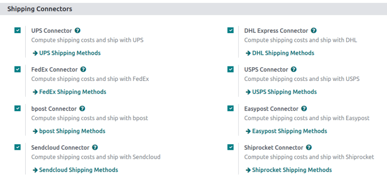
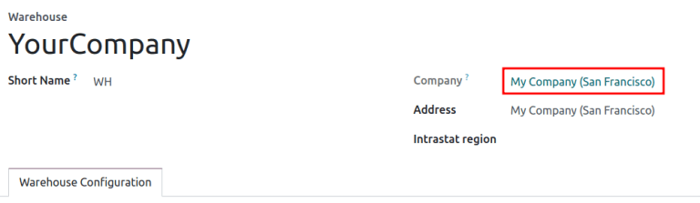
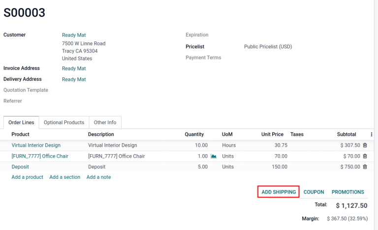

# Third-party shipping carriers

Users can link third-party shipping carriers to Konvergo ERP databases, in order
to verify carriers' delivery to specific addresses,
`automatically calculate shipping costs <delivery_method>`, and
`generate shipping labels <labels>`.

In Konvergo ERP, shipping carriers can be applied to a sales order (SO),
invoice, or delivery order. For tips on resolving common issues when
configuring shipping connectors, skip to the
`Troubleshooting <inventory/shipping_receiving/third-party-troubles>`
section.

\- `dhl_credentials` - `sendcloud_shipping` - `ups_credentials`

The following is a list of available shipping connectors in Konvergo ERP:

| Carrier                          | Region availability      |
|----------------------------------|--------------------------|
| FedEx                            | All                      |
| `DHL <dhl_credentials>`          | All                      |
| `UPS <ups_credentials>`          | All                      |
| US Postal Service                | United States of America |
| `Sendcloud <sendcloud_shipping>` | EU                       |
| Bpost                            | Belgium                  |
| Easypost                         | North America            |
| Shiprocket                       | India                    |

## Configuration

To ensure proper setup of a third-party shipping carrier with Konvergo ERP,
follow these steps:

1.  `Install the shipping connector <inventory/shipping_receiving/shipping-connector>`.
2.  `Set up delivery method <inventory/shipping_receiving/configure-delivery-method>`.
3.  `Activate production environment <inventory/shipping_receiving/production-env>`.
4.  `Configure warehouse <inventory/shipping_receiving/configure-source-address>`.
5.  `Specify weight of products <inventory/shipping_receiving/configure-weight>`.

### Install shipping connector

To install shipping connectors, go to
`Inventory app --> Configuration --> Settings`.

Under the `Shipping Connectors` section, tick the third-party shipping
carrier's checkbox to install it. Multiple third-party shipping
connectors can be selected at once. Then, click `Save`.

> [!NOTE]
> `Delivery methods <delivery_method>` can also be integrated with
> operations in the *Sales*, *eCommerce*, and *Website* apps. To
> install, refer to the `install apps and modules
> <general/install>` documentation.

### Delivery method

To configure the API credentials, and activate the shipping carrier,
begin by going to
`Inventory app --> Configuration --> Shipping Methods`, and select the
desired delivery method.

> [!NOTE]
> The list often includes **two** delivery methods from the same
> `Provider`: one for international shipping and one for domestic
> shipping.
>
> Additional delivery methods can be created for specific purposes, such
> as `packaging
> <../../product_management/product_tracking/packaging>`.

`Configure delivery methods <delivery_method>`

> [!NOTE]
> Ensure the delivery method is published when it should be available on
> the *Website* app. To publish a delivery method on the website, click
> the desired delivery method, then click the `Unpublished` smart
> button. Doing so changes that smart button to read: `Published`.

The `Shipping Method` page contains details about the provider,
including:

- `Shipping Method` (*Required field*): the name of the delivery method
  (e.g. FedEx US,
  FedEx EU, etc.).

- `Website`: configure shipping methods for an *eCommerce* page that is
  connected to a specific website in the database. Select the applicable
  website from the drop-down menu, or leave it blank to apply the method
  to all web pages.

- `Provider` (*Required field*): choose the third-party delivery
  service, like FedEx. Upon choosing a provider, the
  `Integration Level`, `Invoicing Policy` and `Insurance Percentage`
  fields become available.

- `Integration Level`: choose `Get Rate` to simply get an `estimated
  shipment cost <inventory/shipping_receiving/third-party-so>` on an
  `SO (Sales Order)` or invoice.

  > [!IMPORTANT]
  > Select `Get Rate and Create Shipment` to also
  > `generate shipping labels
  > <labels>`.

- `Company`: if the shipping method should apply to a specific company,
  select it from the drop-down menu. Leave the field blank to apply the
  method to all companies.

- `Delivery Product` (*Required field*): the delivery charge name that
  is added to the `SO (Sales Order)` or invoice.

- `Invoicing Policy`: select and calculate an `Estimated cost` of
  shipping directly from the shipping carrier. If the `Real cost` of
  shipping is wanted instead, refer to this
  `doc about invoicing real shipping costs
  <../advanced_operations_shipping/invoicing>`.

- `Margin on Rate`: specify an additional percentage amount added to the
  base shipping rate to cover extra costs, such as handling fees,
  packaging materials, exchange rates, etc.

- `Free if order amount is above`: enables free shipping for orders
  surpassing a specified amount entered in the corresponding `Amount`
  field.

- `Insurance Percentage`: specify a percentage amount of the shipping
  costs reimbursed to the senders if the package is lost or stolen in
  transit.

<figure>

<figcaption><strong>Shipping Method</strong> configuration page for
FedEx US.</figcaption>
</figure>

In the `Configuration` tab, fill out the API credential fields (e.g. API
key, password, account number, etc.). Depending on the third-party
shipping carrier chosen in the `Provider` field, the `Configuration` tab
will contain different required fields. For more details about
configuring specific carriers' credentials, refer to the following
documents:

\- `DHL credentials <dhl_credentials>` -
`Sendcloud credentials <sendcloud_shipping>` -
`UPS credentials <ups_credentials>`

### Production environment

With the delivery method details configured, click the
`Test Environment` smart button to set it to `Production Environment`.

> [!WARNING]
> Setting the delivery method to `Production` creates **real** shipping
> labels, and users are at risk of being charged through their carrier
> account (e.g. UPS, FedEx, etc.) **before** users charge customers for
> shipping. Verify all configurations are correct before launching the
> delivery method to `Production`.

### Warehouse configuration

Ensure the warehouse's `Address` (including ZIP code) and `Phone` number
are entered accurately. To do that, go to
`Inventory app --> Configuration -->
Warehouses`, and select the desired warehouse.

On the warehouse configuration page, open the warehouse contact page by
clicking the `Company` field.

Verify that the `Address` and `Phone` number are correct, as they are
required for the shipping connector to work properly.

### Product weight

For the carrier integration to work properly, specify the weight of
products by going to `Inventory app --> Products --> Products`, and
selecting the desired product.

Then, switch to the `Inventory` tab, and define the `Weight` of the
product in the `Logistics` section.

## Apply third-party shipping carrier

Shipping carriers can be applied on a `SO (Sales Order)`, invoice, or
delivery order.

After configuring the third-party carrier's `delivery method
<inventory/shipping_receiving/configure-delivery-method>` in Konvergo ERP,
create or navigate to a quotation by going to
`Sales app --> Orders --> Quotations`.

### Sales order

To assign a third-party shipping carrier, and get an estimated cost of
shipping, begin by going to `Sales app --> Orders --> Quotations`.
Create or select an existing quotation, and add the cost of shipping
through a third-party carrier to a quotation, by clicking the
`Add Shipping` button in the bottom-right corner of the `Order Lines`
tab.

In the resulting `Add a shipping method` pop-up window, select the
intended carrier from the `Shipping Method` drop-down menu. The `Cost`
field is automatically filled based on:

- the amount specified in the `Total Order Weight` field (if it is not
  provided, the sum of
  `product weights <inventory/shipping_receiving/configure-weight>` in
  the order is used)
- the distance between the warehouse's `source address
  <inventory/shipping_receiving/configure-source-address>` and the
  customer's address.

After selecting a third-party provider in the `Shipping Method` field,
click `Get Rate` in the `Add a shipping method` pop-up window to get the
estimated cost through the shipping connector. Then, click the `Add`
button to add the delivery charge to the `SO (Sales Order)` or invoice.

`Charge customers for shipping after product delivery
<../advanced_operations_shipping/invoicing>`

### Delivery order

For users making shipments without installing the *Sales* app, assign
the shipping carrier to the delivery order, by first going to the
`Inventory` app. Then, from the `Inventory Overview` dashboard, select
the `Delivery Orders` operation type, and choose the desired delivery
order that is not already marked as `Done` or `Cancelled`.

In the `Additional info` tab, set the `Carrier` field to the desired
third-party shipping carrier. When the delivery method is set to
`production mode
<inventory/shipping_receiving/configure-delivery-method>`, a
`Tracking Reference` is provided.

`Generate shipping labels <labels>`

## Troubleshooting

Since shipping connectors can sometimes be complex to set up, here are
some checks to try when things are not working as expected:

1.  Ensure the
    `warehouse information <inventory/shipping_receiving/configure-source-address>`
    (e.g., address and phone number) in Konvergo ERP is correct **and** matches
    the records saved in the shipping provider's website.

2.  Verify that the
    `package type <inventory/warehouses_storage/package-type>` and
    parameters are valid for the shipping carrier. To check, ensure the
    shipment can be directly created on the shipping carrier's website.

3.  When encountering a price mismatch between Konvergo ERP's estimated cost and
    the provider's charge, first ensure the delivery method is set to
    `production environment
    <inventory/shipping_receiving/production-env>`.

    Then, create the shipment in both the carrier's website and Konvergo ERP,
    and verify the prices are the same across Konvergo ERP, the shipping
    provider, and in the *debug logs*.

    

    When checking for a price mismatch in the debug logs, if the request
    says the package weighs six kilograms, but the response from FedEx
    says the package weights seven kilograms, it concludes that the
    issue is on FedEx's side.

    

### Debug log

Track shipping data inconsistencies by activating debug logging. To do
that, go to the delivery method's configuration page
(`Inventory app --> Configuration --> Shipping
Method`), and select the desired shipping method. Click the
`No Debugging` smart button to activate `Debug Requests`.

With `Debug Requests` activated, each time the shipping connector is
used to estimate the cost of shipping, records are saved in the
`Logging` report. To access the report, turn on
`developer mode <developer-mode>`, and go to
`Settings app --> Technical -->
Database Structure section --> Logging`.

> [!NOTE]
> Logs are created for a shipping method each time the `Get Rate
> <inventory/shipping_receiving/third-party-rate>` button is clicked on
> `SOs (Sales Orders)` and invoices, **and** when a customer adds the
> shipping carrier to their order through the *Website* app.

Click the *HTTP request* line item to open a detailed page, and verify
the correct information is sent from Konvergo ERP to the shipping carrier. In
the *HTTP response*, verify that the same information is received.

