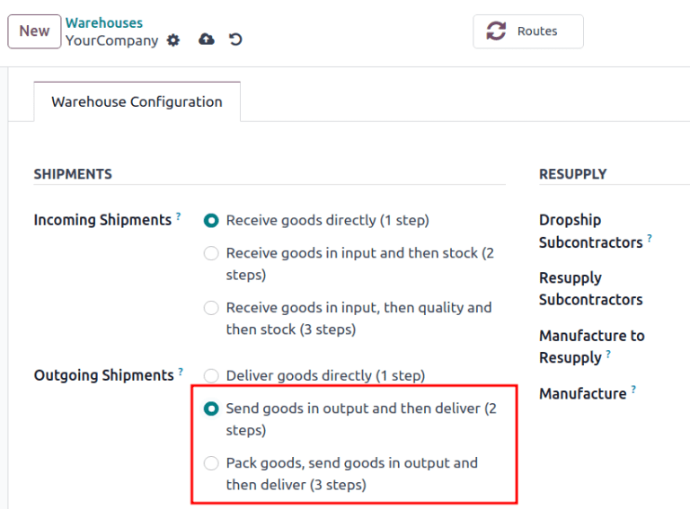
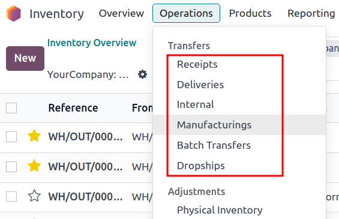
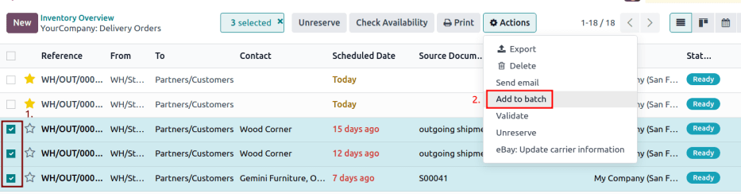
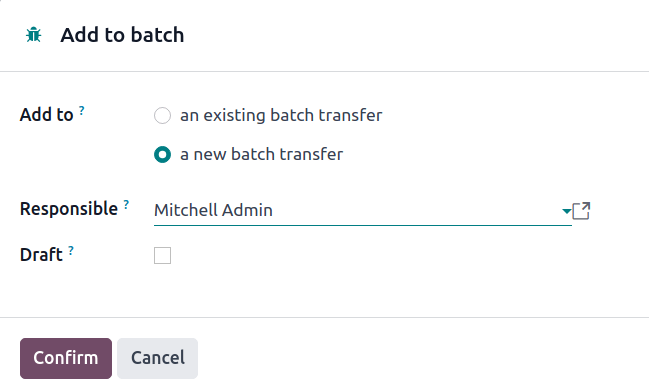

# Batch picking

*Batch picking* enables a single picker to handle multiple orders at
once, reducing the time needed to navigate to the same location in a
warehouse.

When picking in batches, orders are grouped and consolidated into a
picking list. After the picking, the batch is taken to an output
location, where the products are sorted into their respective delivery
packages.

`Use Barcode app for pickings <inventory/management/barcode_picking>`

Since orders *must* be sorted at the output location after being picked,
this picking method suits businesses with a few products that are
ordered often. Storing high-demand items in easily accessible locations
can increase the number of orders that are fulfilled efficiently.

## Configuration

To activate the batch picking option, begin by going to
`Inventory app -->
Configuration --> Settings`. Under the `Operations` section, check the
`Batch
Transfers` box.

Since batch picking is a method to optimize the *pick* operation in
Konvergo ERP, the `Storage
Locations` and `Multi-Step Routes` options under the `Warehouse` heading
must also be checked on this settings page. When finished, click `Save`.

Lastly, enable the warehouse picking feature, by navigating to the
warehouse settings page, which is accessible from
`Inventory app --> Configuration --> Warehouses`.

From here, select the desired warehouse from the list. Then, from the
radio options available for `Outgoing Shipments`, select either the
`Send goods in output and then deliver
(2 steps)` or
`Pack goods, send goods in output and then deliver (3 steps)`.

\- `Delivery in two steps <inventory/receipts_delivery_two_steps>` -
`Delivery in three steps <inventory/delivery_three_steps>`

## Create batch transfers

Manually create batch transfers directly from the
`Inventory app --> Operations -->
Batch Transfers` page. Click the `New` button to begin creating a batch
transfer.

On the batch transfer form, fill the following fields out accordingly:

- `Responsible`: employee assigned to the picking. Leave this field
  blank if *any* worker can fulfill this picking.
- `Operation Type`: from the drop-down menu, select the operation type
  under which the picking is categorized.
- `Scheduled Date`: specifies the date by which the `Responsible` person
  should complete the transfer to the output location.

Next, in the `Transfers` list, click `Add a line` to open the `Add:
Transfers` window.

If the `Operation Type` field was filled, the list will filter transfer
records matching the selected `Operation Type`.

Click the `New` button to create a new transfer.

Once the transfer records are selected, click `Confirm` to confirm the
batch picking.

A new batch transfer assigned to the `Responsible`,
Joel Willis, for the
Pick `Operation Type`. The
`Scheduled Date` is set to August 11.

Clicking the `Add a line` button opens the `Add:Transfers` window,
displaying only pickings. This is because the `Operation Type` was set
to Pick on the batch transfer form.

Click the checkbox to the left of the transfers,
WH/PICK/00001 and
WH/PICK/00002, to include them in the new
transfer. Then, click the `Select` button to close the `Add:Transfers`
window.

### Add batch from transfers list

Another method of creating batch transfers is available using the
`Add to batch` option in a list. Navigate to the
`Inventory app --> Operations` drop-down menu, and select any of the
`Transfers` to open a filtered list of transfers.

On the transfers list, select the checkbox to the left of the selected
transfers to add in a batch. Next, navigate to the `Actions ⚙️ (gear)`
button, and click `Add to batch` from the resulting drop-down menu.

Doing so opens an `Add to batch` pop-up window, wherein the employee
`Responsible` for the picking can be assigned.

Choose from the two radio options to add to `an existing batch transfer`
or create `a new batch transfer`.

To begin with a draft, select the `Draft` checkbox.

Conclude the process by clicking `Confirm`.

## Process batch transfer

Handle batch transfers in the
`Inventory app --> Operations --> Batch Transfers` page.

From here, select the intended transfer from the list. Then, on the
batch transfer form, input the `Done` quantities for each product, under
the `Detailed Operations` tab. Finally, select `Validate` to complete
the picking.

> [!TIP]
> Be certain the batch transfer is complete when the `Validate` button
> is highlighted in purple. If the `Check Availability` button is
> highlighted instead, that means there are items in the batch that are
> currently *not* available in-stock.

In a batch transfer involving products from pickings,
WH/PICK/00001 and
WH/PICK/00002, the `Detailed Operations`
tab shows that the product, Cabinet with
Doors, has been picked because the `Done` column matches the
value in the `Reserved` column. However,
0.00 quantities have been picked for the
other product, Cable Management Box.

Only in-stock products are visible in the `Detailed Operations` tab.

To view the complete product list, switch to the `Operations` tab. On
this list, the `Demand` column indicates the required quantity for the
order. The `Reserved` column shows the available stock to fulfill the
order. Lastly, the `Done` column specifies the products that have been
picked, and are ready for the next step.

The product, Desk Pad, from the same
batch as the `example above
<inventory/management/batch-transfers-example>`, is only visible in the
`Operations` tab because there are no `Reserved` quantities in-stock to
fulfill the batch picking.

Click the `Check Availability` button to search the stock again for
available products.

### Create backorder

On the batch transfer form, if the `Done` quantity of the product is
*less* than the `Reserved` quantity, a pop-up window appears.

This pop-up window provides the option: `Create Backorder?`.

Clicking the `Create Backorder` button automatically creates a new batch
transfer, containing the remaining products.

Click `No Backorder` to finish the picking *without* creating another
batch picking.

Click `Discard` to cancel the validation, and return to the batch
transfer form.

## Process batch transfer: Barcode app

Created batch transfers are also listed in the `Barcode` app, accessible
by selecting the `Batch Transfers` button.

By default, confirmed batch pickings appear on the `Batch Transfers`
page. On that page, click on the desired batch transfer to open the
detailed list of products for the picking.

For the chosen batch transfer, follow the instructions at the top of the
page in the black background. Begin by scanning the product's barcode to
record a single product for picking. To record multiple quantities,
click the `✏️ (pencil)` icon, and enter the required quantities for the
picking.

> [!NOTE]
> Products from the same order are labeled with the same color on the
> left. Completed pickings are highlighted in green.

In a batch transfer for 2 Cabinet with
Doors, 3 Acoustic Bloc Screens,
and 4 Four Person Desks, the
3/3 and
4/4 `Units` indicate that the last two
product pickings are complete.

1/2 units of the
Cabinet with Doors has already been
picked, and after scanning the product barcode for the second cabinet,
Konvergo ERP prompts the user to Scan a serial
number to record the unique serial number for
`product tracking <inventory/serial_numbers/configure>`.

Once all the products have been picked, click on `Validate` to mark the
batch transfer as `Done`.
