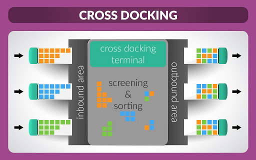
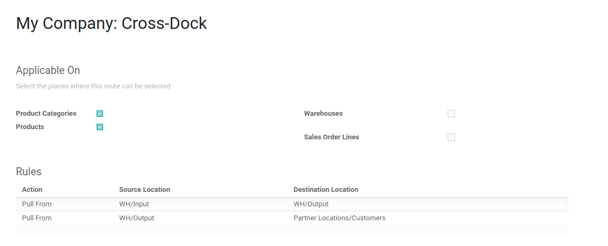
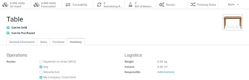
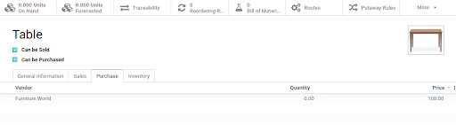
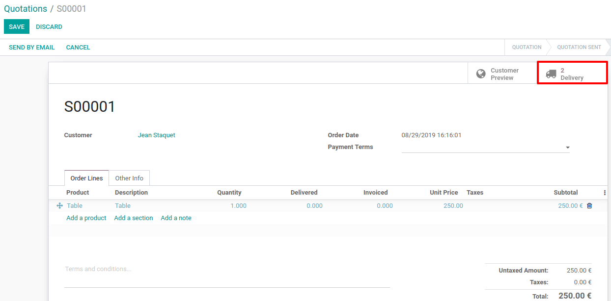
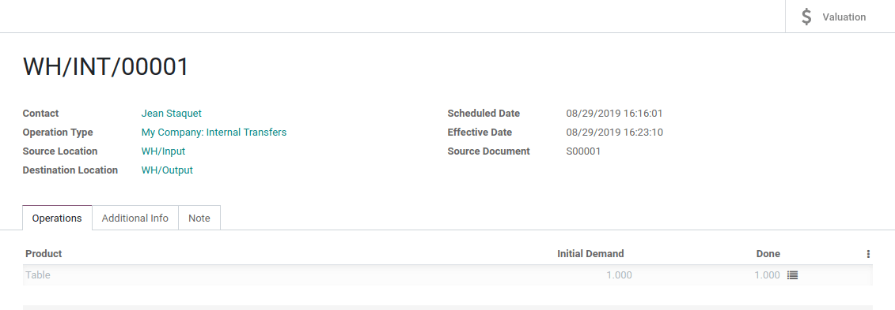
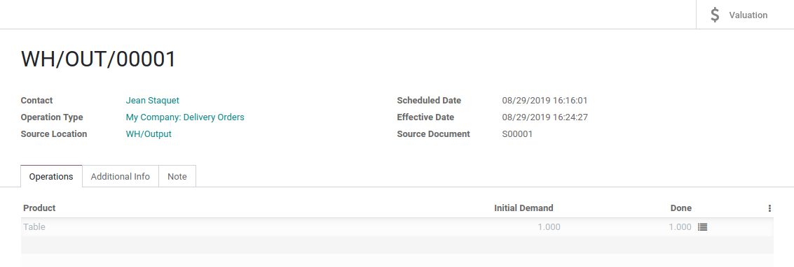

# Organize a cross-dock in a warehouse

Cross-docking is the process of sending products that are received
directly to the customers, without making them enter the stock. The
trucks are simply unloaded in a *Cross-Dock* area in order to reorganize
products and load another truck.

> [!NOTE]
> For more information on how to organize your warehouse, read our blog:
> [What is cross-docking and is it for
> me?](https://www.odoo.com/blog/business-hacks-1/post/what-is-cross-docking-and-is-it-for-me-270)

## Configuration

In the *Inventory* app, open `Configuration --> Settings` and activate
the *Multi-Step Routes*.

> [!NOTE]
> Doing so will also enable the *Storage Locations* feature.

Now, both *Incoming* and *Outgoing* shipments should be configured to
work with 2 steps. To adapt the configuration, go to
`Inventory --> Configuration --> Warehouses` and edit your warehouse.

This modification will lead to the creation of a *Cross-Docking* route
that can be found in `Inventory --> Configuration --> Routes`.

## Configure products with Cross-Dock Route

Create the product that uses the *Cross-Dock Route* and then, in the
inventory tab, select the routes *Buy* and *Cross-Dock*. Now, in the
purchase tab, specify the vendor to who you buy the product and set a
price for it.

Once done, create a sale order for the product and confirm it. Odoo will
automatically create two transfers which will be linked to the sale
order. The first one is the transfer from the *Input Location* to the
*Output Location*, corresponding to the move of the product in the
*Cross-Dock* area. The second one is the delivery order from the *Output
Location* to your *Customer Location. Both are in state*Waiting Another
Operation\* because we still need to order the product to our supplier.

Now, go to the *Purchase* app. There, you will find the purchase order
that has been automatically triggered by the system. Validate it and
receive the products in the *Input Location*.

When the products have been received from the supplier, you can go back
to your initial sale order and validate the internal transfer from
*Input* to *Output*.

The delivery order is now ready to be processed and can be validated
too.

