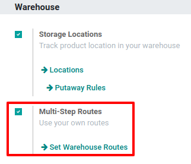

# Putaway rules

Putaway is the process of routing products to appropriate storage
locations upon shipment arrival.

Konvergo ERP can accomplish this seamlessly using *putaway rules*, which dictate
how products move through specified warehouse locations.

Upon shipment arrival, operations are generated based on putaway rules
to efficiently move products to specified locations, and ensure easy
retrieval for future delivery orders.

In warehouses that process specific kinds of products, putaway rules can
also prevent volatile substances from being stored in close proximity,
by directing them to different locations determined by the warehouse
manager.

[Konvergo ERP Tutorials: Putaway
Rules](https://www.youtube.com/watch?v=nCQMf6sj_w8)

## Configuration

To use putaway rules, navigate to
`Inventory app --> Configuration --> Settings`, and activate the
`Multi-Step Routes` feature under the `Warehouse` section. By doing so,
the `Storage Locations` feature is also automatically activated.

Finally, click `Save`.

### Define putaway rule

To manage where specific products are routed for storage, navigate to
`Inventory app
--> Configuration --> Putaway Rules`. Use the `Create` button to
configure a new putaway rule on a `Product` or `Product Category` that
the rule affects.

> [!IMPORTANT]
> Putaway rules can be defined either per product/product category,
> and/or package type (the *Packages* setting must be enabled in
> `Inventory app --> Configuration -->
> Settings` for that).

In the same line, the `When product arrives in` location is where the
putaway rule is triggered to create an operation to move the product to
the `Store to` location.

For this to work, the `Store to` location must be a *sub-location* of
the first (e.g., WH/Stock/Fruits is a
specific, named location inside WH/Stock
to make the products stored here easier to find).

In a warehouse location, **WH/Stock**, there are the following
sub-locations:

- WH/Stock/Fruits
- WH/Stock/Vegetables

Ensure all apples are stored in the fruits section by filling the field
`Store to` with the location
WH/Stock/Fruits when the `Product`,
Apple arrives in
WH/Stock.

Repeat this for all products and hit `Save`.

### Putaway rule priority

Konvergo ERP selects a putaway rule based on the following priority list (from
highest to lowest) until a match is found:

1.  Package type and product
2.  Package type and product category
3.  Package type
4.  Product
5.  Product category

The product Lemonade can has the
following putaway rules configured:

1.  When receiving a Pallet
    (`Package Type`) of Lemonade cans, it
    is redirected to
    WH/Stock/Pallets/PAL1.
2.  Lemonade can's `Product Category` is
    All/drinks, and when receiving a
    Box of any item in this product
    category, items are redirected to
    WH/Stock/Shelf 1.
3.  Any product on a Pallet is redirected
    to WH/Stock/Pallets
4.  The product Lemonade can is
    redirected to WH/Stock/Shelf 2
5.  Items in the All/drinks product
    category are redirected to WH/Stock/Small
    Refrigerator.

## Storage categories

A *storage category* is an extra location attribute. Storage categories
allow the user to define the quantity of products that can be stored in
the location, and how the location will be selected with putaway rules.

### Configuration

To enable storage categories, go to
`Inventory app --> Configuration --> Settings`, and activate the
`Storage Categories` feature in the `Warehouse` section. Then, click
`Save`.

> [!IMPORTANT]
> The `Storage Locations` feature **must** be enabled to enable `Storage
> Categories`.

### Define storage category

To create a storage category, go to
`Inventory app --> Configuration --> Storage
Categories` and click `Create`.

On the storage category form, type a name for the `Storage Category`
field.

Options are available to limit the capacity by weight, by product, or by
package type. The `Allow New Product` field defines when the location is
considered available to store a product:

- `If location is empty`: a product can be added there only if the
  location is empty.
- `If products are the same`: a product can be added there only if the
  same product is already there.
- `Allow mixed products`: several different products can be stored in
  this location at the same time.

Create putaway rules for pallet-stored items and ensure real-time
storage capacity checks by creating the High
Frequency pallets storage category.

Name the `Storage Category`, and select `If all products are same` in
the `Allow New Product` field.

Then, define package capacity in the `Capacity by Package` tab,
specifying the number of packages for the designated `Package Type` and
setting a maximum of 2.00
Pallets for a specific location.

Once the storage category settings are saved, the storage category can
be linked to a location.

To do that, navigate to the location by going to
`Inventory app --> Configuration -->
Locations`, and select the location. Click `Edit` and select the created
category in the `Storage Category` field.

Assign the High Frequency pallets storage
category to the WH/Stock/pallets/PAL 1
sub-location.

### Storage categories in putaway rules

To continue the example from above, apply the
High Frequency Pallets on the
PAL1 and
PAL2 locations and
`rework the putaway rules <inventory/routes/putaway-rule>` as follows:

Assume one pallet of lemonade cans is received:

- If PAL1 and PAL2 are empty, the pallet will be redirected to
  WH/Stock/Pallets/PAL1.
- If PAL1 is full, the pallet will be redirected to
  WH/Stock/Pallets/PAL2.
- If PAL1 and 2 are full, the pallet will be redirected to
  WH/Stock/Pallets.

