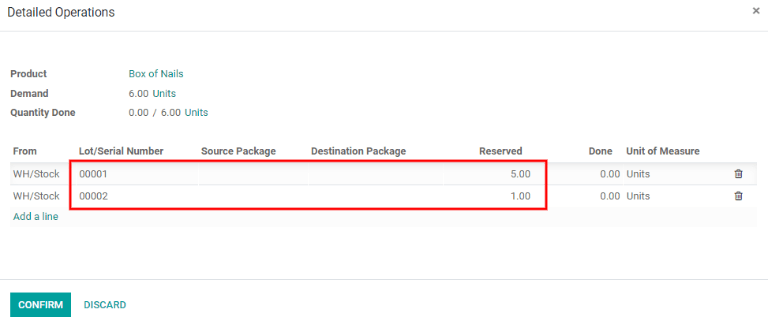
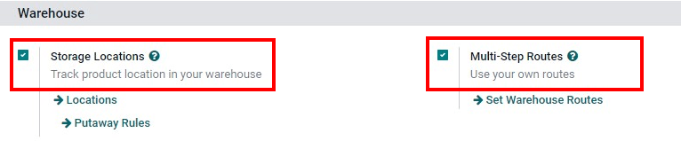
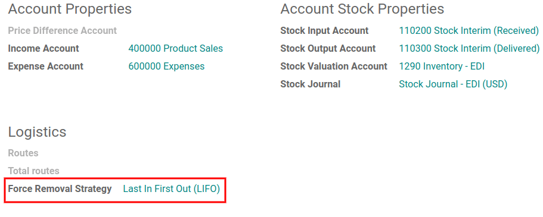
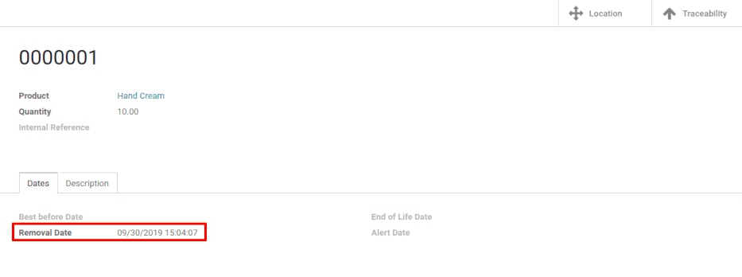
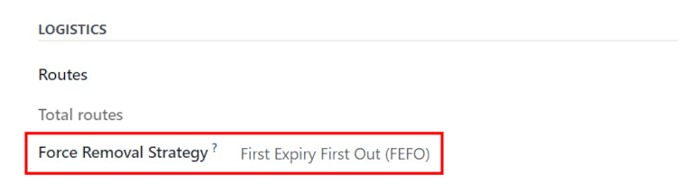

# Removal strategies (FIFO, LIFO, FEFO)

For companies with warehouses, **removal strategies** determine which
products are taken from the warehouse, and when. Removal strategies are
typically defined for specific picking operations. This helps companies
to select the best products, optimize the distance workers need to
travel when picking items for orders, and account for quality control,
such as moving products with expiration dates.

Usually, *Removal Strategies* are defined in picking operations to
select the best products to optimize the distance for the worker, for
quality control purposes, or to first move the products with the closest
expiration date.

When a product needs to be moved, Konvergo ERP finds available products that can
be assigned to the transfer. The way Konvergo ERP assigns these products depends
on the `Removal Strategy` defined in either the `Product Category` or
the `Location` dashboards.

To change the `Removal Strategy`, go to `Inventory app --> Configuration
--> Locations` or `Product Categories`. Click on a `Location` or
`Product Category`, and then click `Edit`. Change the product category
`Force Removal Strategy` or the location `Removal Strategy` by clicking
on the drop-down menu and selecting the desired removal strategy. After
selecting the new removal strategy, click `Save`.

## What happens inside the warehouse?

Most warehouses share the same important areas: receiving docks and
sorting areas, storage locations, picking and packing areas, and
shipping/loading docks. While all products entering or leaving the
warehouse might go through each of these locations at some point,
removal strategies can have an effect on which products are taken, from
where, and when.

In this example below, vendor trucks unload pallets of goods at the
receiving docks. Then, operators scan the products in the receiving
area, with the reception date and expiration date. After that, products
are stored in their respective storage locations.

> [!NOTE]
> Not all products have expiration dates, but in this example,
> expiration dates apply.

In Konvergo ERP, receive products by navigating to the `Inventory` application,
and in the kanban view, click on either the `Receipts` heading or
`# TO PROCESS` button. On the `Receipts` dashboard, find and click on
the individual receipt which will open the warehouse intake form. Click
`Edit`, and then enter the received quantity in the `Done` column. To
finish, `Validate` to receive the products and register them in the Konvergo ERP
database.

> [!TIP]
> Receiving products can also be done within the Konvergo ERP *Barcode*
> application. If using the *Barcode* app, scan the product(s), update
> the quantity, and finally, click `Validate`. After products are
> received in Konvergo ERP, the products can then be moved to their respective
> storage locations.

Continuing with the same example, below, imagine several sales orders
are made for the products received earlier, that use expiration dates.
In this example, the products weren't received on the same day, and they
don't have the same expiration date. In this situation, logically,
sending products with the closest expiration date is preferred, instead
of products received first or last. Using the chosen removal strategy
configured for those products (in this example, `FEFO
<routes/FEFO>`), Konvergo ERP generates a transfer for the products with the
soonest expiration date to the picking area, then the packing area, and
finally, to the shipping docks for delivery to the customer.

> [!NOTE]
> To pick for delivery, the product's lot/serial number can be found on
> the transfer form. To learn more about picking and shipping, refer to
> either the `Two-step delivery
> <inventory/receipts_delivery_two_steps>` or `Three-step delivery
> <inventory/delivery_three_steps>` documentation.

## How each removal strategy works

Removal strategies determine which products are taken from the warehouse
when orders are confirmed.

### First In, First Out (FIFO)

When using a `First In, First Out (FIFO)` strategy, demand for a product
triggers a removal rule, which requests a transfer for the lot/serial
number that entered the stock first (and therefore, has been in stock
for the longest time).

For example, imagine there are three lots of nails in the warehouse, and
have the corresponding lot numbers:
00001,
00002,
00003. Each lot has five boxes of nails
in it.

Lot 00001 entered the stock on May 23,
lot 00002 on May 25, and lot
00003 on June 1. A customer orders six
boxes on June 11.

Using the `FIFO (First In, First Out)` removal strategy, a transfer
request will pick the five boxes from lot
00001 first, and then from the boxes in
lot 00002, since lot
00001 entered the stock first. The box
from lot 00002 is taken next because it
has the oldest receipt date after lot
00001.

### Last In, First Out (LIFO)

Similar to the `FIFO (First In, First Out)` method, the
`Last In, First Out (LIFO)` removal strategy moves products based on the
date they entered a warehouse's stock. Instead of removing the oldest
stock on-hand, however, it targets the **newest** stock on-hand for
removal.

Every time an order for products with the `LIFO (Last In, First Out)`
method is placed, a transfer is created for the lot/serial number that
has most recently entered the stock (the **last** lot/serial number that
entered the warehouse's inventory).

> [!WARNING]
> In many countries, the `LIFO (Last In, First Out)` removal strategy in
> banned, since it can potentially result in old, expired, or obsolete
> products being delivered to customers.

For example, imagine there are three lots of boxes of screws in the
warehouse, and have the corresponding lot numbers:
10001,
10002, and
10003, each with 10 boxes of screws per
lot.

Lot 10001 entered the stock on June 1,
lot 10002 on June 3, and lot
10003 on June 6. A customer orders seven
boxes on June 8.

Using the `LIFO (Last In, First Out)` removal strategy, a transfer is
requested for seven boxes of screws from lot
10003 because that lot is the last one to
have entered the stock.

### First Expired, First Out (FEFO)

While the `FIFO (First In, First Out)` and `LIFO (Last In, First Out)`
methods target products for removal based on date of entry into the
warehouse, the `First Expired, First
Out (FEFO)` method targets products for removal based on their assigned
expiration dates.

Using the `FEFO (First Expired, First Out)` removal strategy, every
sales order that includes products with this removal strategy assigned
ensures that transfers are requested for products with the expiration
date soonest to the order date.

As an example, imagine there are three lots of six-egg boxes. Those
three lots have the following lot numbers:
20001,
20002, and
20003, each with five boxes in it.

Lot 20001 entered the stock on July 1 and
expires on July 15, lot 20002 entered on
July 2 and expires on July 14, and lot
20003 entered on July 3 and expires on
July 21. A customer orders six boxes on July 5.

Using the `FEFO (First Expired, First Out)` method, a transfer is
requested for the five boxes from lot
20002 and one from lot
20001. All the boxes in lot
20002 are transferred because they have
the earliest expiration date. The transfer also requests one box from
lot 20001 because it has the next closest
expiration date after lot 20002.

## Using removal strategies

To differentiate some units of products from others, the units need to
be tracked, either by `Lot` or by `Serial Number`. To do so, go to
`Inventory -->
Configuration --> Settings`. Then, activate the `Storage Locations`,
`Multi-Step
Routes`, and `Lots & Serial Numbers` settings. Click `Save` to save
changes.

> [!NOTE]
> To use the `FEFO (First Expired, First Out)` removal strategy, the
> `Expiration
> Dates` setting needs to be activated as well. To enable this, go to
> `Inventory app
> --> Configuration --> Settings`, scroll down to the `Traceability`
> section, and click the checkbox next to `Expiration Dates`. Remember
> to click `Save` to save all changes.

Now, specific removal strategies can be defined on product categories.
To do this, go to
`Inventory app --> Configuration --> Product Categories`, and choose a
product category to define the removal strategy on. In the
`Force Removal Strategy` field, choose a removal strategy.

The *First Expired, First Out* (FEFO) strategy is a bit different from
the other two removal strategies. For `FEFO (First Expired, First Out)`,
the expiration date is important, not the date the product entered the
stock.

For example, imagine there are three lots of six-egg boxes (in this
specific case, don't forget to use `units of measure
</applications/inventory_and_mrp/inventory/product_management/product_replenishment/uom>`).
Those three lots have the following numbers: `20001`, `20002`, and
`20003`, each with five boxes in it.

`20001` entered the stock on the 1st of July and expires on the 15th of
July, `20002` entered on the 2nd and expires on the 14th of July, and
`20003` entered on the 4th and expires on the 21st of July. A customer
orders six boxes on the 5th of July. With the
`FEFO (First Expired, First Out)` strategy selected, a transfer is
requested for the five boxes of `20002` and one from `20001`. The
transfer for all the boxes in lot `20002` is because they have the
closest expiration date. The transfer also requests one box from `20001`
because has the next closest expiration date after lot `20002`.

Basically, for every sales order of a product with the
`FEFO (First Expired, First Out)` strategy, a transfer is requested for
the product that has the nearest expiration date from the order date.

### Closest Location

The *Closest Location* strategy is completely different from the other
removal strategies. It is not related to the date of entry in the
warehouse, but rather the location of the product. It is commonly used
for products that do not deteriorate with time.

The aim is to avoid making the warehouse worker take a long journey to
the bottom of the stock when the product is also located at a near
location. This method is only available if the `Storage Locations`
setting is on. The closest location is actually the one that comes first
in the alphabetic order.

## Use removal strategies

To differentiate some units from others, the units need to be tracked,
either by *lot* or by *serial number*. To do so, go to
`Inventory --> Configuration --> Settings`. Then, activate the
`Storage Location`, `Multi-Step Routes`, and `Lots &
Serial Numbers` settings.

To view all products with lots/serial numbers assigned to them, navigate
to `Inventory app --> Products --> Lots/Serial Numbers`. This reveals a
page with drop-down menus of all products assigned lots or serial
numbers, filtered by *product* by default. To change the category these
products are filtered by, click `Product` (in the search bar, in the top
right of the page) to remove the default filter, and select a new filter
if desired.

To view the serial numbers being selected for a sales order, go to the
`Sales app` and select the sales order in question. In the sales order,
click the `Delivery` smart button in the top right. In the `Operations`
tab, click the `⦙≣ (Detailed Operations)` icon in the far right for the
product in question. The `Detailed Operations` window appears, and
displays the lot or serial numbers selected for that specific product
for the delivery order.

### FIFO (First In, First Out)

The `FIFO (First In, First Out)` removal strategy implies that products
which enter a warehouse's stock first are removed first. Companies
should use this method if they are selling products with short demand
cycles, such as clothes, to ensure they are not stuck with outdated
styles in stock.

In this example, there are three lots of white shirts. The shirts are
from the *All/Clothes* category, where *FIFO* is set as the removal
strategy. In the `Inventory Valuation
Report`, the three different receipts are listed with the amounts.

Lot 000001 contains five shirts, lot
000002 contains three shirts, and lot
000003 contains two shirts.

To see the removal strategy in action, go to the `Sales app` and click
`Create` to create a sales order. Next, select a `Customer` from the
drop-down menu. Then click `Add a product` in the `Order Lines` tab.
Select a product (for this example, the `White Shirt`) from the
drop-down menu, or type in the name of the product in the field. Enter a
quantity (for this example, 6.00) in the
`Quantity` field, then click `Save`, then click `Confirm`.

Once the sales order is confirmed, the delivery order will be created
and linked to the picking, and the oldest lot numbers will be reserved
thanks to the `FIFO (First In, First Out)` strategy. All five shirts
from lot 000001 and one shirt from lot
000002 will be selected to be sent to the
customer.

### LIFO (Last In, First Out)

The `LIFO (Last In, First Out)` removal strategy works in the
**opposite** manner from the `FIFO (First In, First Out)` strategy. With
this method, the products that are received **last** are moved out
first. This method is mostly used for products without a shelf life, and
no time-sensitive factors, such as expiration dates.

In this example, there are three lots of cinder blocks. The blocks are
from the *All/Building Materials* category, where *FIFO* is set as the
removal strategy. In the `Inventory
Valuation Report`, the three different receipts are listed with the
amounts.

Lot 000020 contains three cinder blocks,
lot 000030 contains five cinder blocks,
and lot 0000400 contains four cinder
blocks.

To see how the `LIFO (Last In, First Out)` strategy works, first
navigate to `Inventory app --> Configuration --> Product Categories`,
and select a product category (for this example, the
`All/Building Materials` category) to edit. This reveals a product
category form.

Once on the product category form, under the `Logistics` section, change
the `Force Removal Strategy` to `Last In First Out (LIFO)`.

To see the removal strategy in action, go to the `Sales app` and click
`Create` to create a sales order. Next, select a `Customer` from the
drop-down menu. Then click `Add a product` in the `Order Lines` tab.
Select a product (for this example, the `Cinder Block`) from the
drop-down menu, or type in the name of the product in the field. Enter a
quantity (for this example, 5.00) in the
`Quantity` field, then click `Save`, then click `Confirm`.

Once the sales order is confirmed, the delivery order will be created
and linked to the picking, and the newest lot numbers will be reserved
thanks to the `LIFO (Last In, First Out)` strategy. All four cinder
blocks from lot 0000400 and one cinder
block from lot 000030 will be selected to
be sent to the customer.

### FEFO (First Expired, First Out)

The `FEFO (First Expired, First Out)` removal strategy differs from the
`FIFO (First In,
First Out)` and `LIFO (Last In, First Out)` strategies, because it
targets products for removal based on **expiration dates** instead of
their warehouse receipt dates. With this method, the products that are
going to expire first are moved out first. This method is used for
perishable products, such as medicine, food, and beauty products.

Lots are picked based on their **removal date** from earliest to latest.
Removal dates indicate how many days *before* the expiration date the
product needs to be removed from stock. The removal date is set on the
product form. Lots without a removal date defined are picked after lots
with removal dates.

> [!WARNING]
> If products are not removed from stock when they should be, lots that
> are past the expiration date may still be picked for delivery orders!

> [!NOTE]
> For more information about expiration dates, reference the
> `Expiration dates
> <../../product_management/product_tracking/expiration_dates>`
> document.

First, go to `Inventory app --> Configuration --> Settings` and ensure
`Expiration Dates` is enabled. Once the `Expiration Dates` setting is
enabled, it's possible to define different expiration dates for
individual serialized products, as well as for lot numbers containing
many products.

In this example, there are three lots of hand cream. The creams are from
the *All/Health & Beauty* category, where *FEFO* is set as the removal
strategy. In the `Inventory Valuation
Report`, the three different receipts are listed with the amounts.

Lot 0000001 contains twenty tubes of hand
cream, expiring on Sept 30, lot 0000002
contains ten tubes of hand cream, expiring on November 30, and lot
0000003 contains ten tubes of hand cream,
expiring on October 31.

Expiration dates can be entered when validating the received products,
or set on products by going to
`Inventory app --> Products --> Lots/Serial Numbers`. Click `Create`,
enter the serial number, and select the product from the drop-down menu.
Next, select the expiration date in the `Dates` tab. Finally, click
`Save`.

To see how the `FEFO (First Expired, First Out)` strategy works, first
navigate to `Inventory app --> Configuration --> Product Categories`,
and select a product category (in this example, the
`All/Health & Beauty` category) to edit. This reveals a product category
form.

Once on the product category form, under the `Logistics` section, change
the `Force Removal Strategy` to `FEFO (First Expired, First Out)`.

Next, go to the `Sales app` and click `Create` to create a sales order.
Next, select a `Customer` from the drop-down menu. Then click
`Add a product` in the `Order Lines` tab. Select a product (for this
example, the `Hand Cream`) from the drop-down menu, or type in the name
of the product in the field. Enter a quantity (in this example,
25.00) in the `Quantity` field, then
click `Save`, then click `Confirm`.

Once the sales order is confirmed, the delivery order will be created
and linked to the picking, and the lot numbers expiring first will be
reserved thanks to the `FEFO (First Expired, First
Out)` strategy. All twenty tubes of hand cream from lot
0000001 and five from lot
0000003 will be selected to be sent to
the customer, detailed in the `Detailed Operations` tab in the sales
order.

