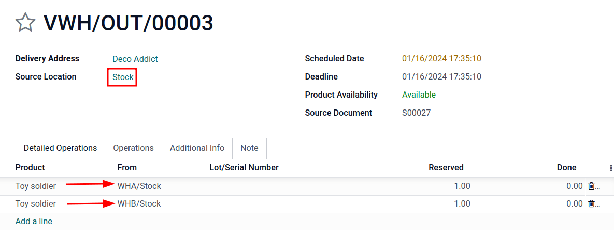

# Sell stock from multiple warehouses using virtual locations

While keeping stock and selling inventory from one warehouse might work
for smaller companies, bigger companies might need to keep stock in, or
sell from, multiple warehouses in multiple locations.

Sometimes products included in a single sales order might take stock
from two (or more) warehouses; in Konvergo ERP, pulling products from multiple
warehouses to satisfy sales demands can be done using *virtual
locations*.

> [!IMPORTANT]
> The solution in this document, describing the use of a virtual
> warehouse to fulfill orders for multiple warehouses, has some
> limitations. Consider the following before proceeding:
>
> 1.  When the `Warehouse` field is set to a virtual warehouse on a
>     sales order, the virtual warehouse's address is indicated on the
>     picking, packing, and delivery forms, **not** the actual
>     warehouse's address.
> 2.  Each location has a warehouse_id
>     (hidden field). This means that the stock in the virtual warehouse
>     will **not** be the sum of the stock of the real warehouses, but
>     rather the sum of the stock in the locations whose warehouse ID is
>     the virtual warehouse.

Danger

Potential limitation for those using `two
<../../shipping_receiving/daily_operations/receipts_delivery_two_steps>`
or `three-step
delivery <../../shipping_receiving/daily_operations/delivery_three_steps>`:

1.  The output or packing zone on the various forms is incorrectly
    listed as the virtual warehouse's address.
2.  There is no workaround for two or three-step deliveries.
3.  Proceed **only** if setting a virtual warehouse's address as the
    output or packing zone makes sense for the company's workflow.

> [!NOTE]
> In order to create virtual locations in warehouses, and proceed to the
> following steps, the `Storage Locations` and `Multi-Step Routes`
> features **must** be enabled.
>
> To do so, go to `Inventory app --> Configuration --> Settings`, scroll
> down to the `Warehouse` section, and enable the `Storage Locations`
> and `Multi-Step Routes` options. Then, `Save` the changes to finish.

## Create virtual parent location

Before creating any virtual stock locations, create a new warehouse that
acts as a *virtual* warehouse — the *parent* location of other physical
warehouses.

Why a "virtual" warehouse?

Virtual warehouses are great for companies with multiple physical
warehouses. This is because a situation might arise when one warehouse
runs out of stock of a particular product, but another warehouse still
has stock on-hand. In this case, stock from these two (or more)
warehouses could be used to fulfill a single sales order.

The "virtual" warehouse acts as a single aggregator of all the inventory
stored in a company's physical warehouses, and is used (for traceability
purposes) to create a hierarchy of locations in Konvergo ERP.

To create a new warehouse, go to
`Inventory app --> Configuration --> Warehouses`, and click `Create`.
From here, the warehouse `Name` and `Short Name` can be changed, and
other warehouse details can be changed under the `Warehouse
Configuration` tab.

Lastly, click `Save` to finish creating a *regular* warehouse. Continue
following the steps below to finish configuring the virtual parent
warehouse.

\-
`Warehouse configurations <../inventory_management/warehouses_locations>` -
`Incoming and outgoing shipments <inventory/receipts_delivery_one_step/wh>` -
`Resupply from another warehouse <../inventory_management/resupply_warehouses>`

## Create child warehouses

Create at least two *child* warehouses to link to the virtual warehouse.

> [!IMPORTANT]
> In order to take stock from multiple warehouses to fulfill a sales
> order, there needs to be at least **two** warehouses acting as child
> locations of the virtual parent location warehouse.

To do that, navigate to
`Inventory app --> Configuration --> Warehouses`, click `Create`, and
follow the `preceding instructions <inventory/routes/virtual-wh>` to
configure the physical stock locations.

**Parent Warehouse**  
`Warehouse`: Virtual Warehouse  
`Location`: VWH/Stock

**Child Warehouses**  
`Warehouses`: Warehouse A and
Warehouse B  
`Locations`: WHA and
WHB

> [!IMPORTANT]
> While the virtual stock location will be changed to 'View' later, the
> `Location Type` **must** be `Internal Location` at this point to
> `link the child warehouses
> <inventory/routes/link-to-vwh>` in the next section.

## Link child warehouses to virtual stock

To set physical warehouses as child locations of the virtual location
configured in the `previous step <inventory/routes/virtual-wh>`,
navigate to `Inventory app -->
Configuration --> Locations`.

Remove any filters from the search bar. Then, click the physical
warehouse `Location` that was previously created to be a child location
(e.g. WHA), and click `Edit`.

Change the `Parent Location` field from `Physical Locations` to the
virtual warehouse's **stock location** (e.g.
VWH/Stock) from the drop-down menu, and
click `Save`.

> [!IMPORTANT]
> To select the virtual warehouse's stock location in the
> `Parent Location` drop-down menu, the parent warehouse stock location
> (e.g. VWH/Stock) **must** have its
> `Location Type` set to `Internal Location`.

Repeat the preceding steps to configure two or more child warehouses.

Once complete, the virtual, parent warehouse (e.g.
VWH/Stock) fulfills orders using stock
from child warehouses (e.g. WHA and
WHB), if there is insufficient stock in
any one location.

## Set virtual stock location as 'view'

Set the virtual stock location's `Location Type` to `View`, as it is a
non-existent location used to group various physical warehouses
together.

To do that, navigate to `Inventory app --> Configuration --> Locations`.

Click the virtual warehouse's stock location (e.g.
VWH/Stock) that was `previously created
<inventory/routes/virtual-wh>`, from the `Locations` list.

On the location form, under the `Additional Information` heading, set
the `Location Type` to `View`. `Save` the changes.

> [!TIP]
> To view the total quantity across **all** linked child warehouses, go
> to the product form and click the `On Hand` smart button.
>
>  alt="Display stock across all linked warehouses." />

## Example: sell products from a virtual warehouse

To sell products from multiple warehouses using a virtual parent
location, the database must have at least **two** warehouses configured
— with at least **one** product, with quantity on-hand in each
warehouse, respectively.

The following product, Toy soldier, is
available at each location with the quantities:

- WHA/Stock : 1
- WHB/Stock : 2
- Warehouses WHA and
  WHB are child warehouses of the virtual
  warehouse VWH.

Create a quotation for the product by navigating to the `Sales` app and
clicking `Create`. On the quote, add a `Customer`, and click
`Add a product` to add the two products stored in the two warehouses.

Then, click the `Other Info` tab on the sales order form. Under the
`Delivery` section, change the `Warehouse` field value to the virtual
warehouse that was `previously created <inventory/routes/virtual-wh>`.
Next, `Confirm` the sales order.

Then, click the `Delivery` smart button. From the warehouse delivery
form, confirm that the `Source Location` value matches the `Warehouse`
field value from the sales order. Both should list the virtual warehouse
location.

Finally, on the warehouse delivery form, under the `Detailed Operations`
tab, confirm that the `Locations` in the `From` column for each product
match the child locations that are tied to the virtual parent location.

> [!IMPORTANT]
> The `Source Location` on the warehouse delivery form, and the
> `Warehouse` under the `Other Info` tab on the sales order, **must**
> match for products in the sales order to be pulled from different
> warehouses.
>
> - If the virtual warehouse is not in the `Source Location` field on
>   the warehouse delivery form, retry product reservation by:
>   - Running the scheduler: turn on `developer mode <developer-mode>`,
>     and then go to `Inventory app --> Operations --> Run Scheduler`.
>   - Clicking `Check Availability` on the delivery order.
> - If the virtual warehouse is **not** assigned to the `Warehouse`
>   field on the sales order, then cancel it, and create a new sales
>   order with the virtual warehouse set in the `Warehouse` field.
> - If the `Warehouse` field is missing on the sales order form, then
>   the multiple child warehouses may not have been set up correctly.
>   Review the `previous section
>   <inventory/routes/child-wh>` to ensure the correct settings.

> [!TIP]
> To use a virtual *parent* location as the default warehouse for sales
> orders, each salesperson should have the virtual warehouse assigned to
> them from the drop-down menu next to `Default Warehouse` on their
> employee form.
>
>  class="align-center"
> alt="Default warehouse location on employee form." />
