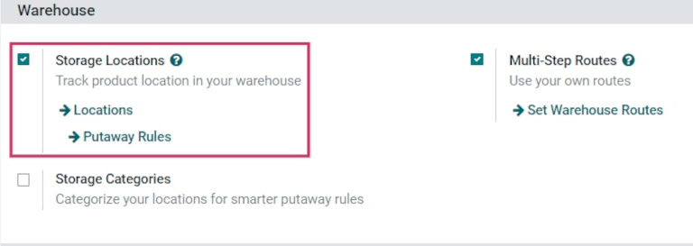
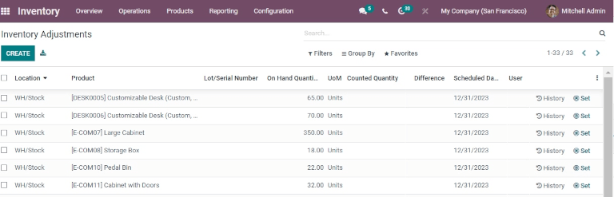
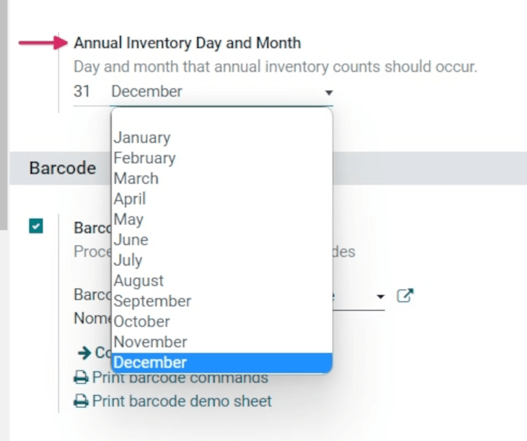

# Cycle counts

For most companies, warehouse stock only needs to be counted once a
year. This is why, by default, after making an *inventory adjustment* in
Konvergo ERP, the scheduled date for the next inventory count is set for the
31st of December of the current year.

However, for some businesses, it's crucial to have an accurate inventory
count at all times. These companies use *cycle counts* to keep critical
stock levels accurate. Cycle counting is a method by which companies
count their inventory more often in certain *locations*, to ensure that
their physical inventory counts match their inventory records.

## Activate storage locations

In Konvergo ERP, cycle counts are location-based. Therefore, the *storage
locations* feature needs to be enabled before performing a cycle count.

To enable this feature, navigate to
`Inventory app --> Configuration --> Settings`, and scroll down to the
`Warehouse` section. Then, click the checkbox next to
`Storage Locations`. Click `Save` to save all changes.

## Change inventory count frequency by location

Now that the storage locations setting is enabled, the inventory count
frequency can be changed for specific locations created in the
warehouse.

To view and edit locations, navigate to
`Inventory app --> Configuration -->
Locations`. This reveals a `Locations` page containing every location
currently created and listed in the warehouse.

From this page, click into a location to reveal the settings and
configuration page for that location. Click `Edit` to edit the location
settings.

Under the `Cyclic Inventory` section, locate the
`Inventory Frequency (Days)` field, which should be set to
0 (if this location has not been edited
previously). In this field, change the value to whichever number of days
is desired.

A location that needs an inventory count every 30 days should have the
`Inventory
Frequency (Days)` value set to 30.

Once the frequency has been changed to the desired number of days, click
`Save` to save changes. Now, once an inventory adjustment is applied to
this location, the next scheduled count date is automatically set, based
on the value entered into the `Inventory Frequency
(Days)` field.

## Count inventory by location

To perform a cycle count for a specific location in the warehouse,
navigate to `Inventory app --> Operations --> Inventory Adjustments`.
This reveals an `Inventory Adjustments` page containing all products
currently in stock, with each product listed on its own line.

From this page, the `Filters` and `Group By` buttons (at the top of the
page, under the `Search...` bar), can be used to select specific
locations and perform inventory counts.

To select a specific location and view all products within that
location, click `Group
By`, then click `Add Custom Group` to reveal a new drop-down menu to the
right.

Click `Location` from the drop-down menu, then click `Apply`. The page
now displays condensed drop-down menus of each location in the warehouse
that has products in stock, and a cycle count can be performed for all
products in that location.

> [!TIP]
> In large warehouses with multiple locations and a high volume of
> products, it might be easier to search for the specific location
> desired. To do this, from the `Inventory Adjustments` page, click
> `Filters`. Then, click `Add Custom Filter` to reveal a new menu to the
> right. Click this menu to reveal three drop-downs.
>
> For the first field, click and select `Location` from the drop-down.
> For the second field, leave the `contains` value as is. For the third
> field, type in the name of the location that is being searched for.
> Click `Apply` for that location to appear on the page.

## Change full inventory count frequency

While cycle counts are typically performed per location, the scheduled
date for full inventory counts of everything in-stock in the warehouse
can also be manually changed to push the date up sooner than the date
listed.

To modify the default scheduled date, go to
`Inventory app --> Configuration -->
Settings`. Then, in the `Operations` section, locate the
`Annual Inventory Day
and Month` setting field, which includes a drop-down that is set to
31 `December` by default.

To change the day, click the 31, and
change it to a day within the range 1-31,
depending on the desired month of the year.

Then, to change the month, click `December` to reveal the drop-down
menu, and select the desired month.

Once all changes have been made, click `Save` to save all changes.

`count_products`

