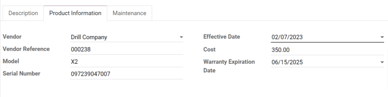
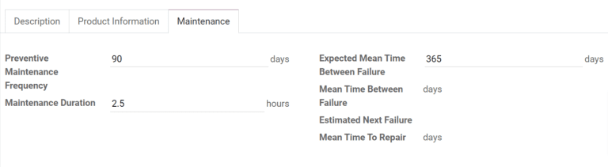

# Add new equipment

In Odoo, *equipment* refers to any item that is used in everyday
operations, including the manufacturing of products. This can mean a
piece of machinery on a production line, a tool that is used in
different locations, or a computer in an office space. Equipment
registered in Odoo can be owned by the company that uses the Odoo
database, or by a third party, such as a vendor in the case of equipment
rentals.

Using Odoo *Maintenance*, it is possible to track individual pieces of
equipment, along with information about their maintenance requirements.
To add a new piece of equipment, navigate to the `Maintenance` module,
select `Equipments --> Machines & Tools --> Create`, and configure the
equipment as follows:

- `Equipment Name`: the product name of the piece of equipment
- `Equipment Category`: the category that the equipment belongs to; for
  example, computers, machinery, tools, etc.; new categories can be
  created by navigating to `Configuration --> Equipment Categories` and
  clicking `Create`
- `Company`: the company that owns the equipment; again, this can be the
  company that uses the Odoo database, or a third-party company
- `Used By`: specify if the equipment is used by a specific employee,
  department, or both; select `Other` to specify both an employee and a
  department
- `Maintenance Team`: the team responsible for servicing the equipment;
  new teams can be created by navigating to
  `Configuration --> Maintenance Teams` and selecting `Create`; the
  members of each team can also be assigned from this page
- `Technician`: the person responsible for servicing the equipment; this
  can be used to assign a specific individual in the event that no
  maintenance team is assigned or when a specific member of the assigned
  team should always be responsible for the equipment; any person added
  to Odoo as a user can be assigned as a technician
- `Used in location`: the location where the equipment is used; this is
  a simple text field that can be used to specify locations that are not
  work centers, like an office, for example
- `Work Center`: if the equipment is used at a work center, specify it
  here; equipment can also be assigned to a work center by navigating to
  `Maintenance --> Equipments -->
  Work Centers`, selecting a work center or creating a new one using the
  `Create` button, and clicking the `Equipment` tab on the work center
  form

## Include additional product information

The `Product Information` tab at the bottom of the form can be used to
provide further details about the piece of equipment:

- `Vendor`: the vendor that the equipment was purchased from
- `Vendor Reference`: the reference code assigned to the vendor
- `Model`: the specific model of the piece of equipment
- `Serial Number`: the unique serial number of the equipment
- `Effective Date`: the date that the equipment became available for
  use; this is used to calculate the `MTBF (Mean Time Between Failures)`
- `Cost`: the amount the equipment was purchased for
- `Warranty Expiration Date`: the date on which the equipment's warranty
  will expire

## Add maintenance details

The `Maintenance` tab includes information that can be useful to
maintenance teams:

- `Preventive Maintenance Frequency`: specifies how often maintenance
  should be performed to prevent equipment failure
- `Maintenance Duration`: the amount of time required to fix the
  equipment when it fails
- `Expected Mean Time Between Failure`: the average amount of time that
  the equipment is expected to operate before failing

> [!NOTE]
> The `Maintenance` tab also includes sections for
> `Mean Time Between Failure`, `Estimated Next Failure`,
> `Latest Failure`, and `Mean Time To Repair`. These values are
> calculated automatically based on maintenance requests if any exist.

> [!TIP]
> To see the maintenance requests for a piece of equipment, go to the
> page for the equipment and select `Maintenance` in the top right
> corner of the form.
