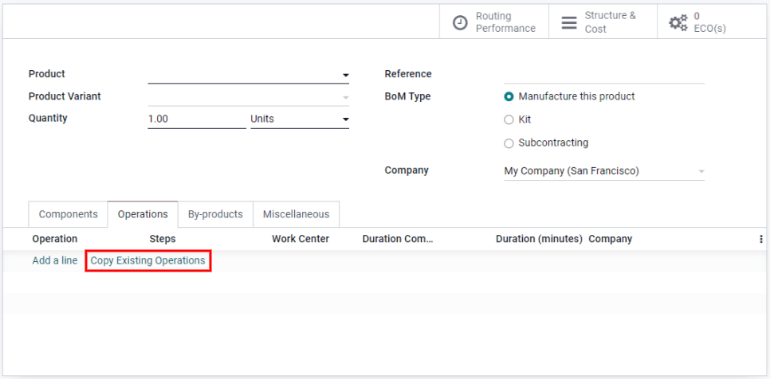

# Bill of materials

A *bill of materials* (or *BoM* for short) is a document that defines
the quantity of each component required to make or deliver a finished
product. It can also include various operations and the individual step
guidelines needed to complete a production process.

In Konvergo ERP Manufacturing, multiple `BoMs (Bills of Materials)` can be
linked to each product, so even product variants can have their own
tailored `BoMs (Bills of Materials)`.

Correctly setting up a `BoM (Bill of Materials)` helps optimize the
manufacturing process and save time.

## Set up a bill of materials (BoM)

The simplest `BoM (Bill of Materials)` setup is one without operations
or instructions, only components. In this case, the production is solely
managed using *Manufacturing Orders*.

To create a `BoM (Bill of Materials)` from the `Manufacturing` module,
go to `Products --> Bills of Materials`. Then, click `Create`. Next,
specify the `Product`.

> [!NOTE]
> A `BoM (Bill of Materials)` can also be created directly from the
> product form, in which case the `Product` field is pre-filled.

For a standard `BoM (Bill of Materials)`, set the `BoM Type` to
`Manufacture this Product`. Then, click `Add a Line` to specify the
various components that make up the production of the final product and
their respective quantities. New components can be created quickly
through the `BoM (Bill of Materials)`, or can be created beforehand in
`Manufacturing --> Products --> Products --> Create`. Finally, click
`Save` to finish creating the `BoM (Bill of Materials)`.

### Specify a bill of materials (BoM) for a product variant

`BoMs (Bills of Materials)` can also be assigned to specific *Product
Variants*, with two setup options available to choose from.

> [!NOTE]
> In order to assign `BoMs (Bills of Materials)` to product variants,
> the product's variant attributes must already be configured on the
> product form.

The first method is to create one `BoM (Bill of Materials)` per variant
by creating a new `BoM (Bill of Materials)` and specifying the
`Product Variant`. The second method is to create one master
`BoM (Bill of Materials)` that contains all of the components, and
specify which variant each component applies to using the
`Apply on Variants` column.

## Set up operations

Add an `Operation` to a `BoM (Bill of Materials)` to specify
instructions for production and register time spent on an operation. To
use this feature, first enable the `Work Orders` feature in
`Manufacturing --> Configuration --> Settings -->
Operations`.

Then, when creating a new `BoM (Bill of Materials)`, click on the
`Operations` tab and click `Add a line` to add a new operation. In the
`Create Operations` box, give the operation a name, specify the
`Work Center` and duration settings. Like components, Konvergo ERP gives the
option to specify a product variant in the `Apply on Variants` field so
the operation only applies to that variant. Finally, click
`Save & Close`.

> [!NOTE]
> Each operation is unique, as it is always exclusively linked to one
> `BoM (Bill of
> Materials)`. Operations can be reused when configuring a new
> `BoM (Bill of Materials)`, with the `Copy Existing Operations`
> feature.

## Add by-products to a bill of materials (BoM)

A *By-Product* is a residual product that is created during production
in addition to the main product of a `BoM (Bill of Materials)`. Unlike
the primary product, there can be more than one by-product on a
`BoM (Bill of Materials)`.

To add by-products to a `BoM (Bill of Materials)`, first enable the
`By-Products` feature in
`Manufacturing --> Configuration --> Settings --> Operations`.

Once the feature is enabled, you can add by-products to a
`BoM (Bill of Materials)` by clicking on the `Operations` tab and
clicking `Add a line`. Then, name the by-product and indicate the
`Quantity` and the `Unit of Measure`. If the `BoM (Bill of Materials)`
has configured operations, specify exactly which operation the
by-product is produced from in the `Produced in Operation` field.
Finally, click `Save`.
