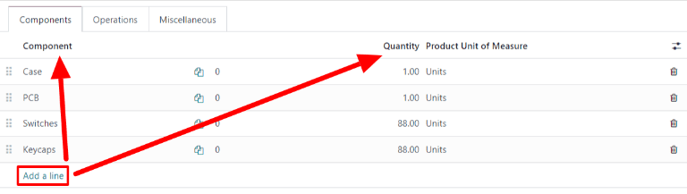
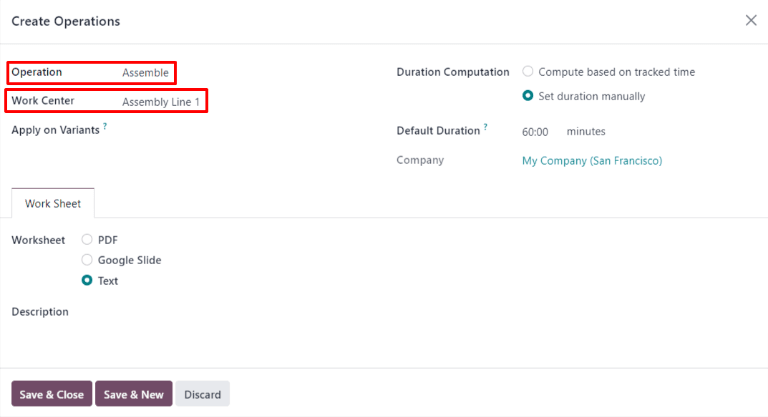

# Manufacturing product configuration

In order to manufacture a product in Odoo *Manufacturing*, the product
must be properly configured. Doing so consists of enabling the
*Manufacturing* route and configuring a bill of materials (BoM) for the
product. Once these steps are completed, the product is selectable when
creating a new manufacturing order.

## Activate the Manufacture route

The Manufacture route is activated for each product on its own product
page. To do so, begin by navigating to
`Manufacturing --> Products --> Products`. Then, select an existing
product, or create a new one by clicking `New`.

On the product page, select the `Inventory` tab, then enable the
`Manufacture` checkbox in the `Routes` section. This tells Odoo the
product can be manufactured.

## Configure a bill of materials (BoM)

Next, a must be configured for the product so Odoo knows how it is
manufactured. A is a list of the components and operations required to
manufacture a product.

To create a for a specific product, navigate to
`Manufacturing --> Products -->
Products`, then select the product. On the product page, click the
`Bill of Materials` smart button at the top of the page, then select
`New` to configure a new .

On the , the `Product` field auto-populates with the product. In the
`Quantity` field, specify the number of units that the BoM produces.

Add a component to the by selecting the `Components` tab and clicking
`Add
a line`. Select a component from the `Component` drop-down menu, then
enter the quantity in the `Quantity` field. Continue adding components
on new lines until all components have been added.

Next, select the `Operations` tab. Click `Add a line` and a `Create
Operations` pop-up window appears. In the `Operation` field, specify the
name of the operation being added (e.g. Assemble, Cut, etc.). Select the
work center where the operation will be carried out from the
`Work Center` drop-down menu. Finally, click `Save & Close` to finish
adding operations, or `Save & New` to add more.

> [!IMPORTANT]
> The `Operations` tab only appears if the `Work Orders` setting is
> enabled. To do so, navigate to
> `Manufacturing --> Configuration --> Settings`, then enable the
> `Work Orders` checkbox.

Learn more

The section above provides instructions for creating a basic that allows
a product to be manufactured in Odoo. However, it is by no means an
exhaustive summary of all the options available when configuring a . For
more information about bills of materials, see the documentation on how
to `create a bill of materials
<manufacturing/management/bill-configuration>`.

