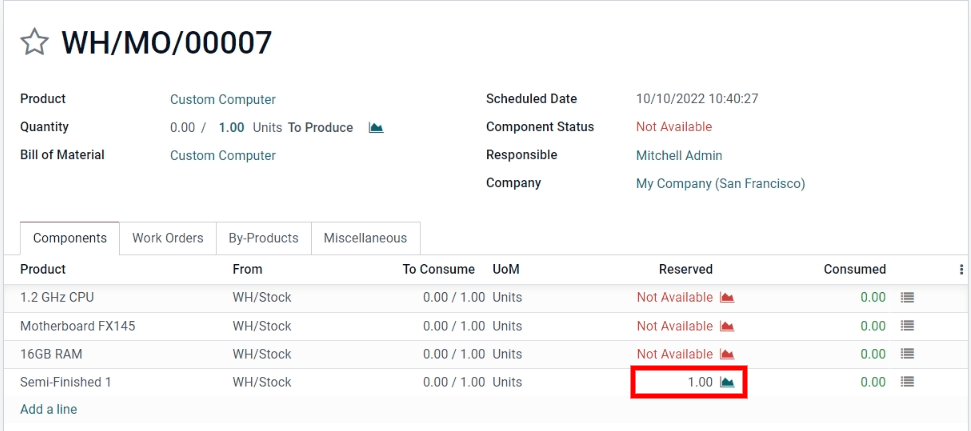

# Manage semi-finished products

A *semi-finished product*, also known as a *subassembly*, is a
manufactured product that is used as a component in another product's
bill of materials (BoM). Semi-finished products are used to simplify
complex `BoMs (Bills of Materials)` or to more accurately represent a
manufacturing flow. A `BoM (Bill of Materials)` that contains
semi-finished products is referred to as a *multilevel BoM*, where the
main *top-level product* and its subassemblies are distinguished.

## Configure semi-finished products

To set up a multilevel `BoM (Bill of Materials)`, the top-level product
and semi-finished products must be configured. Therefore, the first step
is to create the semi-finished products and their
`BoMs (Bills of Materials)`.

`bill_configuration`

## Create the top-level bill of materials (BoM)

After the semi-finished products are fully configured, navigate to
`Manufacturing
--> Products --> Products`. Then, `Create` the top-level product.
Configure the product's specifications as desired, and be sure to
`Save`.

Once the top-level product is configured, click the `Bill of Materials`
smart button on the product form, then click `Create` to make a
`BoM (Bill of Materials)` for the top-level product. Then, simply add
the semi-finished products to this `BoM (Bill of
Materials)`, along with any other necessary components.

## Manage production planning

There are several methods to manage manufacturing order automation for
products with multilevel `BoMs (Bills of Materials)`.

> [!NOTE]
> Semi-finished products are specifically used to manage manufacturable
> products with multilevel BoMs. If a BoM is being created simply to
> organize components or bundle sellable products, using
> `Kits <kit_shipping>` is the more appropriate option.

To automatically trigger manufacturing orders for semi-finished products
after confirming a manufacturing order for the main product, there are
two options:

- **Option 1 (recommended):** Create *Reordering Rules* for the
  semi-finished products and set both the minimum and maximum desired
  stock quantities to 0.

`../../purchase/products/reordering`

- **Option 2:** Activate the `Replenish on Order (MTO)` and
  `Manufacture` routes under the `Inventory` tab of the semi-finished
  product's product form.

Option 1 is more flexible than Option 2 and is therefore recommended.
Reordering rules do not directly link demand to replenishment, and
therefore allow stocks to be unreserved and redirected to other orders,
if necessary. The Replenish on Order (MTO) route creates a unique link
between the semi-finished and top-level products, exclusively reserving
quantities for the confirmed top-level manufacturing order.

Regardless of the method chosen, semi-finished products must be fully
manufactured before manufacturing can begin on the top-level product.

