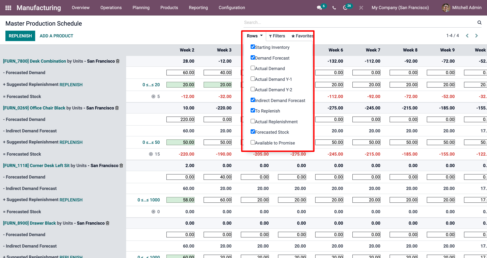

# Use the Master Production Schedule

The Master Production Schedule (MPS) is a valuable tool to plan your
production based on your demand forecast.

## Configuration

Go to the `Manufacturing app --> Configuration --> Settings` and
activate the Master Production Schedule feature before hitting save.

> [!TIP]
> In the MPS settings, you can define the time range of your MPS
> (month/week/day) and the number of periods you want to display at all
> times.

Now, go to `Planning --> Master Production Schedule` and click on *add a
product*. You can now define your safety stock target (= the stock you
want to have on hand at the end of the period) and the minimum and
maximum quantities that must or can be replenished in each period.

In the MPS view, you can decide which information you would like to
display by clicking on *rows*. For instance, the *Actual demand* will
show you which quantity of products has already been ordered for the
period, or *Available to Promise*, what can still be sold during that
same period (what you plan to replenish - what is already sold during
the period). You can also decide to hide rows if you like.

## Estimate your demand and launch replenishment

The next step is to estimate the demand for the chosen period. This is
done in the *Forecasted Demand* Row. You can easily, at any time,
compare the demand forecast with the actual demand (= confirmed sales).
The demand forecast for a finished product will impact the indirect
demand for its components.

Once the forecasted demand has been set, the quantity to replenish for
the different periods will automatically be computed. The replenishments
you are supposed to launch based on your lead times (vendor lead time or
manufacturing lead time) are then displayed in green. You can now launch
the replenishment by clicking on the replenish button.

Depending on the configuration of the product (buy vs. manufacture),
requests for quotations or manufacturing orders will be created. You can
easily access those by clicking on the *Actual Replenishment* cell.

In case you manually edit the *Suggested Replenishment* quantity, a
small cross will appear on the left hand side of the cell. In case you
want to go back to the automatically computed value given by Konvergo ERP,
simply click the cross.

## Cells color signification

The cells, which are part of the *Suggested Replenishment* line, can
take different colors depending on the situation:

- **Green**: quantity of products which should be replenished to reach
  the expected safety stock considering the demand forecast and the
  indirect demand forecast.
- **Grey**: replenishment order has already been generated, and its
  quantity still matches current data.
- **Red**: replenishment order has already been generated, and its
  quantity was too high considering current data.
- **Orange**: replenishment order has already been generated, and its
  quantity was too low considering current data.

The *Forecasted stock* line can also contain red cells, which means the
stock will be negative during the period in question.

### What if I have underestimated the demand?

You can still increase the demand forecast. It will impact the quantity
to replenish. The cell will become orange, and you’ll be able to launch
a new replenishment.

### What if I have overestimated the demand?

You can decrease the demand forecast. The cell will become red to inform
you that you’ve ordered more than planned. If you’re still able to do
it, you can cancel some RFQ or MO manually.

### What if I wrongly added a product to the MPS?

You can easily remove a product from the MPS by clicking the small bin
on the right of its name.
