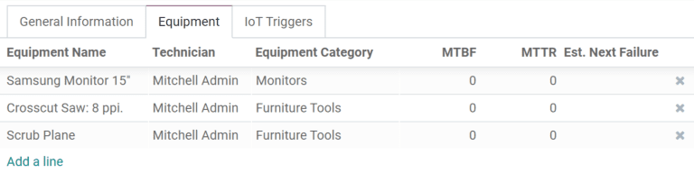
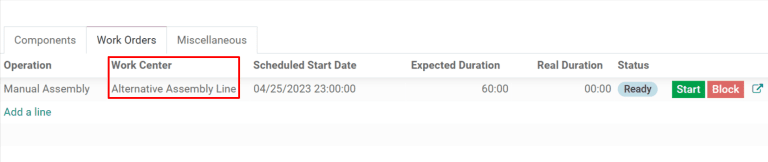

# Make work centers unavailable using Time Off

In Odoo, *work centers* are used to carry out manufacturing operations
at specific locations. However, if a work center cannot be used for some
reason, work orders begin to pile up at the work center until it is
operational again.

As a result, it is necessary to make the work center unavailable in Odoo
so that the platform routes new work orders to alternative work centers
that are operational. Using Odoo *Time Off*, it is possible to designate
a work center as being unavailable for a set period of time. Doing so
ensures that manufacturing operations can continue until the impacted
work center is available again.

## Configuration

Before a work center can be designated as unavailable, the Odoo platform
must be properly configured. First, it is necessary to enable
`developer mode <developer-mode>`. This allows the `Time Off` smart
button to appear on each work center's `Working Hours` pop-up window.

Enable developer mode by going to `Settings`, scrolling to the bottom of
the page, and clicking `Activate the developer mode` under the
`Developer Tools` heading.

Next, install the *Time Off* app. This is the app used for assigning
time off to all resources within Odoo, including employees and work
centers. Navigate to `Apps`, then type Time
Off in the `Search...` bar. The card for the `Time Off` module
should be the only one that appears on the page. Click the green
`Install` button on the card to install the app.

The last step is to properly configure work centers. For this workflow,
it is necessary to have at least two work centers: one that is made
unavailable and a second that receives the work orders that the other
cannot accept. If no second work center is configured, Odoo cannot route
work orders away from the unavailable work center and they will pile up
in its queue.

To create a work center, navigate to
`Manufacturing --> Configuration --> Work
Centers --> Create`.

Make sure that both work centers have the same equipment listed under
the `Equipment` tab. This ensures that operations carried out at one
work center can also be performed at the other.

For the work center that will be made unavailable, select the second
work center on the `Alternative Workcenters` drop-down menu. Now, Odoo
knows to send work orders to the second work center when the first is
unavailable for any reason.

## Add time off for a work center

With configuration completed, time off can now be assigned to the work
center that will be made unavailable. Begin by navigating to
`Manufacturing --> Configuration --> Work
Centers` and selecting the affected work center. Click `Edit`, and then
the `↗
(external link)` button next to the `Working Hours` drop-down menu.

A pop-up appears, titled `Open: Working Hours`. The standard working
hours for the work center are listed here, along with various other
details about it. Since developer mode was enabled, there is a
`Time Off` button in the top right of the pop-up. Click it to be taken
to the `Resource Time Off` page.

On this page, click `Create` to configure a new time-off entry. On the
time-off form, note the `Reason` for the work center closure (broken,
maintenance, etc.), select the affected work center as the `Resource`,
and choose a `Start Date` and `End
Date` to specify the period during which the work center will be
unavailable. Click `Save` and the time off for the work center is logged
in Odoo.

## Route orders to an alternative work center

Once a work center is within its specified time-off period, work orders
sent to it can be automatically routed to an alternative work center
using the `Plan` button.

Begin by creating a new manufacturing order by selecting `Operations -->
Manufacturing Orders --> Create`. On the manufacturing order form,
specify a `Product` that uses the unavailable work center for one of its
operations. Click `Confirm` to confirm the work order.

On the confirmed work order, select the `Work Orders` tab. By default,
the unavailable work center is specified in the `Work Center` column.
There is also a green `Plan` button on the top left of the page.

Click `Plan` and the work center listed under the `Work Orders` tab is
automatically changed to the alternative work center.

Once the time-off period for the unavailable work center ends, Odoo
recognizes that the work center is available again. At this point,
clicking the `Plan` button does not route work orders to an alternative
work center unless the first one is at capacity.
