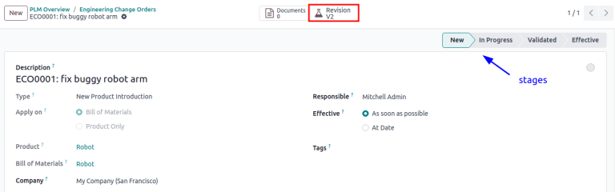

# Engineering change orders

Utilize *engineering change orders* (*ECOs*) to track, implement, and
revert change versions made to products, and
`bills of materials <manufacturing/management/bill-configuration>`.

Engineering change orders can be created:

1.  `directly in the ECO type <plm/eco/create-eco>`.
2.  by an operator in the `tablet view <plm/eco/tablet-view>` of an
    operation.
3.  automatically from feedback submitted to the
    `ECO type's email alias <plm/eco/eco-type>`.

## Create ECO

To create a new `ECO (Engineering Change Order)`, begin by navigating to
the *PLM* app. Then, select the `ECO (Engineering Change Order)` type
card that will be used to track the progress of the change. On the
`Engineering Change Orders` page, click the `New` button in the top-left
corner.

> [!NOTE]
> Learn how to create new `ECO types <plm/eco/eco-type>` to categorize
> and organize change orders. Doing so ensures employees only view the
> `ECOs (Engineering Change Orders)` related to their responsibilities,
> whether it involves new product introductions, targeted product line
> updates, or regulatory compliance fulfillment.

On the `ECO (Engineering Change Order)` form, fill in the following
fields accordingly:

- `Description` is a brief summary of the improvement.

- `Type`: specifies the `ECO (Engineering Change Order)` type project
  for organizing the `ECOs (Engineering Change Orders)`.

- `Apply on` determines if the `ECO (Engineering Change Order)` changes
  the `Bill of Materials` or the `Product Only`.

- `Product` indicates the product being improved.

- `Bill of Materials` specifies the changed `BoM (Bill of Materials)`.
  It auto-populates if the product in `Product` field has an existing
  `BoM (Bill of Materials)`. If multiple `BoMs (Bills of Materials)`
  exist, select the intended radio options from the drop-down menu.

- `Company` field is used in multi-company databases. Specify if the
  change applies to products in a specific company, or leave blank if
  the change applies to all companies.

- `Responsible` represents the assignee in charge of this
  `ECO (Engineering Change Order)`. (Optional)

- `Effective` specifies when the `ECO (Engineering Change Order)`
  becomes live. Choosing `As soon as
  possible` means the `ECO (Engineering Change Order)` applies to the
  production `BoM (Bill of Materials)` as soon as an authorized user
  `applies the changes <plm/eco/apply-changes>`.

  On the other hand, choosing `At Date`, and setting a specific date,
  leaves a date that makes it easier to track the version history of the
  `BoM (Bill of Materials)`, and the specific date
  `BoMs (Bills of Materials)`, used for production.

- `Tags` are assigned to `ECOs (Engineering Change Orders)` for
  prioritization and organization. Create a new tag by typing the name
  in the field and selecting `Create` from the drop-down menu.
  (Optional)

After filling out the `ECO (Engineering Change Order)` form, click the
`Start Revision` button to begin implementing the changes.

By pressing `Start Revision`, three actions occur:

1.  The `Documents` smart button appears, storing relevant files of the
    `BoM (Bill of Materials)`.
2.  A copy of the production `BoM (Bill of Materials)` is stored in the
    newly-appeared `Revision` smart button of the
    `ECO (Engineering Change Order)`. The next available version number
    (e.g., V2,
    V3, ...) is also assigned to keep
    track of all `BoM (Bill of Materials)` versions.
3.  The stages of the `ECO (Engineering Change Order)` `Type` are
    displayed in the top-right corner of the
    `ECO (Engineering Change Order)`.

> [!NOTE]
> The `Revision` smart button is available **only** when the `Bill of
> Materials` radio button is selected in the `Apply on` field, and the
> `Start
> Revision` button has been pressed.

## Change components

To modify the components in a `BoM (Bill of Materials)`, click the
`Revision` smart button on an `ECO (Engineering Change Order)` to access
the new version of the `BoM (Bill of Materials)`. Konvergo ERP distinguishes the
non-production version of the `BoM (Bill of Materials)` from the current
version, by flagging the test `BoM (Bill of Materials)` with a large
`Archived` tag.

After clicking the `Start Revision` button for an
`ECO (Engineering Change Order)` for the product,
\[D_0045 Stool\], make changes to the
product's `BoM (Bill of Materials)` by clicking the `Revision` smart
button. Doing so opens the archived `BoM (Bill of Materials)`, marked
with a large red `Archived` flag.

On the new `BoM (Bill of Materials)`, in the `Components` tab, proceed
to modify the components list, by changing the `Quantity` of existing
components, adding new components using the `Add a line` button, and
removing components with the `🗑️ (trash)` icon.

In version two of the `BoM (Bill of Materials)` for a keyboard, the
component quantities are reduced, and an additional component,
Stabilizers, is added.

### Compare changes

Once the changes are complete, navigate back to the
`ECO (Engineering Change Order)`, by clicking
ECO00X in the breadcrumbs located in the
top-left corner. On the `ECO (Engineering Change Order)` form, a new
`BoM Changes` tab displays the differences between the current
`BoM (Bill of Materials)` and the new version.

Blue text indicates new components added to the revised
`BoM (Bill of Materials)` that are not in the production
`BoM (Bill of Materials)`. Black text represents updates shared by both
`BoMs (Bills of Materials)`, while red text indicates components removed
in the revised `BoM (Bill of Materials)`.

Changes and tests are encapsulated in the revised
`BoM (Bill of Materials)`, and do **not** affect the
`BoM (Bill of Materials)` currently used in production. That is, until
the `changes are applied <plm/eco/apply-changes>`.

View the summary of the differences between the current and revised
keyboard `BoMs (Bills of Materials)` in the `BoM Changes` tab of the
`ECO (Engineering Change Order)`.

## Change operations

To modify the operations in a `BoM (Bill of Materials)`, click the
`Revision` smart button on an `ECO (Engineering Change Order)` to access
the archived, new version of the `BoM (Bill of Materials)`.

In the new `BoM (Bill of Materials)` version, switch to the `Operations`
tab to view and edit `BoM (Bill of Materials)` operations. To make
changes, select each operation, which opens the corresponding `Open:
Operations` pop-up window.

> [!NOTE]
> The `Operations` tab is *not* available by default. To enable it,
> navigate to `Manufacturing app --> Configuration --> Settings`, and
> check the `Work
> Orders` box.

Make changes to any of the fields in the `Open: Operations` pop-up
window, then click `Save` once completed.

Create new operations by clicking the `Add a line` button, and remove
new operations by clicking the `Archive Operation` button.

### Compare changes

Once the changes are complete, navigate back to the
`ECO (Engineering Change Order)`, by clicking
ECO00X in the breadcrumbs located in the
top-left corner.

On the `ECO (Engineering Change Order)` form, a new `Operation Changes`
tab displays the differences between the current production
`BoM (Bill of Materials)` and the new version.

Blue text indicates new operations added to the revised
`BoM (Bill of Materials)` that do not yet exist in the production
`BoM (Bill of Materials)`. Black text represents updates shared by both
`BoMs (Bills of Materials)`, while red text indicates operations removed
in the revised `BoM (Bill of Materials)`.

Modifications to the `BoM (Bill of Materials)` in an
`ECO (Engineering Change Order)` will **not** affect the
`BoM (Bill of Materials)` used in production. That is, until the
`changes are applied <plm/eco/apply-changes>`.

In the `Operation Changes` tab, each row of details, beneath the columns
in the table, reflect the following information:

- `Operation`: Name of the operation that was modified.
- `Step`: specifies the quality control point, visible when the
  operation includes detailed instructions.

> [!NOTE]
> To check for instructions, click the operation line item in the
> `Operations` tab of a `BoM (Bill of Materials)`. Then, in the
> `Open: Operations` pop-up window, look for the `Instructions` smart
> button displayed at the top.

The Assembly `Operation` includes
10 detailed `Instructions` to complete
it.

- `Step Type` details the type of quality control for further
  instructions in the operation.
- `Type` corresponds with the colored text to specify how the revised
  `BoM (Bill of Materials)` differs from the production
  `BoM (Bill of Materials)`. Operation change types can be `Add`,
  `Remove`, or `Update`.
- `Work Center` specifies the work center at which the operation is
  performed.
- `Manual Duration Change` refers to the change in the
  `Default Duration` field in the `Open: Operations` pop-up window,
  which specifies the expected time for completing the operation.

The `Operation Changes` tab compares the production
`BoM (Bill of Materials)` with the revised `BoM (Bill of Materials)` in
the `ECO (Engineering Change Order)`.

In the revised `BoM (Bill of Materials)`, a new
Assembly `Operation` at the `Work Center`
Assembly Line 1 is added. In addition,
the expected duration of the operation is
20.00 minutes, as specified by the
`Manual Duration Change`.

To supplement the Assembly operation, two
quality control point instructions are added:

1.  The first is the `Step` QCP00039, a
    `Step Type` to `Register
    Production` of components.
2.  The second `Step` is QCP00034, an
    Instructions `Step Type` that
    provides additional assembly details.

## Apply changes

After verifying the changes, move the `ECO (Engineering Change Order)`
to a `verification stage <plm/eco/stage-config>`, which are stages that
require approval before the revised changes can be applied to the
production `BoM (Bill of Materials)`.

Once the approvers accept the changes, the `Apply Changes` button
becomes available. Click this button, and the
`ECO (Engineering Change Order)` is automatically moved to a closing
stage. The changes are applied, which archives the original production
`BoM (Bill of Materials)`, and the revised `BoM (Bill of Materials)`
becomes the new production `BoM (Bill of Materials)`.

### Verify changes

To ensure the changes are live, from the
`ECO (Engineering Change Order)` where the `Apply Changes` button was
just pressed, return to the revised `BoM (Bill of Materials)` by
clicking the `Revision` smart button.

On the revised `BoM (Bill of Materials)`, the large red `Archived` flag
is removed.

To further verify the changes, check the production
`BoM (Bill of Materials)` by going to `Manufacturing
app --> Products --> Products` and select the product.

Then, on the product form, click the `Bill of Materials` smart button,
and select the `BoM (Bill of Materials)` from the list. In the
`Miscellaneous` tab of the `BoM (Bill of Materials)`, the `Version`
field is updated to match the version number shown on the `Revision`
smart button of the latest `ECO (Engineering Change Order)`.

After applying the changes of the `ECO (Engineering Change Order)` for
the `keyboard <plm/eco/example-keyboard>`, view the version of the
current keyboard `BoM (Bill of Materials)` in the `Miscellaneous` tab.
Here, the `Version` number has been updated to
2, matching the
V2 that appears in the `Revision` smart
button of the `ECO (Engineering Change Order)`.

## Create ECO from tablet view

Operators can directly suggest clearer operation instructions, while
performing manufacturing orders (MOs) in the *Manufacturing* app.

To create `ECOs (Engineering Change Orders)` in this manner, begin by
navigating to `Manufacturing app -->
Operations --> Manufacturing Orders`. Then, select the desired
`MO (Manufacturing Order)` and switch to the `Work Orders` tab. Then,
click the `📱 (mobile phone)` icon for the desired work order to open
the *tablet view* of the operation.

> [!IMPORTANT]
> The `📱 (mobile phone)` icon is **only** available for
> `MOs (Manufacturing
> Orders)` with a `Confirmed` or `In Progress` status.

Next, add an instructional step, by clicking the
`☰ (three horizontal lines)` icon in the tablet view of an operation.
Doing so opens the `Menu` of action items for a `MO
(Manufacturing Order)`. Then, click the `Add a step` button.

Clicking the button reveals an `Add a step` pop-up window, where the
proposed changes are submitted.

In the `Title` field, enter a short step description. Next, in the
`Instruction` text field, type the instructions of the step in greater
detail. Optionally, add an image to the `Document` field. Once
completed, finish by clicking the `Propose Change` button.

To propose an additional check for broken components, enter the details
in the `Add a
Step` pop-up window. Doing so creates an instructional quality control
point that will be reviewed in the following section.

Based on the inputs from the `Add a Step` pop-up window, an
`ECO (Engineering Change Order)` is created with the following
information:

1.  `Description` is the name of the operation, followed by the
    `MO (Manufacturing
    Order)` number for reference.
2.  The `ECO (Engineering Change Order)` `Type` is automatically
    assigned to BOM Changes.
3.  `Product` and `Bill of Materials` fields are automatically
    populated, based on the `BoM (Bill of Materials)` used in the
    `MO (Manufacturing Order)`.
4.  `Responsible` is the operator who submitted the feedback.

### View ECO

To review the proposed changes, navigate to the `PLM app --> Overview`.
In the BOM Updates
`ECO (Engineering Change Order)` type card, the `X Engineering Changes`
button represents the amount of operational changes created from the
tablet view.

Click on the `X Engineering Changes` button to open the kanban view of
the `ECO (Engineering Change Order)` type. To view the suggestion,
select an `ECO (Engineering Change Order)` in the
New stage.

On the `ECO (Engineering Change Order)`, view a summary of the proposed
changes in the `Operation Changes` tab. Click the `Revision` smart
button to navigate to the revised `BoM (Bill of Materials)` and look
into the proposed changes in greater detail.

An operator suggested another check for broken components by adding a
step from the tablet view, while performing the
Assemble switches operation for the
`MO (Manufacturing Order)` WH/MO/00010
for the product, Keyboard.

Then, this created `ECO (Engineering Change Order)` can be viewed by
navigating to the BOM Changes ECO type
found in `PLM app --> Overview`. By default,
`ECOs (Engineering Change Orders)` created from tablet view are set to
spawn in the New stage.

The `Responsible` field is assigned to the operator who made the
suggestion, allowing the employee revising the `BoM (Bill of Materials)`
to seek further clarification from the person who proposed the changes.

On the revised `BoM (Bill of Materials)`, switch to the `Operations`
tab, and select the `☰ (three
horizontal lines)` icon. Doing so opens a list of `Steps` to perform the
operation, with the newest instruction titled
New Step Suggestion:, followed by the
user-entered title. Click the line item to view the suggested changes.

On the
`quality control point <quality/quality_management/quality-control-points>`
form, ensure the following form fields are accurately filled out to give
detailed instructions for operators:

- `Title`: rename to give a concise description of the new instruction.
- `Control per`: using the drop-down menu, determine whether this
  instruction applies broadly for the `Product`, specifically for this
  `Operation` *only*, or a particular `Quantity` of the product.
- `Type`: categorizes the control point type. From the drop-down menu,
  select `Instructions` to detail an instruction for the worker. To
  receive input from the workers, select the `Take a Picture`,
  `Register Consumed Materials`, `Print Label`, or other
  `quality check options
  <quality/quality_management/quality-control-points>`.

`Configure quality control points <quality/quality_management/quality-control-points>`

Once the quality control point is configured, return to the `Steps` list
using the breadcrumbs. Finally, drag the last quality control line item
to its intended order of instructions.

Drag and reorder the Check for broken
switches instruction, by clicking and dragging its "6 dots" icon
to move it from the bottom to the second position.

