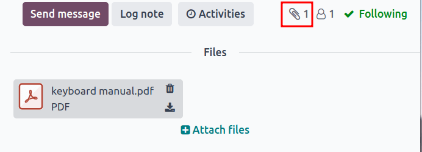

# Version control

Use Odoo's *Product Lifecycle Management (PLM)* to manage previous
versions of bills of materials (BoMs). Store former assembly
instructions, component details, and past product design files while
keeping the past details out of the production
`BoM (Bill of Materials)`.

Easily revert to previous `BoM (Bill of Materials)` versions, when
needed. Additionally, use *PLM* to trace which `BoM (Bill of Materials)`
version was active on specific dates for recalls or customer complaints.

Every `BoM (Bill of Materials)` version is stored in an *engineering
change order* (ECO) for organized testing and improvements without
disrupting normal manufacturing operations.

`Engineering change order <plm/eco>`

## Current BoM version

To see the current version of the `BoM (Bill of Materials)` used in
production, go to `PLM app --> Master
Data --> Bill of Materials`, and select the desired
`BoM (Bill of Materials)` from the list. Then, switch to the
`Miscellaneous` tab, where the currently live `Version` of the
`BoM (Bill of Materials)` is displayed.

> [!NOTE]
> `BoMs (Bills of Materials)` can also be accessed from
> `Manufacturing app --> Products --> Bill of
> Materials`.

## Version history

To manage all former, current, and future versions of a
`BoM (Bill of Materials)`, begin by navigating to
`Manufacturing app --> Products --> Bills of Materials` and click the
desired `BoM (Bill of Materials)`.

From the `BoM (Bill of Materials)` page, click the `ECO` smart button,
and switch to list view by selecting the `≣ (four horizontal lines)`
icon on the top right corner.

> [!NOTE]
> The `ECO` smart button is visible on the `BoM (Bill of Materials)`
> **only** if the *PLM* app is installed.

In the list of `ECOs (Engineering Change Orders)` for the product,
navigate to the search bar at the top, and click the `▼ (down arrow)`
icon on the right to access a drop-down menu of `Filters`.

Next, filter by `Done` `ECOs (Engineering Change Orders)` to view: the
revision history of the `BoM (Bill of Materials)`, the `Responsible`
user who applied the change, and the `Effective Date` of the
`BoM (Bill of Materials)`.

Click each `ECO (Engineering Change Order)` to view the past components,
operations, and design files associated with the
`BoM (Bill of Materials)`.

> [!NOTE]
> If the `Effective Date` field is empty, the `Effective` date of the
> `ECO (Engineering Change Order)` is automatically set to
> `As soon as possible` and no dates are recorded in the revision
> history of the `BoM (Bill of Materials)`.
>
>  alt="List of BOM effective dates." />

> [!TIP]
> A workaround for checking when the `BoM (Bill of Materials)` went live
> is by navigating to the chatter, and hovering over the time the
> `ECO (Engineering Change Order)` was moved to the
> `closing stage <plm/eco/stage-config>`.

## Design files

Attach computer-aided design (CAD) files, PDFs, images, or other design
material to the `BoM (Bill of Materials)` itself.

To do so, navigate to `PLM app --> Master Data --> Bill of Materials`,
and select the desired `BoM (Bill of Materials)`. On the
`BoM (Bill of Materials)`, navigate to the *chatter*, and click the
`📎 (paperclip)` icon.

The files associated with the `BoM (Bill of Materials)` are displayed in
the `Files` section. To add more design files, select the `Attach files`
button.

### Manage design files in an ECO

Add, modify, and remove files in an `ECO (Engineering Change Order)`.
Once the `ECO (Engineering Change Order)` is approved and applied, the
new files are automatically linked to the production
`BoM (Bill of Materials)`. Archived files are removed from the
`BoM (Bill of Materials)`, but are still accessible in the
`ECO (Engineering Change Order)`.

To manage the design files in the `ECO (Engineering Change Order)`,
begin by navigating to `PLM app --> Changes` and choose the desired
`ECO (Engineering Change Order)`. Next, open the `Attachments` page by
clicking the `Documents` smart button.

Hover over each attachment to reveal the `︙ (three vertical dots)`
icon. From there, choose whether to `Edit`, `Remove`, or `Download` the
file. Any changes made to these files are contained within the
`ECO (Engineering Change Order)`, and will only apply to the production
`BoM (Bill of Materials)` once the
`changes are applied <plm/eco/apply-changes>`.

In the Create 60% keyboard
`ECO (Engineering Change Order)`, the design files are from the original
100% keyboard `BoM (Bill of Materials)`.
To replace the keyboard PDF, begin by selecting the `Documents` smart
button.

On the `Attachments` page, hover over the 100%
keyboard manual.pdf design file, and click the
`︙ (three vertical dots)` icon. Then, click the `Remove` option to
archive the file.

Next, on the same `Attachments` page, click the `Upload` button to
upload the new design file, named 60% keyboard
manual.

> [!NOTE]
> Archived files are **not** permanently deleted — they can still be
> accessed in the previous `ECO (Engineering Change Order)`, or as an
> archived file in the latest `ECO (Engineering Change Order)`, where
> the archival occurred.

## Apply rebase

Odoo simplifies merge conflict resolution for concurrent
`ECOs (Engineering Change Orders)` on the same product.

Conflicts can occur when the production `BoM (Bill of Materials)` is
updated while other `ECOs (Engineering Change Orders)` are modifying the
previous version. Differences between the new and previous production
`BoMs (Bills of Materials)` are displayed in the
`Previous Eco Bom Changes` tab, visible only in this scenario.

To resolve conflicts and retain `ECO (Engineering Change Order)`
changes, click the `Apply Rebase` button.

Two `ECOs (Engineering Change Orders)`,
ECO0011 and
ECO0012, are created when the current
`BoM (Bill of Materials)` version is 5.
In ECO0011, a new component,
Space stabilizer, is added, and the
changes are applied. This means the current `BoM (Bill of Materials)`
version has become 6.

This means ECO0012 is modifying an
outdated `BoM (Bill of Materials)`. As shown in the `Previous Eco Bom
Changes` tab, the `BoM (Bill of Materials)` is missing the
Space stabilizer.

To ensure the changes applied by ECO0011
are kept when the changes occur in
ECO0012, click the `Apply Rebase` button
to apply the previous `ECO (Engineering Change Order)` changes, without
affecting the changes already made to
ECO0012.

