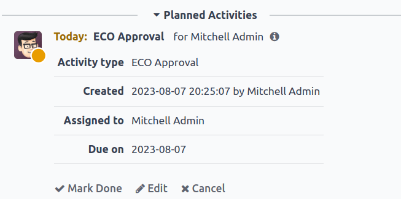

# Approvals

Notify stakeholders and managers automatically by assigning approvers to
stages of `engineering
change orders <plm/eco>` (ECOs) under review. Changes can only be
applied after the assigned approver accepts them. Approvals ensure
reviews by team members, which prevents mistakes and premature actions.

`Stage configuration <plm/eco/stage-config>`

## Add approver

To add an approver, first go to the `PLM app`, and click on the project
card of an ECO type to open the Gantt view of the
`ECOs (Engineering Change Orders)`.

On the `Engineering Change Orders` page, hover over the intended stage,
and select the `⚙️ (gear)` icon. Then, click `Edit` to open a pop-up
window.

> [!NOTE]
> Approvers can be added to any stage, but it's strongly recommended to
> assign them to the *verification* stage, which comes before the
> *closing* stage, where `ECOs (Engineering Change Orders)` are applied,
> and the `BoM (Bill of Materials)` version is updated.
>
> See the documentation about `stage types <plm/eco/stage-config>` for
> more information.

In the `Edit` stage pop-up window, click the `Add a line` button,
located under `Approvals`. Then, type in the approver's position (or
title) under `Role` (e.g. Engineering
Manager, Quality Team, etc.), and
select the relevant `User` from the drop-down menu.

Next, set the `Approval Type` to `Is required to approve`, `Approves,
but the approval is optional`, or `Comments only`.

Assign the CTO, "Mitchell Admin," as a
required approver for `ECOs (Engineering Change Orders)` in the
Validated stage in the
New Product Introduction ECO type.

Approvals from the quality and marketing teams are **not** required to
apply changes to the `ECO (Engineering Change Order)` because their
`Approval Type` is set to `Approves, but the approval is
optional` and `Comments only`, respectively.

## Manage approvals

Approvers can easily track their to-do approvals by navigating to the
`PLM app`, and looking at the card for an ECO type, which shows the
count of open tasks assigned to them.

Here's what each button on an ECO project card does:

1.  The `# Engineering Changes` button displays a count of in-progress
    `ECOs (Engineering Change Orders)` of this ECO type. Clicking the
    button opens the Gantt view of the `Engineering Change Orders` page.

2.  `My Validations` displays a count of
    `ECOs (Engineering Change Orders)` the approver must accept or
    reject. Clicking on this button displays
    `ECOs (Engineering Change Orders)` pending approval or rejected
    (marked with the red `Blocked` state).

3.  The `All Validations` button shows the count of
    `ECOs (Engineering Change Orders)` awaiting approval or rejected by
    any approver. Clicking it reveals these pending
    `ECOs (Engineering Change Orders)`.

4.  `To Apply` displays a count of `ECOs (Engineering Change Orders)` to
    which the user needs to apply changes. Clicking on the button
    displays all the `ECOs (Engineering Change Orders)` to approve, and
    apply changes to, in the verification stage.

    `ECOs (Engineering Change Orders)` marked with the green `Done`
    stage have already been approved, and the user just needs to click
    on the `ECO (Engineering Change Order)` to enter the form view, and
    click the `Apply Changes` button.

### Approve ECOs

Navigate to an `ECO (Engineering Change Order)` in a verification stage,
while logged in as the assigned approver, to see the `Approve`,
`Reject`, and `Apply Changes` buttons.

To approve the `ECO (Engineering Change Order)`, and apply the changes
onto the production `BoM (Bill of Materials)`, click `Approve`, and then
`Apply Changes`.

Note that the `Apply Changes` button will **not** work unless the
`Approve` button was clicked first. Additionally, the chatter logs the
history of the clicked buttons.

> [!WARNING]
> When the `Approval Type` is **not** set to `Is required to approve`,
> approval from the associated user is not needed before applying
> changes with the `Apply Changes` button. Thus, the `Apply Changes`
> button **will work** without requiring the `Approve` button to be
> clicked first.

### Automated activities

When an `ECO (Engineering Change Order)` is moved to a verification
stage, a planned activity is automatically created for assigned
approvers to review the `ECO (Engineering Change Order)`. Approvers
receive a notification in their activities inbox, accessible through the
`🕘 (clock)` icon at the top of the page.

In the to-do task list, the `Engineering Change Order (ECO)`
notification displays the number of activities marked `Late`, `Today`,
and `Future`. Clicking on each of these buttons shows a filtered Gantt
view of the respective `ECOs (Engineering Change Orders)`.

Scheduled activities are shown as a number on the `🕘 (clock)` icon,
with 5 `ECOs (Engineering Change Orders)`
pending approval `Today`. Currently, there are
0 `Late` or `Future`
`ECOs (Engineering Change Orders)`.

By clicking a pending `ECO (Engineering Change Order)`, a *planned
activity* for `ECO Approval` is recorded in the chatter. Click on the
`i (Info)` icon to view additional information, including the approval's
`Created` date, the approver `Assigned to` it, and the due date.

#### Follow-up activities

When `ECOs (Engineering Change Orders)` are rejected, tasks need to be
assigned to project members for required modifications before
`ECO (Engineering Change Order)` approval. To create tasks with
deadlines, navigate to the rejected `ECO (Engineering Change Order)`
form, and go to the chatter.

Select the `Mark Done` button in the `Planned Activities` section of the
chatter to close the activity, and open a pop-up window for creating
tasks.

In the `Mark Done` window, click `Done & Schedule Next` to open a new
`Schedule an Activity` window. Next, set the `Assigned to` team member
and the `Due Date` for completing the changes. Provide task details in
the `Summary` field and the text box. Click the `Schedule` button to
close the window.

After closing the window, on the `ECO (Engineering Change Order)` form,
move the `ECO (Engineering Change Order)` back one stage. Doing so
ensures that when the team member completes the changes, and returns the
`ECO (Engineering Change Order)` to the verification stage, a new
`ECO Approval` task is created for the approver.

The approver creates an activity for the `Responsible` of the
`ECO (Engineering Change Order)`, Laurie
Poiret, that details the changes required for the approver to
`Accept` the `ECO (Engineering Change Order)`. Clicking the `Schedule`
button creates a planned activity for Laurie due on
08/15/2023.

