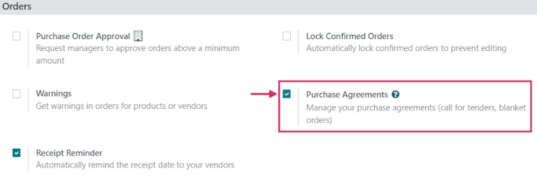
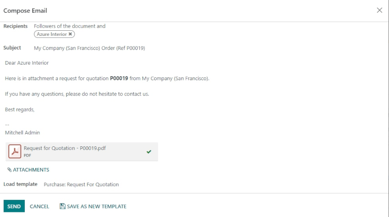
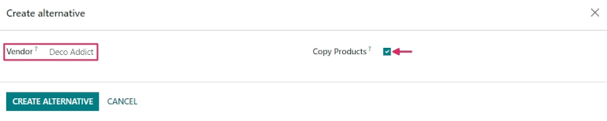
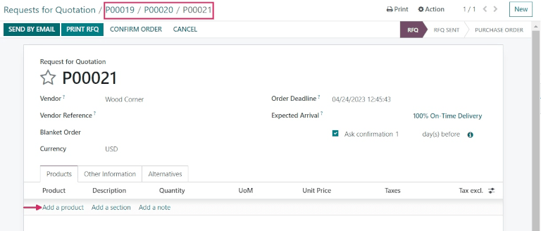
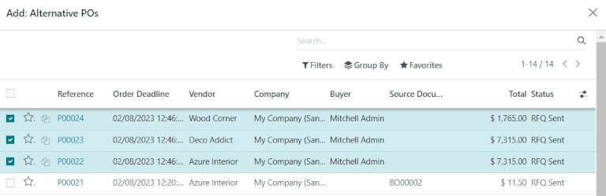
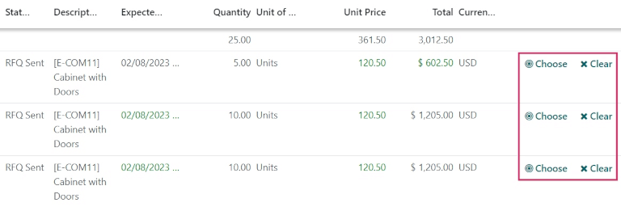
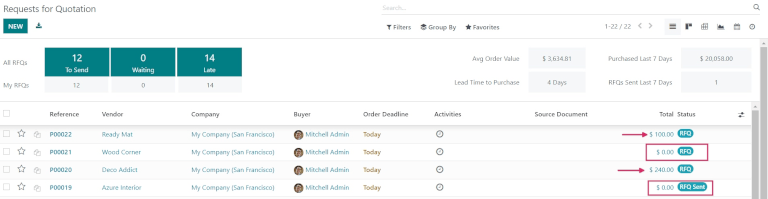
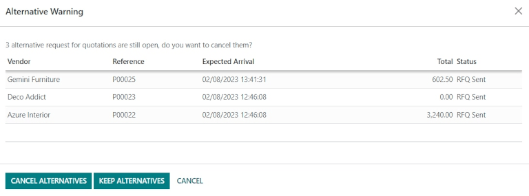

# Create alternative requests for quotation for multiple vendors

Sometimes, companies might want to request offers from multiple vendors
at the same time, by inviting those vendors to submit offers for similar
goods or services all at once. This helps companies to select the
cheapest (and fastest) vendors, depending on their specific business
needs.

In Odoo, this can be done by adding alternative requests for quotation
(RFQs) for different vendors. Once a response is received from each
vendor, the product lines from each `RFQ
(Request for Quotation)` can be compared, and a decision can be made for
which products to purchase from which vendors.

Sometimes referred to as a *call for tender*, this process is primarily
used by organizations in the public sector, who are legally bound to use
it when making a purchase. However, private companies can also use
alternative `RFQs (Requests for Quotation)` to spend money efficiently,
as well.

`blanket_orders`

## Configure purchase agreement settings

To create alternative `RFQs (Requests for Quotation)` directly from a
quotation, the *Purchase Agreements* feature first needs to be enabled
in the settings of the *Purchase* app. To do this, go to
`Purchase --> Configuration --> Settings`, and under the `Orders`
section, click the checkbox next to `Purchase Agreements`. Doing so will
enable the ability to create alternative
`RFQs (Requests for Quotation)`, as well as the ability to create
*blanket orders*.

> [!TIP]
> To save time on a *call for tender*, custom vendors, prices, and
> delivery lead times can be set in the `Purchase` tab on a product
> form. To do so, navigate to `Purchase --> Products --> Products`, and
> select a product to edit. From the product form, click the
> `Purchase tab`, then click `Add a line`. From the drop-down menu,
> choose a vendor to set under the `Vendor` column, and set a `Price`
> and `Delivery Lead Time` if desired. Clicking the
> `additional options (two-dots)` icon provides additional visibility
> options to add to the line item.

## Create an `RFQ (Request for Quotation)`

To create a new `RFQ (Request for Quotation)`, navigate to the
`Purchase` app, and click `New`.

Then, add information to the `RFQ (Request for Quotation)` form: add a
vendor from the drop-down next to the `Vendor` field, and click
`Add a product` to select a product from the drop-down menu in the
`Product` column. Then, set the desired purchase quantity in the
`Quantity` column, and change the purchase price in the `Unit
Price` column, if desired.

Clicking the `additional options (two-dots)` icon provides additional
visibility options to add to the line item. Repeat these steps to add as
many options as desired, including the `UoM` (Units of Measure) to
purchase the products in, and the `Expected Arrival` date.

Once ready, click `Send by Email`. This causes a `Compose Email` pop-up
window to appear, wherein the message to the vendor can be customized.
Once ready, click `Send`. This turns the `RFQ (Request for Quotation)`
into a purchase order (PO), and sends an email to the vendor listed on
the purchase order form.

> [!NOTE]
> Sending emails to each vendor can be useful when creating alternative
> `RFQs (Requests for Quotation)`, because vendors can confirm if their
> past prices still hold today, which can help companies choose the best
> offers for them.

## Create alternatives to an `RFQ (Request for Quotation)`

Once a `PO (Purchase Order)` is created and sent by email to a vendor,
alternative `RFQs
(Requests for Quotation)` can be created and sent to additional,
alternate vendors to compare prices, delivery times, and other factors
to make a decision from which vendors to order which products.

To create alternative `RFQs (Requests for Quotation)`, click the
`Alternatives` tab from the purchase order form, then click
`Create Alternative`. When clicked, a `Create alternative` pop-up window
appears.

From this window, select a new/different vendor from the drop-down menu
next to the `Vendor` field to assign this alternative quotation to.

Next to this, there is a `Copy Products` checkbox that is selected by
default. When selected, the product quantities of the original
`PO (Purchase Order)` are copied to the alternative. For this first
alternative quotation, leave the checkbox checked. Once finished, click
`Create Alternative`. This creates (and navigates to) a new
`PO (Purchase Order)`.

Since the `Create Alternative` checkbox was left checked, this new
purchase order form is already populated with the same products,
quantities, and other details as the previous, original
`PO (Purchase Order)`.

> [!NOTE]
> When the `Copy Products` checkbox is selected while creating an
> alternative quotation, additional products do not need to be added on
> the purchase order form unless desired. However, if a chosen vendor is
> listed in the `Vendor` column under the `Purchase` tab on a product
> form included in the purchase order, the values set on the product
> form carry over to the `PO (Purchase Order)`, and have to be changed
> manually, if desired.

Once ready, create a second alternative quotation by clicking the
`Alternatives` tab, and once again, click `Create Alternative`. This
causes the `Create alternative` pop-up window to appear again. This
time, choose a different vendor from the drop-down menu next to
`Vendor`, and this time, *uncheck* the `Copy Products` checkbox. Then,
click `Create Alternative`.

> [!TIP]
> If an alternative quotation needs to be removed from the
> `Alternatives` tab, they can be individually removed by clicking on
> the `Remove (X)` icon at the end of their row.

This creates a third, new purchase order. But, since the product
quantities of the original `PO (Purchase Order)` were *not* copied over,
the product lines are empty, and new products need to be added by
clicking `Add a product`, and selecting the desired products from the
drop-down menu. Once the desired number of products are added, click
`Send by Email`.

This causes a `Compose Email` pop-up window to appear, wherein the
message to the vendor can be customized. Once ready, click `Send` to
send an email to the vendor listed on the purchase order form.

From this newest purchase order form, click the `Alternatives` tab.
Under this tab, all three purchase orders can be seen in the `Reference`
column. Additionally, the vendors are listed under the `Vendor` column,
and the order `Total` and `Status` of the orders are in the rows, as
well.

## Link a new `RFQ (Request for Quotation)` to existing quotations

Creating alternative quotations directly from a purchase order form
under the `Alternatives` tab is the easiest way to create and link
quotations. However, separate `RFQs (Requests for Quotation)` can also
be linked *after* the fact, even if they are created completely
separately at first.

To create a new `RFQ (Request for Quotation)`, navigate to the
`Purchase` app, and click `New`.

Then, add information to the `RFQ (Request for Quotation)` form: add a
vendor from the drop-down next to the `Vendor` field, and click
`Add a product` to select a product from the drop-down menu in the
`Product` column. Then, set the desired purchase quantity in the
`Quantity` column, and change the purchase price in the `Unit Price`
column, if desired.

Once ready, click `Send by Email`. This causes a `Compose Email` pop-up
window to appear, wherein the message to the vendor can be customized.
Once ready, click `Send` to send an email to the vendor listed on the
purchase order form.

Then, click the `Alternatives` tab once more. Since this new
`PO (Purchase Order)` was created separately, there are no other orders
linked yet. To link this order with the alternatives created previously,
click `Link to Existing RfQ` on the first line in the `Vendor` column.

This causes an `Add: Alternative POs` pop-up window to appear. Select
the three purchase orders created previously, and click `Select`. All of
these orders are now copied to this `PO (Purchase Order)` under the
`Alternatives` tab.

> [!TIP]
> If a large number of purchase orders are being processed and the
> previous `POs (Purchase Orders)` can't be located, try clicking
> `Group By -->
> Vendor` under the search bar at the top of the pop-up window to group
> by the vendors selected on the previous orders.

## Compare product lines

When there are multiple `RFQs (Requests for Quotation)` linked as
alternatives, they can be compared side-by-side in order to determine
which vendors offer the best deals on which products. To compare each
quotation, go to the `Purchase` app, and select one of the quotations
created previously.

Then, click the `Alternatives` tab to see all the linked
`RFQs (Requests for Quotation)`. Next, under the `Create Alternative`
tab, click `Compare Product Lines`. This navigates to a Compare Order
Lines page.

The Compare Order Lines page, by default, groups by `Product`. Each
product included in any of the `RFQs (Requests for Quotation)` is
displayed in its own drop-down, along with all of the
`PO (Purchase Order)` numbers in the `Reference` column.

Additional columns on this page include the `Vendor` from which products
were ordered, the `Status` of the quotation (i.e., RFQ, RFQ Sent); the
`Quantity` of products ordered from each vendor; the `Unit Price` per
product and `Total` price of the order, and more.

> [!NOTE]
> To remove product lines from the Compare Order Lines page, click
> `Clear` at the far right end of that product line's row. This removes
> this product as a chooseable option from the page, and changes the
> `Total` price of that product on the page to **0**. On the purchase
> order form in which that product was included, its ordered quantity is
> changed to **0**, as well.

Once the best offers have been identified, at the end of each row,
individual products can be selected by clicking `Choose`. Once all the
desired products have been chosen, click `Requests for Quotation` (in
the breadcrumbs, at the top of the page) to navigate back to an overview
of all `RFQs (Requests for Quotation)`.

## Cancel (or keep) alternatives

Now that the desired products have been chosen, based on which vendors
provided the best offer, the other `RFQs (Requests for Quotation)` (from
which no products were chosen) can be canceled.

Under the `Total` column, at the far right of each row, the orders from
which no products were chosen have automatically had their total cost
set to **0**. Although they haven't been canceled yet, this means that
they can ultimately be canceled without repercussions, *after* the
desired purchase orders have been confirmed.

To confirm a quotation that contains the chosen product quantities,
click into one. Then, click `Confirm Order`. This causes an
`Alternative Warning` pop-up window to appear. From there, either
`Cancel Alternatives` or `Keep Alternatives` can be clicked. If this
`PO (Purchase Order)` should *not* be confirmed, click `Cancel`.

`Cancel Alternatives` automatically cancels the alternative purchase
orders. `Keep Alternatives` keeps the alternative purchase orders open,
so they can still be accessed if any additional product quantities need
to be ordered. Once all products are ordered, `Cancel Alternatives` can
be selected from whichever `PO (Purchase Order)` is open.

To view a detailed form of one of the `RFQs (Requests for Quotation)`
listed, click the line item for that quotation. This causes an
`Open: Alternative POs` pop-up window to appear, from which all details
of that particular quotation can be viewed. Click `Close` when finished.

From the `Alternative Warning` pop-up window, click `Keep Alternatives`
to keep all alternative quotations open for now. Then, click
`Requests for Quotation` (in the breadcrumbs, at the top of the page) to
navigate back to an overview of all `RFQs (Requests
for Quotation)`.

Click into the remaining quotation(s) that contain products that need to
be ordered, and click `Confirm Order`. This causes the
`Alternative Warning` pop-up window to appear again. This time, click
`Cancel Alternatives` to cancel all other alternative `RFQs` linked with
this quotation.

Finally, click `Requests for Quotation` (in the breadcrumbs, at the top
of the page) to navigate back to an overview of all
`RFQs (Requests for Quotation)`. The canceled orders can be seen greyed
out and listed with a `Cancelled` status under the `Status` column at
the far right of their rows.

Now that all product quantities have been ordered, the purchase process
can be followed, and continued to completion, until the products are
received into the warehouse.
