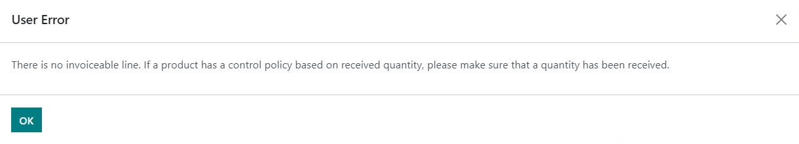
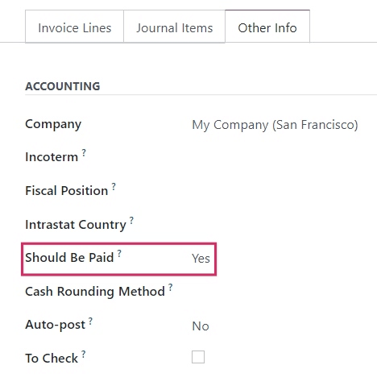
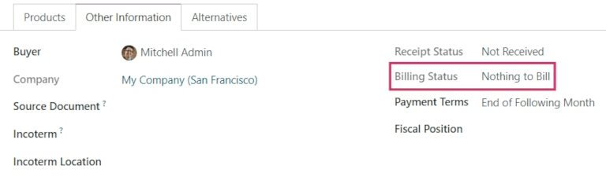

# Bill control policies

In Konvergo ERP, the *bill control* policy determines the quantities billed by
vendors on every purchase order, for ordered or received quantities. The
policy selected in the settings will act as the default value and will
be applied to any new product created.

## Configuration

To view the default bill control policy and make changes, go to
`Purchase -->
Configuration --> Settings`, and scroll down to the `Invoicing` section.
Here, there are the two `Bill Control` policy options:
`Ordered quantities` and `Received quantities`.

The policy selected will be the default for any new product created. The
definition of each policy is as follows:

- `Ordered quantities`: creates a vendor bill as soon as a purchase
  order is confirmed. The products and quantities in the purchase order
  are used to generate a draft bill.
- `Received quantities`: a bill is created only *after* part of the
  total order has been received. The products and quantities *received*
  are used to generate a draft bill. An error message will appear if
  creation of a vendor bill is attempted without receiving anything.

> [!NOTE]
> If one or two products need a different control policy, the default
> bill control setting can be overridden by going to the `Purchase` tab
> in a product's template and modifying its `Control Policy` field.

### Example flow: Ordered quantities

To complete an example workflow using the *ordered quantities* bill
control policy, first go to `Purchase --> Configuration --> Settings`,
scroll down to the `Invoicing` section, and select `Ordered quantities`.
Then, `Save` changes.

In the `Purchase` app, create a new `RFQ (Request for Quotation)`. Fill
out the information on the quotation form, add products to the invoice
lines, and click `Confirm
Order`. Then, click `Create Bill`. Since the policy is set to *ordered
quantities*, the draft bill can be confirmed as soon as it is created,
without any products actually being received.

### Example flow: Received quantities

To complete an example workflow using the *received quantities* bill
control policy, first go to `Purchase --> Configuration --> Settings`,
scroll down to the `Invoicing` section, and select
`Received quantities`. Then, `Save` changes.

In the `Purchase` app, create a new `RFQ (Request for Quotation)`. Fill
out the information on the quotation form, add products to the invoice
lines, and click `Confirm
Order`. Then, click on the `Receipt smart button`. Set the quantities in
the `Done` column to match the quantities in the `Demand` column, and
`Validate` the changes. Then, in the purchase order, click `Create Bill`
and `Confirm`. Since the policy is set to *received quantities*, the
draft bill can be confirmed *only* when at least some of the quantities
are received.

## 3-way matching

Activating `3-way matching` ensures that vendor bills are only paid once
some or all of the products included in the purchase order have actually
been received. To activate it, go to
`Purchase --> Configuration --> Settings`, and scroll down to the
`Invoicing` section. Then, click
`3-way matching: purchases, receptions, and
bills`.

> [!NOTE]
> 3-way matching is *only* intended to work when the bill control policy
> is set to *received quantities*.

### Pay vendor bills with 3-way matching

When `3-way matching` is activated, vendor bills will display the
`Should Be
Paid` field under the `Other Info` tab. When a new vendor bill is
created, the field will be set to `Yes`, since a bill can't be created
until at least some of the products included in a purchase order have
been received.

> [!NOTE]
> If the total quantity of products from a purchase order has not been
> received, Konvergo ERP only includes the products that *have* been received in
> the draft vendor bill.

Draft bills can be edited to increase the billed quantity, change the
price of the products in the bill, and add additional products to the
bill. If this is done, the `Should Be Paid` field status will be set to
`Exception`. This means that Konvergo ERP notices the discrepancy, but doesn't
block the changes or display an error message, since there might be a
valid reason for making changes to the draft bill.

Once payment has been registered for a vendor bill and displays the
green `Paid` banner, the `Should Be Paid` field status will be set to
`No`.

> [!TIP]
> The `Should Be Paid` status on bills is set automatically by Konvergo ERP.
> However, the status can be changed manually by clicking the field's
> drop-down menu inside the `Other Info` tab.

## View a purchase order's billing status

When a purchase order is confirmed, its `Billing Status` can be viewed
under the `Other Information` tab on the purchase order form.

Below is a list of the different statuses that a `Billing Status` could
appear as and when they are displayed, depending on the bill control
policy used.

<table style="width:99%;">
<colgroup>
<col style="width: 28%" />
<col style="width: 45%" />
<col style="width: 24%" />
</colgroup>
<tbody>
<tr class="odd">
<td rowspan="2"><code class="interpreted-text"
role="guilabel">Billing Status</code></td>
<td colspan="2"><blockquote>

<strong>Conditions</strong>

</blockquote></td>
</tr>
<tr class="even">
<td><blockquote>

<em>On received quantities</em>

</blockquote></td>
<td><em>On ordered quantities</em></td>
</tr>
<tr class="odd">
<td><code class="interpreted-text"
role="guilabel">Nothing to Bill</code></td>
<td><blockquote>

PO confirmed; no products received

</blockquote></td>
<td><blockquote>

<em>Not applicable</em>

</blockquote></td>
</tr>
<tr class="even">
<td><code class="interpreted-text"
role="guilabel">Waiting Bills</code></td>
<td><blockquote>

All/some products received; bill not created

</blockquote></td>
<td><blockquote>

PO confirmed

</blockquote></td>
</tr>
<tr class="odd">
<td><code class="interpreted-text"
role="guilabel">Fully Billed</code></td>
<td>All/some products received; draft bill created</td>
<td><blockquote>

Draft bill created

</blockquote></td>
</tr>
</tbody>
</table>
