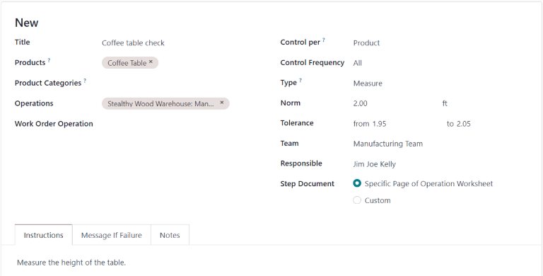
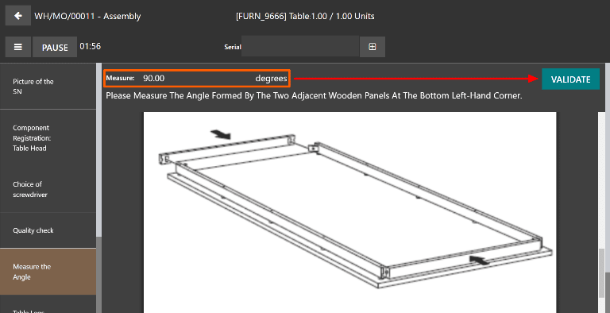

# Measure quality check

In Konvergo ERP *Quality*, a *Measure* check is one of the quality check types
that can be selected when creating a new quality check or quality
control point (QCP). *Measure* checks prompt users to measure a certain
aspect of a product and record the measurement in Konvergo ERP. For the quality
check to pass, the recorded measurement must be within a certain
*tolerance* of a *norm* value.

## Create a Measure quality check

There are two distinct ways that *Measure* quality checks can be
created. A single check can be manually created. Alternatively, a
`QCP (Quality Control Point)` can be configured that automatically
creates checks at a predetermined interval.

This documentation only details the configuration options that are
unique to *Measure* quality checks and `QCPs (Quality Control Points)`.
For a full overview of all the configuration options available when
creating a single check or a `QCP (Quality Control Point)`, see the
documentation on `quality checks
<quality/quality_management/quality-checks>` and `quality control points
<quality/quality_management/quality-control-points>`.

### Quality check

To create a single *Measure* quality check, navigate to
`Quality --> Quality Control
--> Quality Checks`, and click `New`. Fill out the new quality check
form as follows:

- In the `Type` drop-down field, select the `Measure` quality check
  type.
- In the `Team` drop-down field, select the quality team responsible for
  managing the check.
- In the `Instructions` text field of the `Notes` tab, enter
  instructions for how the picture should be taken.

### Quality control point (QCP)

To create a `QCP (Quality Control Point)` that generates *Measure*
quality checks automatically, navigate to
`Quality --> Quality Control --> Control Points`, and click `New`. Fill
out the new `QCP (Quality Control Point)` form as follows:

- In the `Type` drop-down field, select the `Measure` quality check
  type. Doing so causes two new fields to appear: `Norm` and
  `Tolerance`.
  - Use the first text-entry field of the `Norm` field to record the
    ideal measurement that the product should conform to. Use the second
    text-entry field to specify the unit of measurement that should be
    used.
  - The `Tolerance` field features two sub-fields: `from` and `to`. Use
    the `from` field to specify the minimum acceptable measurement, and
    the `to` field to specify the maximum acceptable measurement.
- In the `Team` drop-down field, select the quality team responsible for
  managing the checks created by the `QCP (Quality Control Point)`.
- In the `Instructions` text field, enter instructions for how the
  measurement should be taken.

## Process a Measure quality check

Once created, there are multiple ways that *Measure* quality checks can
be processed. If a quality check is assigned to a specific inventory,
manufacturing, or work order, the check can be processed on the order
itself. Alternatively, a check can be processed from the check's page.

### From the check's page

To process a *Measure* quality check from the check's page, begin by
navigating to `Quality --> Quality Control --> Quality Checks`, and
select a quality check. Follow the `Instructions` for how to take the
measurement.

After taking the measurement, record the value in the `Measure` field on
the quality check form. To manually pass or fail the check, click `Pass`
or `Fail` at the top-left corner of the check.

Alternatively, if the quality check is assigned to a
`QCP (Quality Control Point)` for which *norm* and *tolerance* values
have been specified, click `Measure` at the top-left corner of the check
instead. Doing so automatically marks the check as *Passed* if the
recorded value is within the specified *tolerance*, or *Failed* if the
value is outside of it.

### On an order

To process a *Measure* quality check on an order, select a manufacturing
order or inventory order (receipt, delivery, return, etc.), for which a
check is required. Manufacturing orders can be selected by navigating to
`Manufacturing --> Operations --> Manufacturing Orders`, and clicking on
an order. Inventory orders can be selected by navigating to `Inventory`,
clicking the `# To Process` button on an operation card, and selecting
an order.

On the selected manufacturing or inventory order, a purple
`Quality Checks` button appears at the top of the page. Click the button
to open the `Quality Check` pop-up window, which shows all of the
quality checks required for that order.

To process a *Measure* quality check, measure the product as instructed,
then enter the value in the `Measure` field on the pop-up window.
Finally, click `Validate` to register the recorded value.

If the value entered is within the range specified in the `Tolerance`
section of the `QCP (Quality Control Point)`, the quality check passes
and the pop-up window closes. The rest of the manufacturing or inventory
order can then be processed as usual.

However, if the value entered is outside of the specified range, a new
pop-up window appears, titled `Quality Check Failed`. The body of the
pop-up shows a warning message that states,
`You measured # units and it should be between # units and # units.`, as
well as the instructions entered in the `Message If Failure` tab of the
`QCP (Quality Control Point)`. At the bottom of the pop-up, two buttons
appear: `Correct Measure` and `Confirm Measure`.

If the measurement was not entered correctly and should be changed,
select `Correct
Measure`. Doing so re-opens the `Quality Check` pop-up window. Enter the
corrected measurement in the `Measure` field, and then click `Validate`
to complete the check.

If the measurement was entered correctly, click `Confirm Measure`
instead, and the quality check fails. Follow any instructions that were
listed on the `Quality Check Failed` pop-up window.

If a quality alert must be created, click the `Quality Alert` button
that appears at the top of the manufacturing or inventory order after
the check fails. Clicking `Quality
Alert` opens a quality alert form on a new page.

For a complete guide on how to fill out the quality alert form, view the
documentation on
`quality alerts <quality/quality_management/quality-alerts>`.

### On a work order

When configuring a `QCP (Quality Control Point)` that is triggered
during manufacturing, a specific work order can also be specified in the
`Work Order Operation` field on the `QCP (Quality Control Point)` form.
If a work order is specified, a *Measure* quality check is created for
that specific work order, rather than the manufacturing order as a
whole.

*Measure* quality checks created for work orders must be processed from
the tablet view. To do so, begin by navigating to
`Manufacturing --> Operations --> Manufacturing Orders`. Select a
manufacturing order that includes a work order for which a quality check
is required. Open the tablet view for that work order by selecting the
`Work Orders` tab, and then clicking the `📱 (tablet)` button on the
order's line.

With tablet view open, complete the steps listed on the left side of the
screen until the *Measure* quality check step is reached. Upon reaching
the check, the instructions for how to take the measurement appear at
the top of the screen. Enter the measured value in the `Measure` field
above the instructions, and then click `Validate`.

If the measurement entered is within the range specified in the
`Tolerance` section of the `QCP (Quality Control Point)`, the quality
check passes and the tablet view moves on to the next step of the work
order. However, if the measurement entered is outside of the specified
range, a pop-up window appears, titled `Quality Check Failed`.

The body of the `Quality Check Failed` pop-up window shows a warning
message that states,
`You measured # units and it should be between # units and # units.`, as
well as the instructions entered in the `Message If Failure` tab of the
`QCP (Quality Control Point)`. At the bottom of the pop-up, two buttons
appear: `Correct Measure` and `Confirm Measure`.

If the measurement was not entered correctly, and should be changed,
select `Correct
Measure`. Doing so opens a new pop-up window, titled `Quality Check`.
Enter the corrected measurement in the `Measure` field, then click
`Validate` to complete the check, and move on to the next step of the
work order.

If the measurement was entered correctly, click `Confirm Measure`
instead, and the quality check fails. Follow any instructions that were
listed on the `Quality Check Failed` pop-up window.

If a quality alert must be created, do so by clicking the
`☰ (three horizontal lines)` button, and selecting `Quality Alert` from
the `Menu` pop-up window. A `Quality Alerts` pop-up window appears, from
which a quality alert can be created.

For a complete guide on how to fill out the quality alert form, view the
documentation on
`quality alerts <quality/quality_management/quality-alerts>`.
