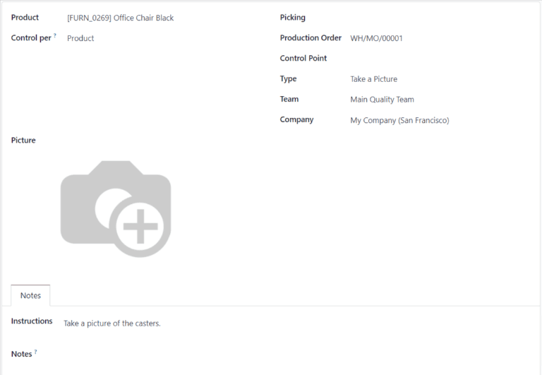
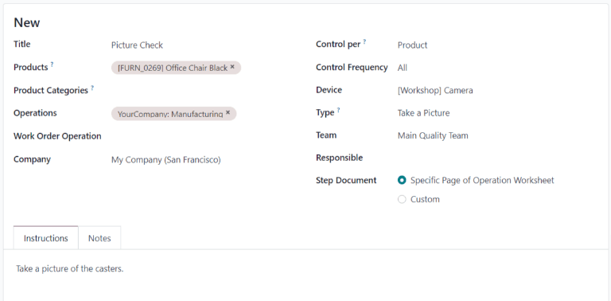
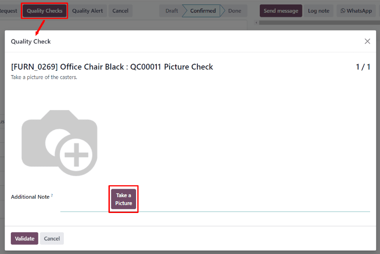
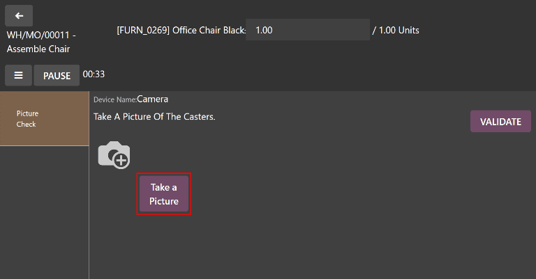

# Take a Picture quality check

In Konvergo ERP *Quality*, a *Take a Picture* check is one of the quality check
types that can be selected when creating a new quality check or quality
control point (QCP). *Take a Picture* checks require a picture to be
attached to the check, which can then be reviewed by a quality team.

## Create a Take a Picture quality check

There are two distinct ways that *Take a Picture* quality checks can be
created. A single check can be manually created. Alternatively, a
`QCP (Quality Control Point)` can be configured that automatically
creates checks at a predetermined interval.

This documentation only details the configuration options that are
unique to *Take a Picture* quality checks and
`QCP (Quality Control Points)`. For a full overview of all the
configuration options available when creating a single check or a
`QCP (Quality Control Point)`, see the documentation on `quality checks
<quality/quality_management/quality-checks>` and `quality control points
<quality/quality_management/quality-checks>`.

### Quality check

To create a single *Take a Picture* quality check, navigate to
`Quality --> Quality
Control --> Quality Checks`, and click `New`. Fill out the new quality
check form as follows:

- In the `Type` drop-down field, select the `Take a Picture` quality
  check type.
- In the `Team` drop-down field, select the quality team responsible for
  managing the check.
- In the `Instructions` text field of the `Notes` tab, enter
  instructions for how the picture should be taken.

### Quality Control Point (QCP)

To create a `QCP (Quality Control Point)` that will generate *Take a
Picture* quality checks automatically, navigate to
`Quality --> Quality Control --> Control Points`, and click `New`. Fill
out the new `QCP (Quality Control Point)` form as follows:

- In the `Type` drop-down field, select the `Take a Picture` quality
  check type.
- If the *Maintenance* app is installed, a `Device` field appears after
  selecting the *Take a Picture* check type. Use this field to specify a
  device that should be used to take quality check pictures. For
  information about managing devices in the *Maintenance* app, see the
  documentation on
  `adding new equipment <maintenance/equipment_management/add_new_equipment>`.
- In the `Team` drop-down field, select the quality team responsible for
  managing the checks created by the `QCP (Quality Control Point)`.
- In the `Instructions` text field, enter instructions for how the
  picture should be taken.

## Process a Take a Picture quality check

Once created, there are multiple ways that *Take a Picture* quality
checks can be processed. If a quality check is assigned to a specific
inventory, manufacturing, or work order, the check can be processed on
the order itself. Alternatively, a check can be processed from the
check's page.

### From the check's page

To process a *Take a Picture* quality check from the check's page, begin
by navigating to `Quality --> Quality Control --> Quality Checks`, and
then select a quality check. Follow the `Instructions` for how to take
the picture.

After taking the picture, make sure it is stored on the device being
used to process the quality check (computer, tablet, etc.). Then, click
the `✏️ (pencil)` button in the `Picture` section to open the device's
file manager. In the file manager, navigate to the picture, select it,
and click `Open` to attach it.

### On an order

To process a *Take a Picture* quality check on an order, select a
manufacturing order or inventory order (receipt, delivery, return,
etc.), for which a check is required. Manufacturing orders can be
selected by navigating to
`Manufacturing --> Operations --> Manufacturing Orders`, and clicking on
an order. Inventory orders can be selected by navigating to `Inventory`,
clicking the `# To Process` button on an operation card, and selecting
an order.

On the selected manufacturing or inventory order, a purple
`Quality Checks` button appears at the top of the page. Click the button
to open the `Quality Check` pop-up window, which shows all of the
quality checks required for that order.

Follow the instructions detailing how to take the picture, which are
shown on the `Quality
Check` pop-up window. After taking the picture, make sure it is stored
on the device being used to process the quality check (computer, tablet,
etc.).

Then, click the `Take a Picture` button in the `Picture` section to open
the device's file manager. In the file manager, navigate to the picture,
select it, and click `Open` to attach it. Finally, click `Validate` on
the `Quality Check` pop-up window to complete the quality check.

If a quality alert must be created, click the `Quality Alert` button
that appears at the top of the manufacturing or inventory order after
the check is validated. Clicking `Quality Alert` opens a quality alert
form on a new page. For a complete guide on how to fill out quality
alert forms, view the documentation on `quality alerts
<quality/quality_management/quality-alerts>`.

### On a work order

When configuring a `QCP (Quality Control Point)` that is triggered
during manufacturing, a specific work order can also be specified in the
`Work Order Operation` field on the `QCP (Quality Control Point)` form.
If a work order is specified, a *Take a Picture* quality check is
created for that specific work order, rather than the manufacturing
order as a whole.

*Take a Picture* quality checks created for work orders must be
completed from the tablet view. To do so, begin by navigating to
`Manufacturing --> Operations --> Manufacturing
Orders`. Select a manufacturing order that includes a work order for
which a quality check is required. Open the tablet view for that work
order by selecting the `Work Orders` tab, and then clicking the
`📱 (tablet)` button on the order's line.

With tablet view open, complete the steps listed on the left side of the
screen until the *Take a Picture* quality check step is reached. Upon
reaching the check, follow the instructions for how to take the picture,
which appear at the top of the screen.

After taking the picture, make sure it is stored on the device being
used to process the work order (computer, tablet, etc.). Then, click the
`Take a Picture` button to open the device's file manager. In the file
manager, navigate to the picture, select it, and click `Open` to attach
it. Finally, click `Validate` to complete the quality check.

If a quality alert must be created, do so by clicking the
`☰ (three horizontal lines)` button in the tablet view, and selecting
`Quality Alert` from the `Menu` pop-up window. A `Quality Alerts` pop-up
window appears, from which a quality alert can be created. For a
complete guide on how to fill out quality alert forms, view the
documentation on
`quality alerts <quality/quality_management/quality-alerts>`.

## Review a picture attached to a check

After a picture has been attached to a check, it can then be reviewed by
quality team members or other users. To do so, navigate to
`Quality --> Quality Control --> Quality Checks`, and select a quality
check to review.

The attached picture appears in the `Picture` section of the quality
check form. After reviewing the picture, click the `Pass` button if the
check passes, or the `Fail` button if the check fails.

