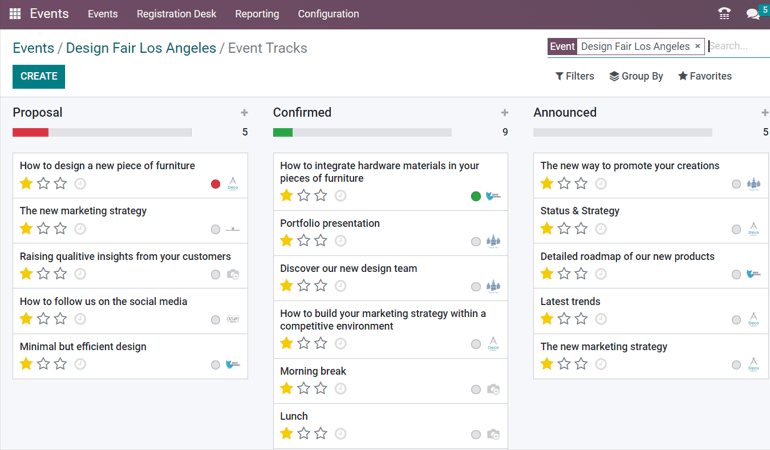
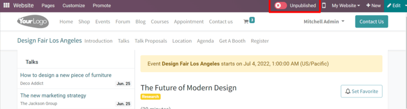
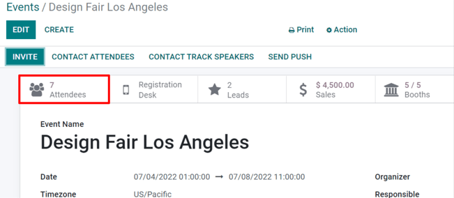
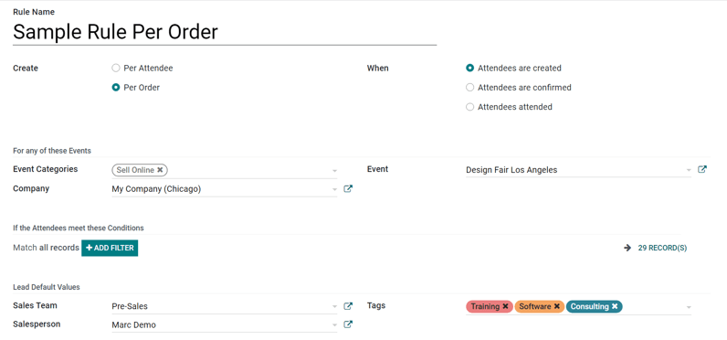

# Track and manage talks

With Konvergo ERP Events, it's possible to provide attendees with the power to
propose presenters to speak at events.

## Configuration

First, go to `Events --> Configuration --> Settings` and enable
`Schedule &
Tracks`.

When that feature is enabled, two more options become available: *Live
Broadcast* and *Event Gamification*.

`Live Broadcast` allows for the airing of tracks online through a
YouTube integration.

`Event Gamification` allows for the sharing of a quiz with your
attendees, once a track (talk) is over.

> [!TIP]
> `Event Gamification` isn't necessary for tracks to appear on the event
> page on the website, but it can enhance the engagement and overall
> enjoyablity of the event for attendees.

## Talks, talk proposals, and agenda

Once those two features are enabled, the following links are
automatically added to the sub-header menu, located on the event page on
the website: `Talks`, `Talk Proposals`, and `Agenda`. Any attendee can
freely access these menu items and their corresponding content.

The `Talks` link takes the attendee to a page full of all the talks for
that event.

The `Talks Proposals` link takes the attendee to a form page, where they
can propose talks for the event.

The `Agenda` link takes the attendee to a page with all the talks for
the event, but in a calendar/time-slot format.

## Manage talk proposals

When attendees fill out and submit a talk proposal form on the website,
a new `Proposal` is instantly created in the back end for the event.

> [!NOTE]
> All talks (Proposals, Confirmed, Announced, etc.) are accessible via
> the `Tracks` smart button on the event form.

If a proposal is accepted, move the `Event Track` to the appropriate
stage in the Kanban view (e.g. Confirmed,
etc.). Then, go to that particular event's template form, and click the
`Go to Website` smart button to reach that specific talk's page on the
website.

In the upper right corner, toggle the switch from `Unpublished` to
`Published`, and the talk is instantly accessible on the website.

> [!NOTE]
> Without publishing a talk, attendees will never be able to access it.

### Attendees list and attendance

Once attendees have registered for a specific event, they are added to
the `Attendee List` for that event, which is accessible via the
`Attendees` smart button on the event template form, or
`Reporting --> Attendees` and sorted by event.

> [!NOTE]
> When an attendee arrives at the event, they will be marked as
> attending (`Confirmed
> Attendance`), and the status of that attendee will change to
> `Attended.`

When analyzing an `Attendees list`, Konvergo ERP provides different ways to view
the information. Each view option presents the same information, but in
a slightly different layout. To change the view, click on the icons in
the upper right hand of the screen.

In the `Kanban` view, it can be confirmed whether the attendees have
already paid or remain unpaid.

The `List` view provides information in a more traditional list
formation.

The `Calendar` view provides a clear schedule visualization of which
attendees are arriving on specific dates of the event.

The `Graph` view provides graphical representations of that event's
attendees, along with numerous filters and customizable measures for
deeper analysis.

The `Cohort` view lays out attendee data to better analyze the number of
registration dates.

> [!NOTE]
> Tickets sold through sales orders validate attendees as soon as the
> quotation is confirmed.

### Manage registrations

Upon selecting an attendee, Konvergo ERP reveals that specific attendee's detail
form.

From here, event badges can be sent manually, by selecting
`Send By Email`. The `Attendee` can also be marked as `Attended`, or the
registration can be canceled altogether via the `Cancel Registration`
button.

### Lead Generation Rules

With Konvergo ERP, leads can be generated from events.

To create and configure a `Lead Generation Rule` related to events,
navigate to `Events app --> Configuration --> Lead Generation`.

On the `Lead Generation Rule` page, every configured
`Lead Generation Rule` can be found, along with pertinent data related
to those rules.

To create a new `Lead Generation Rule`, click `Create`, and fill out the
`Lead Generation Rule` form.

After naming the rule, configure *how* the lead should be created
(either `Per Attendee` or `Per Order`), and *when* they should be
created, (when `Attendees are created`, when `Attendees are confirmed`,
or when `Attendees attended` the event).

In the `For any of these Events` section, there are fields to attach
this rule to any specific event categories, company, and/or event. To
add even more specificity to the rule, a domain filter rule can be
configured to ensure the rule only applies to a specific target audience
of attendees (found in the `If the Attendees meet these Conditions`
section).

Lastly, in the `Lead Default Values` section, designate a `Lead Type`,
then assign it to a specific `Sales Team` (and/or `Salesperson`), and
attach tags to the rule, if necessary.
