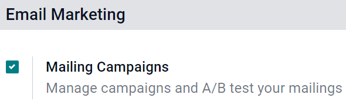
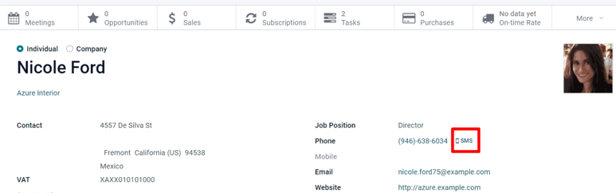

# SMS campaign settings

Utilizing `SMS (Short Message Service)` campaigns with Konvergo ERP *SMS
Marketing* isn't just an effective advertisement strategy, it's also a
great way to remind people about upcoming events, issued invoices, and
so much more.

But, before `SMS (Short Message Service)` campaigns can be created (and
sent), a few specific settings and features must be enabled first.

## SMS campaign setting

To enable `SMS (Short Message Service)` campaigns in Konvergo ERP, make sure the
*Mailing Campaigns* feature is activated by going to
`Email Marketing --> Configuration --> Settings`, and then enable
`Mailing Campaigns` and `Save` the changes.

> [!NOTE]
> Activating the *Mailing Campaigns* feature in the *General Settings*
> also enables the *A/B Test* feature.

Once the setting is enabled, navigate back to the `SMS Marketing` app,
and notice the `Campaigns` header menu is now available for use.
Similarly, the `A/B Test` tab is now also available on every
`SMS (Short Message Service)` template form.

## A/B tests

`A/B Tests` allows any `SMS (Short Message Service)` mailings to be
tested against other versions within the same campaign, in order to
compare which version is the most successful in producing engagement
and/or conversion outcomes.

On an `SMS (Short Message Service)` template form, under the `A/B Tests`
tab, initially, there's only a single checkbox labeled:
`Allow A/B Testing.`

When clicked, a series of other options appear.

In the first field, enter a desired percentage of recipients to conduct
the A/B Test on.

Beneath the percentage field is the `Winner Selection` field. This is
what Konvergo ERP will use to determine the successful result of an A/B Test. In
other words, this tells Konvergo ERP how to pick a winning A/B test.

The following sections are available: `Manual`, `Highest Click Rate`,
`Leads`, `Quotations`, or `Revenues`.

Finally, the `Send Final On` field is listed. This represents the
date-time that Konvergo ERP uses as a deadline to determine the winning mailing
variation. Then, Konvergo ERP sends that winning mailing variation to the
remaining recipients, who weren't involved in the test, at that prior
date and time.

> [!TIP]
> Quickly create different versions of the mailing to add to the A/B
> Test by clicking the `Create an Alternate Version` button.

> [!NOTE]
> Remember, the winning mailing variation is based on the criteria
> selected in the `Winner Selection` field.

## Campaigns page

To create, edit, or analyze any campaign, click `Campaigns` in the
header menu of the `SMS Marketing` app. On the `Campaigns` page, each
campaign displays various information related to the mailings associated
with that campaign (e.g. number of emails, social posts, SMSs, and push
notifications).

## Campaign templates

Click `Create` to create a new campaign, and Konvergo ERP reveals a blank
campaign template form to fill out. Alternatively, select any
previously-made campaign in order to duplicate, review, or edit its
campaign template form.

With each campaign, the options to `Send New Mailing`, `Send SMS`,
`Send Social Post`, and `Push Notifications` are available above the
template form.

Whenever one of those communication options is added to the campaign,
Konvergo ERP will create a new corresponding tab on the template form, where
those types of messages can be reviewed or edited, along with various
data sets related to each specific mailing.

At the top of the template, there are various analytical smart buttons.
When clicked, Konvergo ERP reveals in-depth metrics related to that specific
topic (e.g. `Engagement`, `Opportunities`, etc.) on a separate page.

Beneath the smart buttons, are fields for `Campaign Name` and
`Responsible`. Konvergo ERP also allows for various `Tags` to be added, as well
(if necessary).

## Sending SMSs through the Contacts app

Sending `SMS (Short Message Service)` mailings directly through a
contact's form is available by default.

In order to send an `SMS (Short Message Service)` in this fashion,
navigate to the `Contacts` app, select the desired contact in the
database, and click on the `SMS` icon on the contact form (next to the
`Phone Number` field).

To send a message to multiple contacts at once, navigate to the main
`Contacts` app main dashboard, choose the `List View`, and select all
the desired contacts to whom the message should be sent. Then, under
`Action`, select `Send SMS`.

## Set up SMS templates for future use

In order to set up `SMS Templates` for future use, activate
`developer mode
<developer-mode>`, by navigating to the main Konvergo ERP dashboard that is full
of apps, and select the `Settings app`. Then, scroll down to the
`Developer Tools` section, and click `Activate the Developer Mode`.

Once *developer mode* is activated, the main Konvergo ERP dashboard appears once
more, with a now-visible bug icon, which is located at the top-right
corner of the dashboard; this bug icon indicates that developer mode is
currently active.

Next return to the `Settings app` and, in the now-visible header menus
at the top, choose `Technical --> SMS Templates` to begin setting up
`SMS (Short Message
Service)` templates for future marketing campaigns.

Inside of the `SMS Templates` dashboard, Konvergo ERP reveals an entire page of
`SMS (Short
Message Service)` templates. The default `List` view showcases each
template's name, and to which recipients it applies.

On this page, `SMS (Short Message Service)` templates can be edited or
created from scratch.

