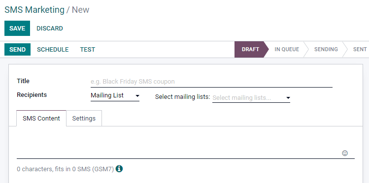
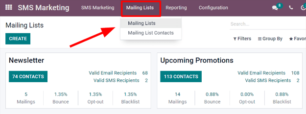

# SMS essentials

Utilizing `SMS (Short Message Service)` outreach in communication
strategies can help companies expand their market reach, especially in
some countries, where emails might not be very common, or even used at
all.

Odoo's *SMS Marketing* application can also help boost conversion rates
around valuable actions, such as event registrations, free trials,
purchases, etc., since text and mobile-based marketing channels
typically yield higher `CTOR (click-to-open rate)` and
`CTR (click-through
rate)` outcomes.

## SMS marketing dashboard

When the application is opened, Odoo displays the main `SMS Marketing`
dashboard, which showcases the various SMS mailings that have been
created, along with pertinent information and data related to that
specific message.

The `Kanban` view is the default Odoo uses when the application is
opened, which provides an organized display of the SMS mailings that
have been created, and what their current status is at the moment.

> [!NOTE]
> An `SMS (Short Message Service)` mailing can have one of the following
> statuses: `Draft`, `In Queue`, `Sending`, or `Sent`.

In the upper right corner of the main `SMS Marketing` dashboard, there
are a few different view options to choose from. Each one provides a
unique take on the same SMS information.

The `List` view provides the same useful data related to SMS mailings,
but in a more traditional list layout.

The `Calendar` view provides a simple calendar, making it easy to see
when SMS mailings are going to be sent (or have been sent). If a future
date is clicked, Odoo reveals a blank SMS template that, when completed,
will be scheduled to be sent on that specific future date.

Lastly, the `Graph` view visualizes that same SMS-related data in series
of graphs and charts. Odoo also provides various ways to sort and group
the data for more detailed analysis.

## Create SMS messages

To start, click `Create` on the main `SMS Marketing` dashboard, and Odoo
reveals a blank SMS template form, which can be configured in a number
of different ways.

First, give the mailing a `Subject`, which describes what the mailing is
about.

Next, in the `Recipients` field, choose to whom this
`SMS (Short Message Service)` will be sent. By default, Odoo has
`Mailing List` selected. If this is the desired `Recipients` field
option, specify which mailing list Odoo should send this `SMS
(Short Message Service)` to in the `Select Mailing List` field.

> [!NOTE]
> To create (or edit) a mailing list, go to
> `Mailing Lists --> Mailing List`. There, Odoo displays all previously
> created mailing lists, along with various types of data related to
> that specific list (e.g. number of contacts, mailings, recipients,
> etc.).
>
> To learn more about mailing lists and contacts, check out
> `mailing_lists_blacklists`.

To reveal all the possible options in the `Recipients` field, click the
field to see all the choices Odoo makes available.

When another field (other than `Mailing List`) is selected, the option
to specify that chosen field even further becomes available — either
with a default recipient filter equation that appears automatically
(which can be customized to fit any business need), or, if no default
recipient filter equation is present, an `Add Filter` button will
appear.

Clicking the `Add Filter` button, reveals fully customizable domain rule
fields, which can be configured similar to an equation. You can create
multiple recipient rules, if necessary.

Then, Odoo will only send the `SMS (Short Message Service)` to
recipients who fit into whatever criteria is configured in those fields.
Multiple rules can be added.

If `Contact` is chosen, all of the *Contacts* records in the Odoo
database (vendors, customers, etc.) will receive the
`SMS (Short Message Service)`, by default — unless more specific
recipient rules are entered.

For instance, the message below will only be sent to contacts in the
database that are located in the United States (e.g.
Country \>
Country Name equals
United States), and they haven't
blacklisted themselves from any mailings (e.g.
Blacklist \>
is \> not
set).

### Writing SMS messages

Enter the content of the `SMS (Short Message Service)` in the text
field, found in the `SMS Content` tab. Links and emojis can also be
included. Beneath the text field, Odoo displays how many characters are
used in the message, along with how many `SMS (Short Message
Service)` mailings it will take to deliver the complete message.

> [!TIP]
> To check the price of sending an `SMS (Short Message Service)` for a
> country, click on the `Information` icon.

> [!NOTE]
> Credits must be purchased from Odoo in order to take advantage of the
> *SMS Marketing* app; `SMS (Short Message Service)` messages will not
> be sent without credits.

[Odoo SMS - FAQ](https://iap-services.odoo.com/iap/sms/pricing)

### Track links used in SMS messages

When links are used in `SMS (Short Message Service)` messages, Odoo
automatically generates link trackers to gather analytical data and
metrics related to those specific links, which can be found by going to
`Configuration --> Link Tracker`.

## Adjust SMS settings

Under the `Settings` tab of the SMS template, there is an option to
`Include
opt-out link`. If activated, the recipient is able to unsubscribe from
the mailing list, thus avoiding all future mailings.

An employee can be designated as the `Responsible` in the `Tracking`
section of the `Settings` tab, as well.

## Send SMS messages

Once a mailing is created, choose when Odoo should deliver the message
from the following options:

- `Send`: sends the message immediately. Consider using this option if
  the recipient list is highly refined, or in cases that involve fast
  approaching deadlines, such as a "flash sale."
- `Schedule`: choose a day (and time) for Odoo to send the mailing. This
  is typically the best option for mailings related to a specific event.
  Such a method can also be used to promote a limited-time offer, or to
  help plan a company's content strategy in advance.
- `Test`: allows for an `SMS (Short Message Service)` to be sent to one
  or multiple numbers for test purposes. Remember to use a comma between
  phone numbers if multiple numbers are used as recipients.

## Visualize reports

On the `Reporting` page (accessible via the `Reporting` option in the
header menu), there are options to apply different combinations of
`Filters` and `Measures` to view metrics in a number of different
layouts (e.g. `Graph`, `List`, and `Cohort` views.)

Each `Reporting` metric view option allows for more extensive
performance analysis of `SMS (Short Message Service)` mailings.

For example, while in the default `Graph` view,
`SMS (Short Message Service)` data is visualized as different graphs and
charts, which can be sorted and grouped in various ways (e.g. `Measures`
drop down menu).

> [!TIP]
> SMS messages can be sent using automated actions in Odoo. Odoo
> *Studio* is required to use automated actions.
>
> To install Odoo *Studio*, go to `Apps application`. Then, using the
> `Search...` bar, and search for studio.
>
> If it is not already installed, click `Install`.
>
> Adding the *Studio* application upgrades the subscription status to
> *Custom*, which increases the cost. Consult
> [support](https://www.odoo.com/contactus), or reach out to the
> database's customer success manager, with any questions on upgrading.
>
> To use automated actions, navigate in
> `developer mode <developer-mode>`, to
> `Settings app --> Technical menu --> Automation section --> Automated Actions`.
> Then, click `New` to create a new action.
>
> Enter an `Action Name`, and select a `Model` to implement this action
> on.
>
> Ensure the `Active` toggle is set to *on*, represented by a full-green
> switch, in order for the automated action to run.
>
> Set the `Trigger` to either `On Creation`, `On Update`,
> `On Creation & Update`, `On Deletion`, `Based on Form
> Modification`, or `Based on Timed Condition`.
>
> Based on the selection for the `Trigger`, additional fields may
> populate.
>
> Under the `Apply on` field, a record filter using a domain can be
> created. Ensure a model has been selected before setting any domains
> on the `Apply on` field. Click `Edit Domain` to set record parameters.
>
> Under `Action To Do` drop-down field, select `Send SMS Text Message`.
> Next, set the `SMS Template`, and choose whether the SMS message
> should be logged as a note, by ticking the checkbox next to
> `Log as Note`.
>
>  alt="Automated action template with action to do, SMS template and log as note highlighted." />
>
> To implement the automated action, save it; either by navigating away,
> or manually saving it (using the `☁️ (cloud)` icon).

\- `sms_campaign_settings` - `mailing_lists_blacklists` -
`../../../essentials/in_app_purchase`

