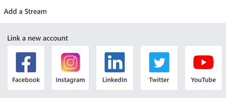
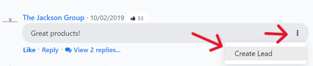
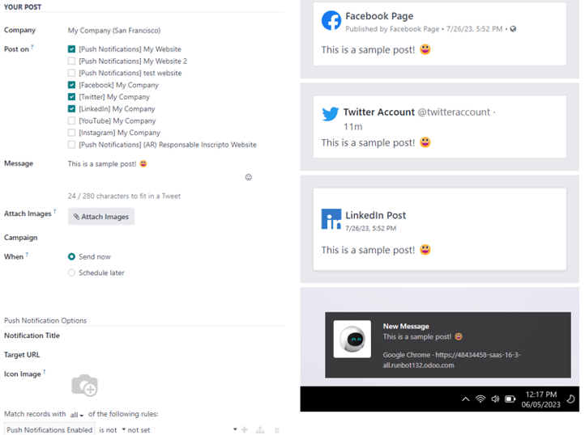

# Social marketing essentials

Odoo's *Social Marketing* application helps content marketers create and
schedule posts, manage various social media accounts, analyze content
effectiveness, and engage directly with social media followers in one,
centralized location.

## Social media accounts

In order to create social posts and analyze content with Odoo *Social
Marketing*, social media accounts **must** be added as a *stream* on the
application's main dashboard.

> [!NOTE]
> Be aware that personal profiles **cannot** be added as a stream. The
> main use of Odoo *Social Marketing* is to manage and analyze business
> accounts on social media platforms.

> [!WARNING]
> Odoo *Social Marketing* has some limitations in regards to social
> media accounts. For example, Odoo **cannot** handle a large quantity
> of various pages (e.g. ~40 pages) under the same company. The same
> limitations are present in a multi-company environment because of how
> the API is constructed.

> [!WARNING]
> In multi-company environments, if every company doesn't activate a
> page at once, it will result in a permission error.
>
> For example, if Company 1 is the only company selected from the main
> Odoo dashboard, and activates *Facebook Page 1* and *Facebook Page 2*,
> then those pages will be accesible on the *Social Marketing*
> dashboard.
>
> However, if on that same database, the user adds Company 2 from the
> company drop-down menu in the header, and attempts to add those same
> streams, it results in a permission error.
>
>  alt="View of the permission error that appears when incorrectly attempting to add stream." />

### Social media streams

To add a social media business account as a stream, navigate to
`Social Marketing
app` and select the `Add A Stream` button located in the upper-left
corner. Doing so reveals an `Add a Stream` pop-up window.

In the `Add a Stream` pop-up window, choose to `Link a new account` for
a business from any of the following popular social media platforms:
`Facebook`, `Instagram`, `LinkedIn`, `Twitter`, and `YouTube`.

After clicking the desired social media outlet from the `Add a Stream`
pop-up window, Odoo navigates directly to that specific social media
outlet's authorization page, where permission must be granted, in order
for Odoo to add that particular social media account as a stream to the
*Social Marketing* application.

Once permission is granted, Odoo navigates back to the `Feed` on the
main `Social Marketing` dashboard, and a new column, with that account's
posts, is added. Accounts/streams can be added at any time.

> [!IMPORTANT]
> A `Facebook` page can be added as long as the `Facebook` account that
> grants permission is the administrator for the page. It should also be
> noted that different pages can be added for different streams.

> [!NOTE]
> `Instagram` accounts are added through a `Facebook` login because it
> uses the same API. This means, an `Instagram` account needs to be
> linked to a `Facebook` account in order for it to show up as a stream
> in Odoo.

### Posts

Clicking on a post from a social media stream reveals a pop-up window,
showcasing the content of that specific post, along with all the
engagement data related to it (e.g. likes, comments, etc.).

If desired, the user can leave a new comment of the post from the post's
pop-up window, by typing one in the `Write a comment...` field, and
clicking `Enter` to post that comment.

### Create leads from comments

Odoo *Social Marketing* also provides the ability to create leads
directly from social media comments.

To create a lead from a comment left on a social media post, click on
the desired post from the dashboard to reveal that post's specific
pop-up window. Then, scroll to the desired comment, and click the
`three vertical dots` icon to the right of that comment.

Doing so reveals a drop-down menu with the option: `Create Lead`.

Upon clicking `Create Lead` from the comment's drop-down menu, a
`Conver Post to
Lead` pop-up window appears.

In this pop-up window, select to either: `Create a new customer`,
`Link to an
existing customer`, or `Do not link to a customer`.

> [!NOTE]
> If `Link to an existing customer` is selected, a new `Customer` field
> appears beneath those options, wherein a customer can be chosen to be
> linked to this lead.

Once the desired selection has been made, click the `Convert` button at
the bottom of the `Convert Post to Lead` pop-up window. Doing so reveals
a fresh lead detail form, where the necessary information can be entered
and processed.

### Insights

When a social media account stream is added to the *Social Marketing*
dashboard, each stream also displays and links that specific social
media platform's KPIs (if the platform has them).

To get redirected to the statistics and metrics related to any social
media account's KPIs, click on the `Insights` link, located at the top
of each stream.

> [!NOTE]
> In a multi-company environment, if not *all* pages are selected,
> de-authentication happens.
>
> For example, if the companies have 3 *Facebook* pages, but only grant
> access to 1, and try to grant access to another at a later date, they
> will be de-authenticated, and access to the initial page's
> insights/analytics will be lost.
>
> So, be sure to add *all* pages for *all* companies in a multi-company
> environment to avoid this issue. If a page gets de-autenticated,
> simply remove the stream, and re-establish it.

## Create and post social media content

Odoo *Social Marketing* offers the ability to create and post content
for social media accounts directly through the application.

To create content for social media accounts, navigated to the
`Social Marketing app`, and click `New Post` located in the upper-right
corner of the *Social Marketing* dashboard.

Or, navigate to `Social Marketing app --> Posts` and click the `New`
button.

Either route reveals a blank social media post detail form that can be
customized and configured in a number of different ways.

### Post detail form

The social media post detail form in Odoo *Social Marketing* has many
different configurable options available.

#### Company

If working in a multi-company environment, the first field in the
`Your Post` section of the social media post detail form is `Company`.
In this field, select the company that should be connected to this
specific social media post.

#### Post on

If working in a single-company environment, the first field in the
`Your Post` section of the social media post detail form is `Post on`.
In this field, determine which social media outlets (streams) this post
is intended to be posted on, and/or which website's visitors this post
should be sent to, via push notification, by checking the box beside the
desired option(s).

Odoo automatically provides every available social media account that's
been linked to the database as an option in this section. If a social
media account hasn't been added as a stream to the *Social Marketing*
application, it will **not** appear as an option on the post template.

Multiple social media outlets (streams) and websites can be selected in
the `Post on` field. At least **one** option in the `Post on` field
*must* be selected.

> [!IMPORTANT]
> In order for the `Push Notification` option to appear on the social
> media post detail form in Odoo *Social Marketing*, make sure the
> *Enable Web Push Notifications* feature is enabled in the *Website*
> app.
>
> To do that, navigate to `Website app --> Configuration --> Settings`,
> activate `Enable Web Push Notifications`, fill out the corresponding
> fields, and click `Save`.

#### Message

Next, there's the `Message` field. This is where the main content of the
post is created.

In the `Message` field, type in the desired message for the social post.
After typing, click away from the `Message` field to reveal visual
samples of how the post will look on all the previously selected social
media accounts (and/or websites, as push notifications).

> [!TIP]
> Emojis can also be added directly to the text in the `Message` field.
> Just click the `🙂 (smiley face)` icon, located on the line of the
> `Message` field to the far right. Clicking this icon reveals a
> drop-down menu containing numerous emojis to choose from.

> [!NOTE]
> If `Twitter` is chosen in the `Post on` field, a character counter
> appears beneath the `Message` field.

#### Attach Images

If images are to be used in the post, click the `Attach Images` button,
in the `Attach Images` field, located beneath the `Message` field. When
clicked, Odoo reveals a pop-up window. In this pop-up window, select the
desired image from the hard drive, and upload it.

After successfully uploading and attaching the desired image, Odoo
reveals a new preview of the social media post, complete with the
newly-added image, on the right side of the detail form.

#### Campaign

Next, there is the `Campaign` field. This non-required field provides
the options to attach this post to a specific marketing campaign.

To add this post to a pre-existing campaign, click the empty `Campaign`
field to reveal a drop-down menu, containing all the existing campaigns
in the database. Select the desired campaign from this drop-down menu to
add this post to that campaign.

To create a new campaign directly from the social media post detail
form, start typing the name of the new campaign in the blank `Campaign`
field, and select either `Create` or `Create and edit...`.

Clicking `Create` creates the campaign, which can be edited/customized
later.

Clicking `Create and edit...` creates the campaign, and reveals a
`Create
Campaign` pop-up form, wherein the `Campaign Identifier`, `Responsible`,
and `Tags` can be instantly configured.

When all the desired settings have been entered, click `Save & Close` to
save the campaign and return to the social media post detail form.

#### When

Then, in the `When` field, choose either `Send Now` to have Odoo publish
the post immediately, or `Schedule later` to have Odoo publish the post
at a later date and time.

If `Schedule later` is selected, a new `Scheduled Date` field appears.
Clicking the empty field reveals a pop-up calendar, in which a future
date and time can be designated.

After selecting a desired date and time, click `Apply`. Then, Odoo will
promptly publish the post at that specific date and time on the
pre-detemined social media account(s).

> [!NOTE]
> If scheduling a post, the `Post` button at the top of the social media
> post detail form changes to `Schedule`. Be sure to click `Schedule`
> after completing the social media post detail form.
>
> Doing so, locks in that specific date/time for Odoo to send the post,
> and it changes the status of the post to `Scheduled`.

#### Push Notification Options

If one (or multiple) `[Push Notification]` options are chosen in the
`Post on` field, a specific `Push Notification Options` section appears
at the bottom of the social media post detail form.

It should be noted that *none* of these fields are required.

The first field in this section is `Notification Title`. In this field,
there is the option to add a custom title to the push notification that
will be sent.

To designate a specific page on the website that should trigger this
push notification, enter that page's URL in the `Target URL` field.
Then, once a visitor reaches that specific page, Odoo will display the
push notification.

Below that field is the option to add a custom `Icon Image` to the push
notification. This is an icon that appears beside the push notification.

To upload a new image, click the `✏️ (pencil) icon` when hovering over
the `Icon
Image` camera icon. Doing so reveals a pop-up window, in which the
desired icon image can be located on the hard drive, and subsequently
uploaded.

Once that's complete, Odoo automatically updates the visual preview of
how the icon appears on the push notification.

> [!NOTE]
> Next, if the post is scheduled to be posted later, there is the option
> to ensure the post is sent in the visitor's timezone, by enabling the
> `Local Time` option. If enabled, Odoo will send it at the appropriate,
> pre-determined time, taking the visitor's location into consideration.
>
>  class="align-center"
> alt="The Local Time option in the Push Notification Options section of features." />

Then, there is the `Match all records` field. This field provides the
ability to target a specific group of recipients in the database, based
on certain criteria, and can be applied to match `all` or `any` of the
rules.

To utilize this field, click the `+ Add condition` button, which reveals
an equation-like rule field.

In this equation-like rule field, specifiy the specific criteria Odoo
should take into account when sending this post to a particular target
audience.

To add an additional rule, click the `➕ (plus sign) icon` to the
far-right of the rule.

To add a branch (series of additional rules based on the previous rule,
to further specify a target audience), click the unique `branch icon`,
located to the right of the `➕ (plus
sign) icon`.

Lastly, click the `🗑️ (trash can) icon` to delete any rule.

The size of the specified target audience of recipients is represented
by the number of `Records` displayed beneath the rules.

## Posts page

To see a complete overview of posts, go to Odoo
`Social Marketing app --> Posts`. Here, on the `Social Posts` page,
every post that has been created and posted with Odoo can be seen and
accessed.

There are four different view options for the `Social Posts` page data:
*kanban*, *calendar*, *list*, and *pivot*.

The view options are located in the upper right corner of the `Posts`
page, beneath the search bar.

Kanban view

By default, Odoo displays the posts in a kanban view. The information on
this page can be sorted even further, via the left sidebar, where all
connected social accounts and posts can be quickly seen, accessed, and
analyzed.

The kanban view is represented by an `inverted bar graph icon` in the
upper-right corner.

Calendar view

The calendar view option displays a visual representation of posts in a
calendar format of when posts were published, or are scheduled to be
published. This option provides a clear overview of any planned day,
week, or month, and Odoo displays all drafted, scheduled, and published
posts.

Clicking on a date reveals a blank social media post detail form, in
which a social media post can be created, and Odoo will post it on that
specific date/time.

The calendar view is represented by a `calendar icon` in the upper-right
corner.

List view

The list view option is similar to the kanban option, but instead of
individual blocks, all post information is displayed in a clear, list
layout. Each line of the list displays the `Social Accounts`, `Message`,
and `Status` of every post.

There is also a helpful left sidebar that organizes all posts by
`Status` and lists all connected `Social Accounts`, as well.

The list view is represented by four vertical lines in the upper-right
corner.

Pivot view

The pivot view option provides a fully customizable grid table, where
different measures of data can be added and analyzed.

The pivot view option provides numerous analytical options, allowing for
in-depth, detailed analysis of various posts and metrics.

Click on any `➕ (plus sign) icon` next to a line in the pivot table to
reveal more metric options to add to the grid.

While in the pivot view, the option to `Insert in Spreadsheet` is
available, located to the right of the `Measures` drop-down menu, in the
upper-left corner of the `Social Posts` page.

Next to the `Insert in Spreadsheet` are three options, specific to the
pivot view.

From left to right, those options are:

- `Flip Axis`, which switches the *X* and *Y* axis in the grid table.
- `Expand All`, which expands each line in the grid, revealing more
  detailed information related to it.
- `Download`, which, when clicked, instantly downloads the pivot table
  as a spreadsheet.

## Visitors

To see a complete overview of all the people who have visited the
website(s) connected to the database, navigate to
`Social Marketing app --> Visitors`.

Here, Odoo provides a detailed layout of all the visitors' pertinent
information in a default kanban view. If visitors already have contact
information in the database, the option to send them an `Email` and/or
an `SMS` is available.

This same visitor data can also be viewed as a list or a graph. Those
view options are located in the upper-right corner of the `Visitors`
page.

## Social media page

Another way to quickly link social media accounts to Odoo *Social
Marketing* can be done on the `Social Media` page. To access the
`Social Media` page, navigate to
`Social Marketing app --> Configuration --> Social Media`.

On the `Social Media` page there is a collection of all social media
options, each complete with a `Link account` button: `Facebook`,
`Instagram`, `LinkedIn`, `Twitter`, `YouTube`, and `Push Notifications`.

## Social accounts page

To see a list of all social accounts and websites linked to the
database, go to
`Social Marketing app --> Configuration --> Social Accounts`. This
`Social
Accounts` display the `Name`, the `Handle/Short Name`, the `Social
Media` platform, who it was `Created by`, and the `Company` to which it
is associated.

To edit/modify any of the social accounts on this page, simply select
the desired account from the list on this page, and proceed to make any
adjustments necessary.

## Social streams page

To view a separate page with all the social media streams that have been
added to the main *Social Marketing* dashboard, navigate to
`Social Marketing app --> Configuration --> Social
Streams`.

Here, the social stream information is organized in a list with the
`Social Media`, the `Title` of the stream, the `Type` of the stream
(e.g. `Posts`, `Keyword`, etc.), who it was `Created by`, and the
`Company` to which it is associated.

To modify any stream's information, simply click the desired stream from
the list, and proceed to make any necessary adjustments.

`/applications/marketing/social_marketing/essentials/social_campaigns`

