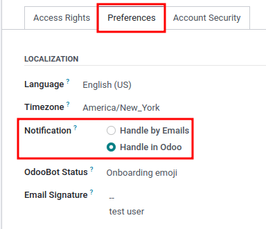
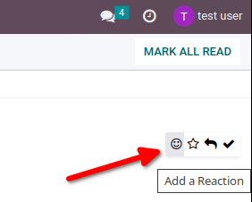
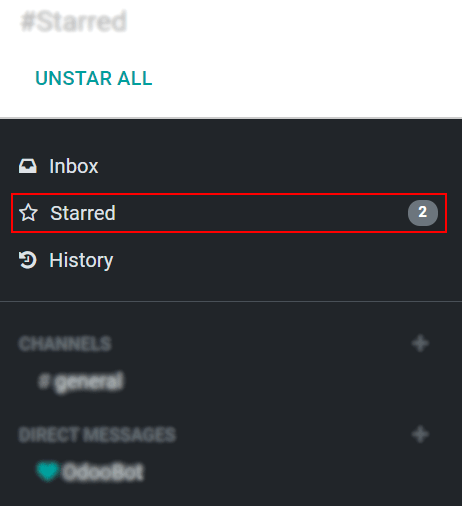
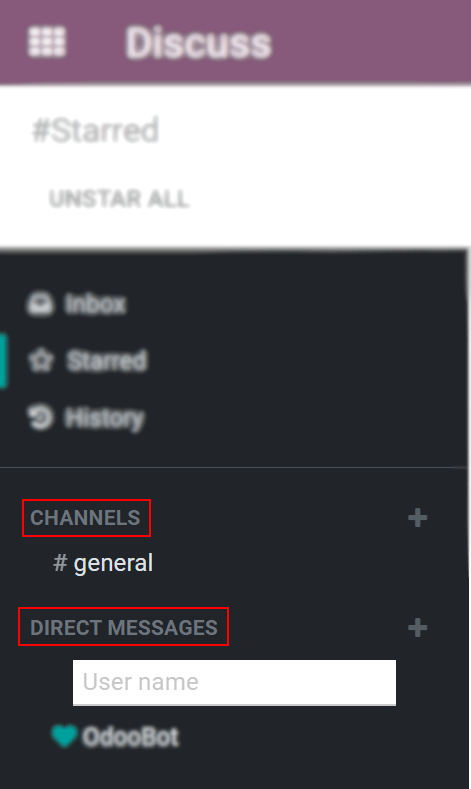

show-content  

show-toc  

# Discuss

Konvergo ERP *Discuss* is an internal communication app that allows users to
connect through messages, notes, and file sharing, either through a
persistent chat window that works across applications, or through the
dedicated *Discuss* dashboard.

## Choose notifications preference

Access user-specific preferences for the *Discuss* app by navigating to
`Settings app
--> Users --> User --> Preferences tab`.

By default, the `Notification` field is set as `Handle by Emails`. With
this setting enabled, a notification email will be sent by Konvergo ERP every
time a message is sent from the chatter, a note is sent with an
@ mention (from chatter), or a
notification is sent for a record that the user follows. Something that
triggers a notification is changing of the stage (if an emailis
configured to be sent, for example if the task is set to `Done`).

By choosing `Handle in Konvergo ERP`, the above notifications are shown in the
*Discuss* app's *inbox*. Messages can have the following actions taken
on them: respond with an emoji by clicking `Add a Reaction`, or reply to
the message by clicking on `Reply`. Additional actions may include
starring the message by clicking `Marked as Todo`, or pinning the
message by selecting `Pin` or even mark the message as unread by
selecting `Marked as unread`.

Clicking `Mark as Todo` on a message causes it to appear on the
`Starred` page, while clicking `Mark as Read` moves the message to
`History`.

## Start chatting

The first time a user logs in to their account, Konvergo ERPBot sends a message
asking for permission to send desktop notifications for chats. If
accepted, the user will receive push notifications on their desktop for
the messages they receive, regardless of where the user is in Konvergo ERP.

> [!TIP]
> To stop receiving desktop notifications, reset the notifications
> settings of the browser.

To start a chat, go to the `Discuss` app and click on the `+ (plus)`
icon next to `Direct Messages` or `Channels` in the left menu of the
dashboard.

A company can also easily create
`public and private channels <discuss/team_communication>`.

### Mentions in the chat and on the chatter

To mention a user within a chat or the chatter, type
@user-name; to refer to a channel, type
\#channel-name. The user mentioned will
be notified in their *inbox* or through an email, depending on their
communication settings.

> [!TIP]
> When a user is mentioned, the search list (list of names) suggests
> values first based on the task's followers, and secondly on employees.
> If the record being searched does not match with either a follower or
> employee, the scope of the search becomes all partners.

### User status

It is helpful to see what colleagues are up to and how quickly they can
respond to messages by checking their *status*. The status is shown on
the left side of a contact's name on the `Discuss` sidebar, on the
*messaging menu* and when listed in the *chatter*.

- Green = online
- Orange = away
- White = offline
- Airplane = out of the office

\- `discuss/team_communication` - `/applications/essentials/activities`

discuss/team_communication discuss/ice_servers

