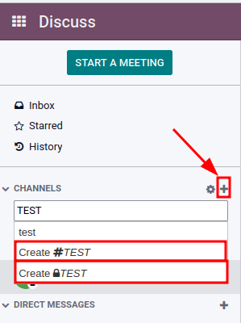
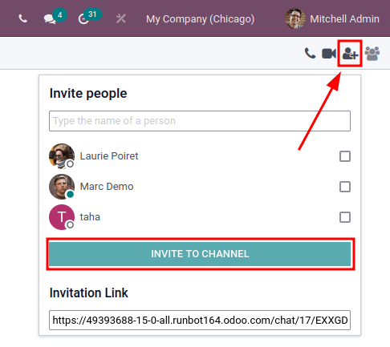
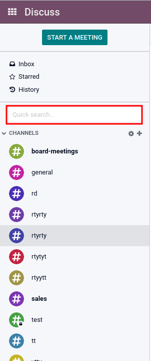
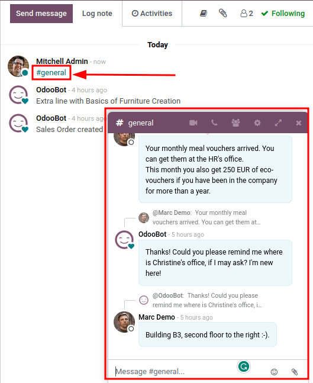

# Use channels for team communication

Use channels in the Konvergo ERP *Discuss* app to organize discussions between
individual teams, departments, projects, or any other group that
requires regular communication. With channels, employees can communicate
inside dedicated spaces within the Konvergo ERP database around specific topics,
updates, and latest developments having to do with the organization.

## Public and private channels

A *Public* channel can be seen by everyone, while a *Private* one is
only visible to users invited to it. To create a new channel, navigate
to the `Discuss` app, and then click on the `➕ (plus)` icon next to the
`Channels` heading in the left-side menu. After typing the name of the
channel, two selectable options will appear: The first is a channel with
a hashtag (\#) to indicate that it is a
public channel; the second option is a channel with a lock icon
(🔒) next to it, to indicate that it is a
private channel. Select the channel type that best fits the
communication needs.

> [!TIP]
> A public channel is best used when many employees need to access
> information (such as company announcements), whereas a private channel
> could be used whenever information should be limited to specific
> groups (such as a specific department).

### Configuration options

The channel's `Group Name`, `Description`, and `Privacy` settings can be
modified by clicking on the channel's settings, represented by a
`⚙️ (gear)` icon in the left sidebar menu, next to the channel's name.

#### Privacy and Members tabs

Changing `Who can follow the group's activities?` controls which groups
can have access to the channel.

> [!NOTE]
> Allowing `Everyone` to follow a private channel lets other users view
> and join it, as they would a public one.

When choosing `Invited people only`, specify in the `Members` tab which
members should be invited. Inviting members can also be done from the
*Discuss* app's main dashboard, by selecting the channel, clicking the
*add user* icon in the top-right corner of the dashboard, and finally
clicking `Invite to Channel` once all the users have been added.

When the `Selected group of users` option is selected, it reveals the
ability to add an `Authorized Group`, along with the options to
`Auto Subscribe Groups` and `Auto Subscribe Departments`.

The option to `Auto Subscribe Groups` automatically adds users of that
particular user group as followers. In other words, while
`Authorized Groups` limits which users can access the channel,
`Auto Subscribe Groups` automatically adds users as members as long as
they are part of a specific user group. The same is true for
`Auto Subscribe Departments`.

## Quick search bar

Once at least 20 channels, direct messages, or live chat conversations
(if *Live Chat* module is installed on the database) are pinned in the
sidebar, a `Quick search…` bar is displayed. This feature is a
convenient way to filter conversations and quickly find relevant
communications.

### Finding channels

Click on the settings `⚙️ (gear)` icon, located in the left sidebar, to
the right of the `CHANNELS` collapsible menu item. Doing so will lead to
a mosaic view containing all the public channels available. Users can
join or leave channels on this screen by clicking the `JOIN` or `LEAVE`
buttons that appear in the channel boxes.

There is also the ability to apply filtering criteria and save them for
later use. The `Search...` function accepts wildcards by using the
underscore character \[ \_ \], and
specific searches can be saved by using the
`Favorites --> Save Current Search` drop-down menu.

## Linking channel in chatter

Channels can be linked in the chatter (log note) of a record in Konvergo ERP. To
do so, simply type: \# and the channel
name. Click or press enter on the *channel* name. Upon logging the note
a link to the channel will appear. After clicking on the link a chat
window with the channel conversation will pop up in the lower right
corner of the screen.

Users are able to contribute to this group channel (either public or
member based) by typing messages in window and pressing *enter*.

\- `../discuss` - `/applications/essentials/activities`

