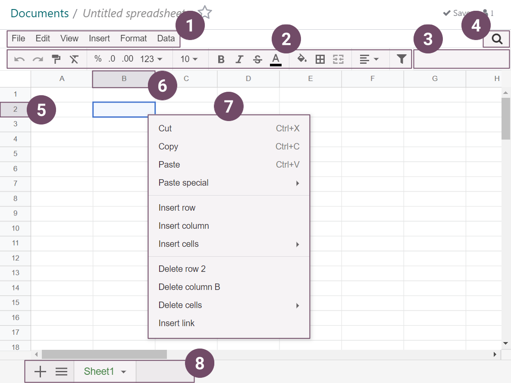

show-content  

hide-page-toc  

# Spreadsheet

spreadsheet/insert spreadsheet/functions spreadsheet/templates

Spreadsheet lets you organize, analyze, and visualize your data in
tabular form. Among others, you can:

- `Insert and link your Konvergo ERP data (pivots, graphs, lists, and menus) <spreadsheet/insert>`.
- `Use formulas and functions <spreadsheet/functions>`.
- `Use default templates or create new ones <spreadsheet/templates>`.
- Format data.
- Sort and filter data.

## Glossary

Some of Spreadsheet's main `UI (user interface)` elements are
highlighted and defined below.

1.  Menu bar
2.  Top bar
3.  Formula bar
4.  Filters button
5.  Row header
6.  Column header
7.  Cell menu
8.  Bottom bar
