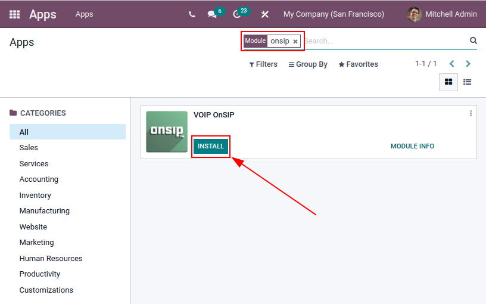
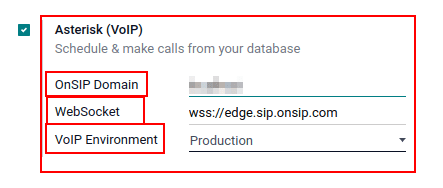
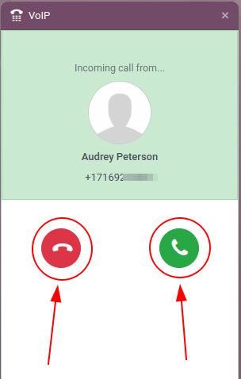
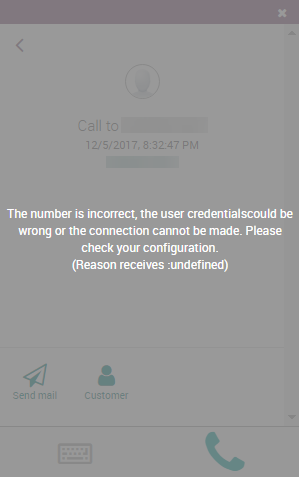

# Use VoIP services in Odoo with OnSIP

> [!IMPORTANT]
> OnSIP `VoIP (voice over internet protocol)` services are only
> available in the **United States** (US). OnSIP
> `VoIP (voice over internet protocol)` services are widely available in
> the lower-48, contiguous United States. In Alaska or Hawaii, charges
> for service can be higher.
>
> Additionally, a `US (United States)` billing address, and
> `US (United States)` credit card are required to use the service.
>
> Before setting up an account with OnSIP, the business will need to
> make sure the business telephone numbers are portable to OnSIP.
>
> OnSIP makes every attempt to work with all telephone service
> providers. However, certain local or regional guidelines may preclude
> the company's current provider from releasing the number.

## Introduction

Odoo *VoIP* can be set up to work together with [OnSIP (Odoo Landing
Page)](https://info.onsip.com/odoo/). OnSIP is a VoIP provider. An
account is needed with OnSIP in order to use this service.

Before setting up an account with OnSIP, make sure the company's home
area, and the areas that will be called, are covered by OnSIP services.

After opening an OnSIP account, follow the configuration procedure below
to configure it on an Odoo database.

## Configuration

To configure the Odoo database to connect to OnSIP services, first
navigate to the `Apps application` from the main Odoo dashboard. Then,
remove the default Apps filter from the
`Search...` bar, and search for VoIP
OnSIP.

Next, install the `VOIP OnSIP` module.

### Odoo VoIP setting

After installing the *VOIP OnSIP* module, go to the `Settings app`,
scroll down to the `Integrations` section, and locate the
`Asterisk (VoIP)` fields. Then, proceed to fill in those three fields
with the following information:

- `OnSIP Domain`: the domain that was assigned when creating an account
  on [OnSIP](https://www.onsip.com/).
- `WebSocket`: wss://edge.sip.onsip.com
- `VoIP Environment`: `Production`

> [!TIP]
> To access the OnSIP domain, navigate to
> [OnSIP](https://www.onsip.com/) and log in. Then, click the
> `Administrators` link in the top-right of the page.
>
> Next, in the left menu, click `Users`, and then select any user. By
> default, the selected user opens on the `User Info` tab.
>
> Click on the `Phone Settings` tab to reveal OnSIP configuration
> credentials (first column).
>
>  alt="Domain setting revealed (highlighted) on administrative panel of OnSIP management
> console." />

### Odoo user setting

Next, the user needs to be set up in Odoo. Every user associated with an
OnSIP user **must** also be configured in the Odoo user's
settings/preferences.

To do that, navigate to
`Settings app --> Manage Users --> Select the User`.

On the user form, click `Edit` to configure the user's OnSIP account.
Then, click the `Preferences` tab, and scroll to the `VoIP` section.

In this section, fill in the fields with OnSIP credentials.

Fill in the following fields with the associated credentials listed
below:

- `VoIP Username` / `Extension Number` = OnSIP `Username`
- `OnSIP Auth Username` = OnSIP `Auth Username`
- `VoIP secret` = OnSIP `SIP Password`
- `External device number` = OnSIP `Ext.` (extension without the
  x)

> [!TIP]
> The OnSIP extension can be found in the *User* banner line above the
> tabs.

When these steps are complete, navigate away from the user form in Odoo
to save the configurations.

Once saved, Odoo users can make phone calls by clicking the `☎️ (phone)`
icon in the top-right corner of Odoo.

Additional setup and troubleshooting steps can be found on [OnSIP's
knowledge base](https://support.onsip.com/hc/en-us).

### Incoming calls

The Odoo database also receives incoming calls that produce pop-up
windows in Odoo. When those call pop-up windows appear, click the green
`📞 (phone)` icon to answer the call.

To ignore the call, click the red `📞 (phone)` icon.

`voip_widget`

### Troubleshooting

#### Missing parameters

If a *Missing Parameters* message appears in the Odoo widget, make sure
to refresh the Odoo browser window (or tab), and try again.

#### Incorrect number

If an *Incorrect Number* message appears in the Odoo widget, make sure
to use the international format for the number. This means leading with
the international country code.

A country code is a locator code that allows access to the desired
country's phone system. The country code is dialed first, prior to the
target number. Each country in the world has its own specific country
code.

For example, 16505555555 (where
1 is the international prefix for the
United States).

For a list of comprehensive country codes, visit:
<https://countrycode.org>.

## OnSIP on mobile phone

In order to make and receive phone calls when the user is not in front
of Odoo on their computer, a softphone app on a mobile phone can be used
in parallel with Odoo *VoIP*.

This is useful for convenient, on-the-go calls, and to make sure
incoming calls are heard. Any SIP softphone will work.

\- `devices_integrations` - [OnSIP App
Download](https://www.onsip.com/app/download)

