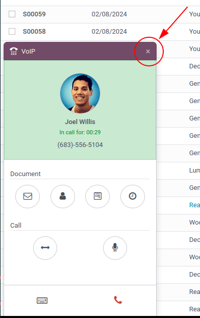

# VoIP widget

The *VoIP* widget is an add-on made available to Odoo users through the
*VoIP* module. It is used to incorporate virtual telephony into the
database. The widget is the control center for making and managing calls
in Odoo.

## Phone calls

To make phone calls while in the Odoo database, click the `☎️ (phone)`
icon, located in the top navigation bar.

When clicked, a `VOIP` pop-up widget appears in the lower-left corner of
the Odoo database. The widget allows users to freely navigate throughout
the database, while making and receiving calls.

When receiving calls in Odoo, the `VOIP` widget rings,and displays a
notification. To close the widget, click the `X (close)` icon in the
upper-right of the widget's screen.

> [!NOTE]
> The `VoIP (Voice over Internet Protocol)` number is the one provided
> by Axivox. It can be accessed by navigating to
> <https://manage.axivox.com/>. After logging into the portal, go to
> `Users --> Outgoing number` (column).

## Troubleshooting

> [!TIP]
> If a *Missing Parameter* error message appears in the Odoo *VoIP*
> widget, refresh the Odoo window, and try again.
>
>  alt="&quot;Missing Parameter&quot; error message in the Odoo softphone." />

> [!TIP]
> If an *Incorrect Number* error message appears in the Odoo *VoIP*
> widget, make sure to use the international format, leading with the
> `+ (plus)` sign, followed by the international country code.
>
> (E.g., +16506913277, where +1 is the
> international prefix for the United States.)
>
>  alt="&quot;Incorrect Number&quot; error message in the Odoo softphone." />

## Tabs

In all, there are three tabs (`Recent`, `Next Activities`, and
`Contacts`) present in the *VoIP* widget, which are used for managing
calls and day-to-day activities in Odoo.

### Recent

Under the `Recent` tab of the *VoIP* widget, the call history for the
user is available. This includes incoming and outgoing calls. Any number
can be clicked to begin a call.

### Next activities

Under the `Next Activities` tab of the *VoIP* widget, a user can see any
activities assigned to them, and which ones are due to be completed for
the day.

Click an activity from this tab to perform any actions including:
Sending an email, accessing their contact, scheduling another activity,
or accessing a linked record (such as a Sales Order, Lead/Opportunity,
or Project Task).

The user can also mark the activity as complete, edit the details of the
activity, or cancel it.

To call the customer related to a scheduled activity, click the
`📞 (phone)` icon, or click the `⌨️ (keyboard)` icon to dial another
number for the customer.

Some other icons appear in the *VoIP* widget, categorized by two
sections: `Document` and `Activity`.

Under the `Document` section, from right to left:

- `✉️ (envelope)` icon: sends an email
- `👤 (person icon)` icon: redirects to the contact card
- `📄 (document)` icon: redirects to the attached record in Odoo
- `🕓 (clock)` icon: schedule an activity

Under the `Activity` section, from left to right:

- `✔️ (checkmark)` icon: mark activity as done
- `✏️ (pencil)` icon: edit the activity
- `✖️ (cancel)` icon: cancel the activity

### Contacts

Under the `Contacts` tab of the *VoIP* widget, a user can access a
contact in the *Contacts* app.

Any contact can easily be called by clicking into the contact from the
*VoIP* widget's `Contacts` tab.

A search feature is also available in the upper-right side of the
widget, represented by a `🔍 (magnifying glass)` icon.
