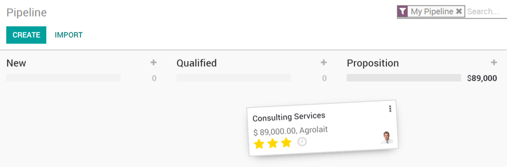
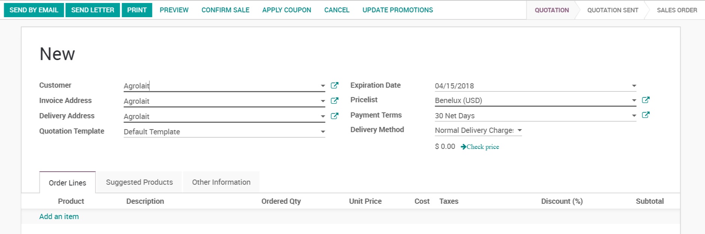
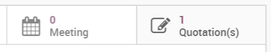

# Send quotations

When you qualify a lead into an opportunity you will most likely need to
send them a quotation. You can directly do this in the CRM App with
Konvergo ERP.

## Create a new quotation

By clicking on any opportunity or lead, you will see a *New Quotation*
button, it will bring you into a new menu where you can manage your
quote.

You will find all your quotes to that specific opportunity under the
*Quotations* menu on that page.

## Mark them won/lost

Now you will need to mark your opportunity as won or lost to move the
process along.

If you mark them as won, they will move to your *Won* column in your
Kanban view. If you however mark them as *Lost* they will be archived.
