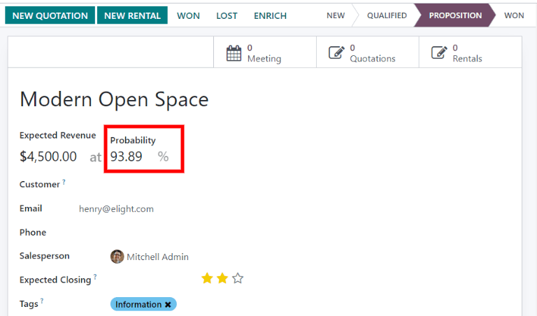
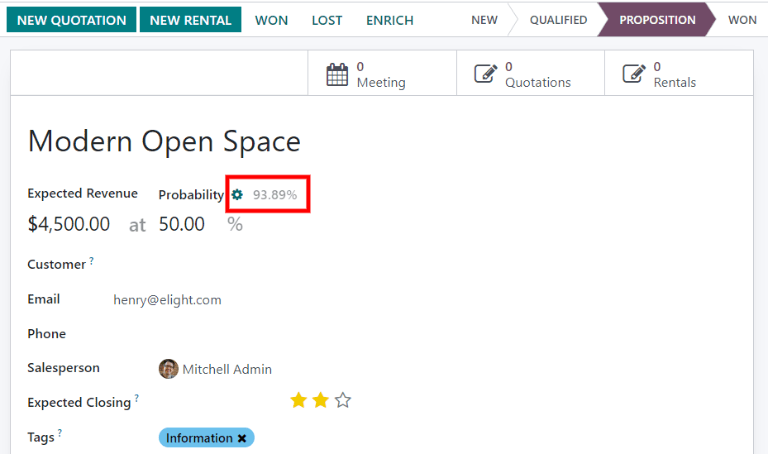

# Assign leads with predictive lead scoring

The Konvergo ERP *CRM* app can automatically assign leads/opportunities to sales
teams and salespeople. A standard practice is to assign leads based on
the probability of winning each lead. Companies can prioritize the leads
that are more likely to result in successful deals by quickly assigning
them to the appropriate salespeople.

Konvergo ERP automatically calculates the probability of winning each lead using
a method called *predictive lead scoring*.

## Predictive lead scoring

Predictive lead scoring is a machine-learning model that uses historical
data from Konvergo ERP *CRM* to score open leads/opportunities.

As a company processes opportunities through the CRM pipeline, Konvergo ERP
collects data on which opportunities are won and lost. Predictive lead
scoring uses this data to predict the probability of winning each new
lead or opportunity.

The more opportunities that are sent through the CRM pipeline, the more
data Konvergo ERP collects, resulting in more accurate probabilities.

Specifically, Konvergo ERP's predictive lead scoring uses the *naive Bayes*
probability model:

$$\begin{equation}
P(A | B) = \frac{P(A) \times P(B | A)}{P(B)}
\end{equation}$$

The probability of success of each opportunity is displayed on the
opportunity form, and it updates automatically as the opportunity
progresses through the CRM pipeline.

When an opportunity moves to the next stage, its probability of success
automatically increases according to the predictive lead scoring
algorithm.

### Configuration

Predictive lead scoring is always active in Konvergo ERP *CRM*. However, the
variables used to calculate the probability of success can be customized
in the settings.

To customize the variables used by predictive lead scoring, go to
`CRM -->
Configuration --> Settings`. Under `Predictive Lead Scoring`, click on
the `Update Probabilities` button.

Then, click on the drop-down menu to choose which variables the
predictive lead scoring feature will take into account.

Any number of the following variables can be activated:

- `State`: the geographical state from which the opportunity originates
- `Country`: the geographical country from which the opportunity
  originates
- `Phone Quality`: whether or not a phone number is listed for the
  opportunity
- `Email Quality`: whether or not an email address is listed for the
  opportunity
- `Source`: the source of an opportunity (e.g. search engine, social
  media)
- `Language`: the spoken language specified on the opportunity
- `Tags`: the tags placed on the opportunity

> [!NOTE]
> The variables Stage and
> Team are always in effect.
> Stage refers to the CRM pipeline stage
> that an opportunity is in. Team refers
> to the sales team that is assigned to an opportunity. Predictive lead
> scoring *always* takes into account these two variables, regardless of
> which optional variables are selected.

Next, click on the date field next to the option
`Consider leads created as of the:` to select the date from which
predictive lead scoring will begin its calculations.

Lastly, click `Confirm` to save changes.

### Change the probability manually

An opportunity's probability of success can be changed manually on the
opportunity form. Click on the probability number to edit it.

> [!IMPORTANT]
> Manually changing the probability removes the automatic probability
> updates for that opportunity. The probability will no longer update
> automatically as the opportunity moves through each stage of the
> pipeline.

To reactivate automatic probability, click on the gear icon next to the
probability percentage.

## Assign leads based on probability

Konvergo ERP *CRM* can assign leads/opportunities to sales teams and salespeople
based on specified rules. Create assignment rules based on the leads'
probability of success to prioritize those that are more likely to
result in deals.

### Configure rule-based assignment

To activate *rule-based assignment*, navigate to
`CRM --> Configuration -->
Settings`, and activate `Rule-Based Assignment`.

The rule-based assignment feature can be set to run `Manually`, meaning
an Konvergo ERP user must manually trigger the assignment, or `Repeatedly`,
meaning Konvergo ERP will automatically trigger the assignment according to the
chosen time period.

To set up automatic lead assignment, select `Repeatedly` for the
`Running` section. Then, customize how often Konvergo ERP will trigger the
automatic assignment in the `Repeat every` section.

If rule-based assignment is set to run `Repeatedly`, the assignment can
still be triggered manually using the circular arrow icon in the
`Rule-Based Assignment` settings (or using the `Assign Leads` button on
the sales team configuration page).

### Configure assignment rules

Next, configure the *assignment rules* for each sales team and/or
salesperson. These rules determine which leads Konvergo ERP assigns to which
people. To get started, navigate to `CRM
--> Configuration --> Sales Teams`, and select a sales team.

On the sales team configuration form, under `Assignment Rules`, click on
`Edit
Domain` to configure the rules that Konvergo ERP uses to determine lead
assignment for this sales team. The rules can include anything that may
be relevant for this company or team, and any number of rules can be
added.

Click `Add Filter` to start creating assignment rules. Click on the `+`
sign on the right of the assignment rule to add another line. Click on
the `x` symbol to remove the line.

To create an assignment rule based on an opportunity's probability of
success, click on the far left drop-down menu of an assignment rule
line, and select `Probability`.

From the middle drop-down menu, select the desired equation symbol—most
likely the symbol for *greater than*, *less than*, *greater than or
equal to*, or *less than or equal to*.

In the far right space, enter the desired number value of the
probability. Finally, click `Save` to save changes.

To configure an assignment rule such that a sales team receives leads
that have a probability of success of 20% or greater, create a `Domain`
line that reads: Probability \>= 20.

Separate assignment rules can also be configured for individual team
members. From the sales team configuration page, click on a team member
in the `Members` tab, then edit the `Domain` section. Click `Save` to
save changes.

If automatic lead assignment is configured in the settings, both the
sales team and individual team members have the option to
`Skip auto assignment`. Check this box to omit a particular sales team
or salesperson from being assigned leads automatically by Konvergo ERP's
rule-based assignment feature. If `Skip auto assignment` is activated,
the sales team or salesperson can still be assigned leads manually.

To manually assign leads to this sales team, click on the `Assign Leads`
button at the top of the sales team configuration page. This will assign
any leads that are currently unassigned and match this team's specified
domain.
