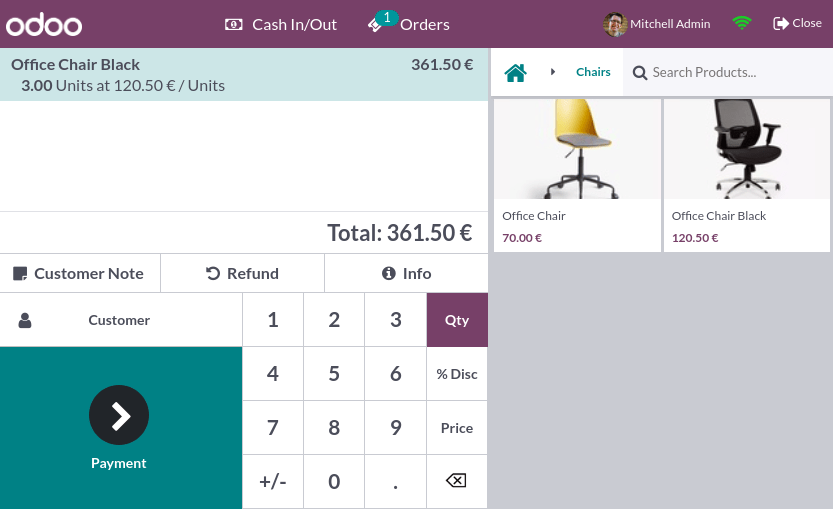
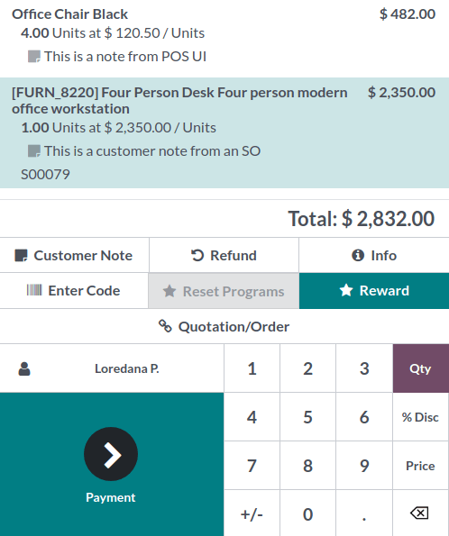
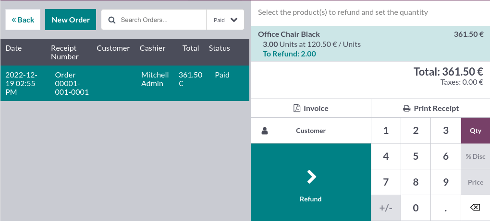
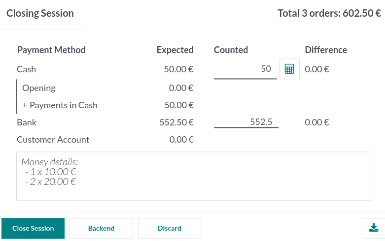

show-content  

show-toc  

# Point of Sale

With **Konvergo ERP Point of Sale**, run your shops and restaurants easily. The
app works on any device with a web browser, even if you are temporarily
offline. Product moves are automatically registered in your stock, you
get real-time statistics, and your data is consolidated across all
shops.

\- [Konvergo ERP Tutorials: Point of Sale
Tutorials](https://www.odoo.com/slides/point-of-sale-28) -
`IoT Boxes Documentations </applications/general/iot>`

## Start a session

From the **POS dashboard**, click `New Session`, and at the
`Opening Cash
Control` screen, click `Open Session` to start a POS session, or click
`Continue
Selling` if the session is already opened.

> [!NOTE]
> `Multiple users <point_of_sale/employee_login>` can be logged into the
> same session at the same time. However, the session can only be opened
> once on the same browser.

## Sell products

Click on products to add them to the cart. To change the **quantity**,
click `Qty` and enter the number of products using the keypad. To add a
**discount** or modify the product **price**, click respectively
`% Disc` or `Price` and enter the amounts.

Once an order is completed, proceed to checkout by clicking `Payment`.
Select the **payment method**, enter the received amount, and click
`Validate`. Click `New Order` to move on to the next customer.

> [!TIP]
> - You can use both , and
> . on your keyboard as decimal
> separators. - **Cash** is selected by default if you enter the amount
> without choosing a payment method.

> [!NOTE]
> The system can only load a limited number of products for effective
> opening. Click `Search more` if the desired product is not loaded
> automatically.

## Set customers

Registering your customer is necessary to
`collect their loyalty points and grant them rewards
<point_of_sale/pricing/loyalty>`, automatically apply the
`attributed pricelist
<point_of_sale/pricing/pricelists>`, or `generate and print an invoice
<receipts-invoices/invoices>`.

You can create customers from an `open POS session <pos/session-start>`
by clicking `Customer --> Create`, and filling in the contact
information. You can also create customers from the backend by going to
`Point of Sale --> Orders --> Customers` and clicking `New`. Then, fill
in the information and save.

To set a customer during an order, access the list of customers by
clicking `Customer` on the POS interface. You can also set a customer at
the payment screen by clicking `Customer`.

## Customer notes

You can add **customer notes** about specific products directly from an
open `POS session
<pos/session-start>`. For instance, to provide cleaning and maintenance
tips. They can also be used to track a customer's particular request,
such as not wanting the product to be assembled for them.

To do so, select a product and click `Customer Note` on the pad. Doing
so opens a pop-up window in which you can add or modify content for the
note.

> [!NOTE]
> Product notes from an `imported SO <point_of_sale/shop/sales_order>`
> are displayed identically in the cart.

Customer notes appear on customers' receipts and invoices similarly to
how they appear in the cart, under the related product.

## Return and refund products

To return and refund a product,

1.  `start a session <pos/session-start>` from the **POS dashboard**;
2.  click `Refund` and select the corresponding order;
3.  select the product and the quantity to refund using the keypad;
4.  click `Refund` to go back to the previous screen;
5.  once the order is completed, click `Payment` to proceed to the
    refund;
6.  click `Validate` and `New Order` to move on to the next customer.

> [!NOTE]
> - You can filter the **orders list** by `Receipt Number`, `Date` or
> `Customer` using the search bar. - You can also refund a product by
> selecting the returned product from an open session, and setting a
> negative quantity that equals the number of returned products. To do
> so, click `Qty` and `+/-`, followed by the quantity of returned
> products.

## Close the POS session

To close your session, click `Close` in the upper right corner of your
screen; doing so opens the `Closing Control` pop-up screen. From this
screen, you can retrieve various information:

- the number of orders made and the total amount made during the
  session;
- the expected amounts grouped by payment method.

Before closing this window, count your cash using the calculator icon.
Doing so opens a pop-up window that computes the total amount in the
cash drawer depending on the coins and bills counted and added manually.
Then, click `Confirm` or `Discard` to close the window. The computed
amount is set in the `Counted` column, and the `Money Details` are
specified in the **Notes** section.

Once you are done controlling the amounts, click `Close Session` to
close and go back to the **POS dashboard**.

> [!NOTE]
> - You can let the session open by clicking `Backend` or abort and keep
> selling by clicking `Discard`. - Depending on your setup, you might
> only be allowed to close a session if the expected cash revenue equals
> the counted cash. To close it anyway, click `Ok` on the
> `Payments Difference` screen.

> [!TIP]
> - It is strongly advised to close your POS session at the end of each
> day. - To look at all your previous sessions, go to
> `Point of Sale --> Orders -->
> Sessions`.

point_of_sale/employee_login point_of_sale/receipts_invoices
point_of_sale/configuration point_of_sale/shop point_of_sale/restaurant
point_of_sale/pricing point_of_sale/payment_methods
point_of_sale/reporting

